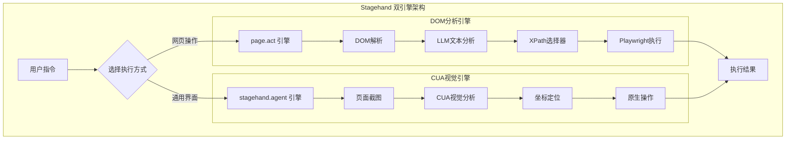

# Stagehand: page.act vs stagehand.agent 技术方案对比

## 概述

Stagehand项目提供了两套完整的UI自动化解决方案：

1. **传统方案**：`page.act` - 基于DOM分析
2. **前沿方案**：`stagehand.agent` - 基于视觉识别（CUA）

这两种方案代表了不同的技术路径，各有其适用场景和优劣势。

---

## 🔍 技术方案对比

### 1. page.act - DOM分析方案

#### **工作原理**

```typescript
// 调用方式
await page.act("点击登录按钮");

// 内部流程
async act(action: string) {
  // 1. 调用 observeAct
  return await this.actHandler.observeAct(actionOrOptions, ...);
}

async observeAct() {
  // 2. 先 observe：分析DOM结构，不是截图
  const observeResults = await observeHandler.observe({
    instruction,
    llmClient,      // 使用传统Chat Completions API
    returnAction: true,
  });

  // 3. 再 actFromObserveResult：执行Playwright操作
  return this.actFromObserveResult(observeResults[0]);
}
```

#### **核心特点**

- **输入数据**：📄 DOM结构和文本内容
- **AI分析**：🧠 文本理解和语义分析
- **API类型**：💬 Chat Completions API
- **定位方式**：🎯 XPath选择器
- **执行机制**：⚡ Playwright原生方法

#### **observe结果示例**

```typescript
// 分析DOM结构，生成选择器
{
  selector: "xpath=//button[contains(text(), '登录')]",
  method: "click",
  arguments: [],
  description: "click the login button"
}

// 然后使用Playwright执行
const locator = deepLocator(page, xpath).first();
await locator.click();  // 原生Playwright操作
```

---

### 2. stagehand.agent - CUA视觉方案

#### **工作原理**

```typescript
// 调用方式
const agent = stagehand.agent({
  provider: "anthropic",
  model: "computer-use-preview",
});
await agent.execute("点击登录按钮");

// 内部流程 (AnthropicCUAClient)
async execute(instruction: string) {
  while (!completed && step < maxSteps) {
    // 1. 截图
    const screenshot = await this.actionHandler.screenshot();

    // 2. 发送给AI分析
    const response = await this.getAction(screenshot, instruction);

    // 3. 执行返回的操作
    await this.takeAction(response);
  }
}
```

#### **核心特点**

- **输入数据**：📷 页面截图
- **AI分析**：👁️ 计算机视觉识别
- **API类型**：🤖 Responses API / Messages API
- **定位方式**：📍 像素坐标
- **执行机制**：🖱️ 原生操作模拟

#### **AI响应示例**

```json
{
  "type": "tool_use",
  "name": "computer",
  "input": {
    "action": "left_click",
    "coordinate": [394, 533] // 直接坐标点击
  }
}
```

---

## 📊 详细对比表

| 维度           | page.act (DOM方案) | stagehand.agent (CUA方案) |
| -------------- | ------------------ | ------------------------- |
| **技术基础**   | DOM解析 + 文本LLM  | 计算机视觉 + CUA模型      |
| **输入方式**   | 网页DOM结构        | 页面截图                  |
| **AI能力要求** | 文本理解           | 视觉识别                  |
| **API依赖**    | Chat Completions   | Responses/Messages API    |
| **定位精度**   | 高（基于结构）     | 中（基于视觉）            |
| **通用性**     | 仅限网页           | 任意界面                  |
| **性能**       | 快速               | 较慢（图像处理）          |
| **稳定性**     | 高                 | 中等                      |
| **学习成本**   | 低                 | 高                        |
| **调试难度**   | 低                 | 高                        |

---

## 🎯 使用场景建议

### page.act 适用场景

✅ **推荐使用：**

- 网页自动化测试
- 表单填写和提交
- 电商网站操作
- 内容管理系统
- SPA应用交互
- 需要高精度和稳定性的场景

❌ **不适用：**

- 桌面应用程序
- 移动应用界面
- 游戏界面
- 图像验证码
- 复杂Canvas应用

### stagehand.agent 适用场景

✅ **推荐使用：**

- 跨平台自动化（桌面+网页）
- 复杂图形界面操作
- 游戏自动化
- 移动应用模拟
- 遗留系统（无API）
- 图像验证码处理

❌ **不适用：**

- 对精度要求极高的场景
- 大批量快速操作
- 资源受限环境
- 需要亚像素级精度

---

## 🔧 实际代码示例

### page.act 示例

```typescript
import { Stagehand } from "@browserbasehq/stagehand";

const stagehand = new Stagehand({ env: "LOCAL" });
await stagehand.init();

// 导航到页面
await stagehand.page.goto("https://example.com/login");

// 使用DOM分析方式操作
await stagehand.page.act("在用户名输入框输入 'admin'");
await stagehand.page.act("在密码输入框输入 'password123'");
await stagehand.page.act("点击登录按钮");

// 提取数据
const result = await stagehand.page.extract({
  instruction: "获取登录后的用户信息",
  schema: z.object({
    username: z.string(),
    role: z.string(),
  }),
});
```

### stagehand.agent 示例

```typescript
import { Stagehand } from "@browserbasehq/stagehand";

const stagehand = new Stagehand({ env: "LOCAL" });
await stagehand.init();

// 创建CUA代理
const agent = stagehand.agent({
  provider: "anthropic",
  model: "computer-use-preview",
  instructions: "你是一个网页自动化助手",
});

// 导航到页面
await stagehand.page.goto("https://example.com/login");

// 使用视觉识别方式操作
await agent.execute(`
  请帮我完成登录流程：
  1. 在用户名输入框输入 'admin'
  2. 在密码输入框输入 'password123'  
  3. 点击登录按钮
  4. 检查是否登录成功
`);
```

---

## ⚖️ 优劣势分析

### page.act 优势

- ✅ **精确可靠**：基于DOM结构，定位准确
- ✅ **性能优秀**：无需图像处理，速度快
- ✅ **成本较低**：使用传统LLM，Token消耗少
- ✅ **调试友好**：可以查看生成的xpath选择器
- ✅ **兼容性好**：支持所有主流LLM厂商

### page.act 劣势

- ❌ **局限性大**：仅限于网页，无法控制桌面应用
- ❌ **依赖DOM**：动态生成内容可能失效
- ❌ **框架限制**：某些JS框架可能干扰DOM分析

### stagehand.agent 优势

- ✅ **通用性强**：可控制任意类型界面
- ✅ **更智能**：具备视觉理解能力
- ✅ **适应性好**：界面变化时仍能工作
- ✅ **未来导向**：代表AI发展趋势

### stagehand.agent 劣势

- ❌ **性能较慢**：需要截图和视觉处理
- ❌ **成本较高**：视觉AI模型费用高
- ❌ **准确度风险**：坐标可能不够精确
- ❌ **调试困难**：难以理解AI的决策过程
- ❌ **厂商依赖**：仅支持OpenAI和Anthropic

---

## 🚀 最佳实践建议

### 1. 混合使用策略

```typescript
// 对于网页操作，优先使用 page.act
if (isWebpage) {
  await page.act("填写表单");
} else {
  // 对于桌面应用，使用 agent
  await agent.execute("操作桌面应用");
}
```

### 2. 错误处理和降级

```typescript
try {
  // 优先尝试精确的 page.act
  await page.act("点击提交按钮");
} catch (error) {
  // 降级到 agent 方式
  await agent.execute("点击提交按钮");
}
```

### 3. 性能优化

```typescript
// 对于批量操作，使用 page.act
for (const item of items) {
  await page.act(`处理项目 ${item.id}`);
}

// 对于复杂流程，使用 agent
await agent.execute("完成整个订单流程");
```

---

## 🔮 发展趋势

### 短期（2025-2026）

- **page.act**：继续优化DOM分析精度，支持更多框架
- **stagehand.agent**：降低成本，提高识别准确度

### 中期（2026-2028）

- 两种方案深度融合，智能选择最佳策略
- CUA技术普及，成本大幅下降
- 支持更多AI厂商和模型

### 长期（2028+）

- CUA成为主流，DOM分析作为补充
- 实现真正的跨平台统一自动化
- AI Agent具备更强的推理和规划能力

---

## 📋 技术架构图



---

## 💡 结论

Stagehand项目通过提供**两套完整的技术方案**，实现了从传统DOM自动化到前沿视觉AI的全覆盖：

1. **page.act**：成熟稳定的网页自动化解决方案
2. **stagehand.agent**：前沿的通用界面控制技术

选择哪种方案主要取决于：

- **应用场景**：网页 vs 通用界面
- **精度要求**：高精度 vs 适应性
- **性能考虑**：速度 vs 智能
- **成本预算**：经济 vs 先进

在实际项目中，建议根据具体需求灵活选择，甚至可以在同一项目中混合使用两种方案，充分发挥各自的优势。
