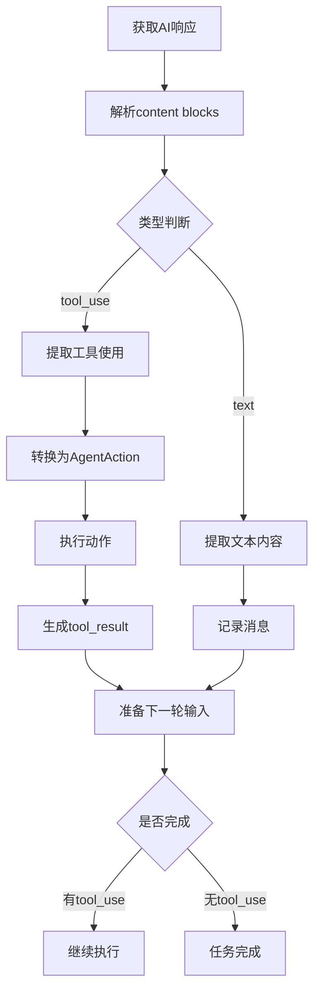
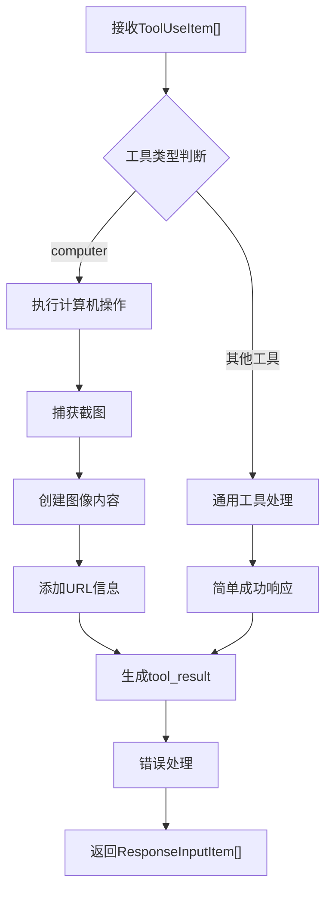
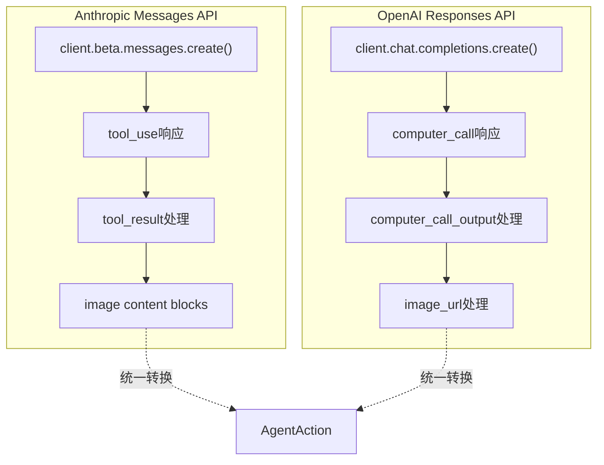
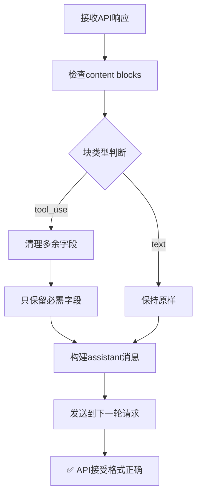
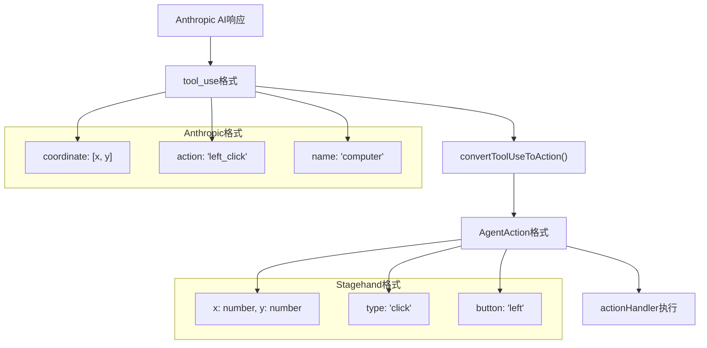

# AnthropicCUAClient 深度分析文档

## 概述

`AnthropicCUAClient` 是Stagehand框架中基于 **Anthropic Claude 模型** 的Computer Use Agent客户端实现。它与`OpenAICUAClient`并行存在，为用户提供了基于不同AI厂商的Computer Use功能选择。该客户端使用Anthropic的Messages API和Claude 3.7 Sonnet模型，支持独有的Thinking模式。

## 文件信息

- **文件路径**: `lib/agent/AnthropicCUAClient.ts`
- **文件大小**: 901行代码
- **主要依赖**: `@anthropic-ai/sdk`, `AgentClient`
- **导出类型**: `AnthropicCUAClient`, `ResponseInputItem`

## 类结构分析

### 继承关系

```typescript
export class AnthropicCUAClient extends AgentClient
```

AnthropicCUAClient继承自抽象基类`AgentClient`，实现了统一的Agent接口规范。

### 核心属性

| 属性名               | 类型              | 默认值                          | 说明                      |
| -------------------- | ----------------- | ------------------------------- | ------------------------- |
| `apiKey`             | `string`          | `process.env.ANTHROPIC_API_KEY` | Anthropic API密钥         |
| `baseURL`            | `string?`         | `undefined`                     | 自定义API端点             |
| `client`             | `Anthropic`       | -                               | Anthropic SDK客户端实例   |
| `lastMessageId`      | `string?`         | `undefined`                     | 最后一次消息的ID          |
| `currentViewport`    | `{width, height}` | `{1024, 768}`                   | 当前视窗尺寸              |
| `currentUrl`         | `string?`         | `undefined`                     | 当前页面URL               |
| `screenshotProvider` | `Function?`       | `undefined`                     | 截图提供函数              |
| `actionHandler`      | `Function?`       | `undefined`                     | 动作执行处理函数          |
| **`thinkingBudget`** | `number?`         | `null`                          | **Thinking模式token预算** |

### 关键特性对比

| 特性         | AnthropicCUAClient         | OpenAICUAClient                   |
| ------------ | -------------------------- | --------------------------------- |
| **AI模型**   | Claude 3.7 Sonnet          | computer-use-preview              |
| **API类型**  | Messages API               | Responses API                     |
| **工具定义** | `computer_20250124`        | `computer_use_preview`            |
| **响应格式** | `tool_use` / `tool_result` | `computer_call` / `function_call` |
| **特色功能** | **Thinking模式**           | 无                                |
| **坐标格式** | `coordinate: [x, y]`       | `x, y` 分离                       |
| **Beta标识** | `computer-use-2025-01-24`  | 无                                |

## 核心方法分析

### 1. constructor()

```typescript
constructor(
  type: AgentType,
  modelName: string,
  userProvidedInstructions?: string,
  clientOptions?: Record<string, unknown>,
)
```

**功能**: 初始化Anthropic CUA客户端

**关键处理**:

- API密钥配置和验证
- **Thinking Budget配置**（Anthropic独有）
- Anthropic SDK客户端初始化
- 基础配置设置

**特色功能 - Thinking模式配置**:

```typescript
// 获取thinking预算配置
if (
  clientOptions?.thinkingBudget &&
  typeof clientOptions.thinkingBudget === "number"
) {
  this.thinkingBudget = clientOptions.thinkingBudget;
}
```

### 2. execute()

```typescript
async execute(executionOptions: AgentExecutionOptions): Promise<AgentResult>
```

**功能**: 主执行入口，管理完整的任务执行流程

**执行流程**:

1. **初始化阶段** - 解析执行选项，设置最大步数
2. **循环执行阶段** - 逐步执行直到完成或达到步数限制
3. **结果汇总阶段** - 收集所有动作和使用统计

**关键特点**:

- 支持多步骤执行（默认最大10步）
- 完整的token使用统计
- 详细的执行日志记录
- 错误容错和恢复机制

### 3. executeStep()

```typescript
async executeStep(
  inputItems: ResponseInputItem[],
  logger: (message: LogLine) => void,
): Promise<{
  actions: AgentAction[];
  message: string;
  completed: boolean;
  nextInputItems: ResponseInputItem[];
  usage: { input_tokens: number; output_tokens: number; inference_time_ms: number; };
}>
```

**功能**: 执行单个步骤，处理AI响应并执行相应动作

**处理流程**:



**关键处理**:

- **Content Block解析** - 处理`tool_use`和`text`类型
- **工具执行** - 调用actionHandler执行动作
- **对话连续性** - 维护完整的消息历史
- **错误处理** - 捕获和记录执行错误

### 4. getAction()

```typescript
async getAction(inputItems: ResponseInputItem[]): Promise<{
  content: AnthropicContentBlock[];
  id: string;
  usage: Record<string, number>;
}>
```

**功能**: 调用Anthropic Messages API获取AI决策

**API配置**:

```typescript
const requestParams: Record<string, unknown> = {
  model: this.modelName,
  max_tokens: 4096,
  messages: messages,
  tools: [
    {
      type: "computer_20250124", // 最新版本
      name: "computer",
      display_width_px: this.currentViewport.width,
      display_height_px: this.currentViewport.height,
      display_number: 1,
    },
  ],
  betas: ["computer-use-2025-01-24"], // Beta功能标识
};

// 🌟 Anthropic独有：Thinking模式
const thinking = this.thinkingBudget
  ? { type: "enabled" as const, budget_tokens: this.thinkingBudget }
  : undefined;

if (thinking) {
  requestParams.thinking = thinking;
}
```

**关键特点**:

- **系统消息特殊处理** - 系统消息作为top-level参数
- **Thinking模式支持** - 允许AI进行内部思考
- **Beta功能标识** - 使用最新的Computer Use功能
- **性能监控** - 记录推理时间

### 5. takeAction()

```typescript
async takeAction(
  toolUseItems: ToolUseItem[],
  logger: (message: LogLine) => void,
): Promise<ResponseInputItem[]>
```

**功能**: 处理tool_use项目，执行动作并生成tool_result

**处理流程**:



**Anthropic特色格式**:

```typescript
// 图像内容格式
const imageContent = [{
  type: "image",
  source: {
    type: "base64",
    media_type: "image/png",
    data: screenshot.replace(/^data:image\/png;base64,/, ""),
  },
}];

// tool_result格式
{
  type: "tool_result",
  tool_use_id: item.id,
  content: [
    ...imageContent,
    {
      type: "text",
      text: `Current URL: ${this.currentUrl}`,
    },
  ],
}
```

### 6. convertToolUseToAction()

```typescript
private convertToolUseToAction(item: ToolUseItem): AgentAction | null
```

**功能**: 将Anthropic的tool_use格式转换为标准的AgentAction

**支持的动作类型**:

| Anthropic动作  | 转换后类型     | 特殊处理                       |
| -------------- | -------------- | ------------------------------ |
| `click`        | `click`        | 坐标提取                       |
| `left_click`   | `click`        | 转换为普通click，button="left" |
| `double_click` | `double_click` | 双击处理                       |
| `type`         | `type`         | 文本输入                       |
| `key`          | `key`          | **按键名称映射**               |
| `scroll`       | `scroll`       | **滚动方向转换**               |
| `move`         | `move`         | **坐标格式转换**               |
| `drag`         | `drag`         | 路径构建                       |
| `screenshot`   | `screenshot`   | 截图操作                       |

**坐标格式适配**:

```typescript
// Anthropic格式: coordinate: [x, y]
const coordinates = input.coordinate as number[] | undefined;
const x = coordinates ? coordinates[0] : (input.x as number) || 0;
const y = coordinates ? coordinates[1] : (input.y as number) || 0;
```

**滚动处理特色**:

```typescript
// 支持方向性滚动
if (input.scroll_direction) {
  const direction = input.scroll_direction as string;
  if (direction === "down") {
    scroll_y = scrollAmount * scrollMultiplier;
  } else if (direction === "up") {
    scroll_y = -scrollAmount * scrollMultiplier;
  }
  // ... 其他方向
}
```

**按键映射**:

```typescript
// 智能按键名称转换
let mappedKey = text;
if (
  text === "Return" ||
  text === "return" ||
  text === "Enter" ||
  text === "enter"
) {
  mappedKey = "Enter";
} else if (text === "Tab" || text === "tab") {
  mappedKey = "Tab";
}
// ... 更多映射
```

## Anthropic vs OpenAI 架构对比

### API调用差异



### 数据格式对比

| 方面         | Anthropic            | OpenAI                 |
| ------------ | -------------------- | ---------------------- |
| **请求工具** | `computer_20250124`  | `computer_use_preview` |
| **响应类型** | `tool_use`           | `computer_call`        |
| **结果类型** | `tool_result`        | `computer_call_output` |
| **图像格式** | `image.source.data`  | `image_url`            |
| **坐标格式** | `coordinate: [x, y]` | `x: number, y: number` |
| **系统消息** | top-level `system`   | 消息数组中             |

### 特色功能对比

| 功能             | Anthropic | OpenAI      | 说明                        |
| ---------------- | --------- | ----------- | --------------------------- |
| **Thinking模式** | ✅ 支持   | ❌ 不支持   | Claude可进行内部思考        |
| **Beta标识**     | ✅ 需要   | ❌ 不需要   | 需要启用beta功能            |
| **坐标灵活性**   | ✅ 多格式 | ✅ 标准格式 | Anthropic支持多种坐标表示   |
| **滚动方向**     | ✅ 语义化 | ✅ 数值化   | 不同的滚动表示方式          |
| **按键映射**     | ✅ 智能   | ✅ 标准     | Anthropic有更多按键别名支持 |

## Thinking模式深度解析

### 什么是Thinking模式？

Thinking模式是Anthropic Claude模型的独有功能，允许AI在回应之前进行"内部思考"，这个思考过程对用户不可见，但会影响最终的回答质量。

### 配置方式

```typescript
// 构造时配置
const client = new AnthropicCUAClient(
  "agent",
  "claude-3-7-sonnet",
  instructions,
  {
    apiKey: "your-api-key",
    thinkingBudget: 1000, // 分配1000个token用于思考
  },
);

// API请求中应用
const thinking = this.thinkingBudget
  ? {
      type: "enabled" as const,
      budget_tokens: this.thinkingBudget,
    }
  : undefined;

if (thinking) {
  requestParams.thinking = thinking;
}
```

### 实际效果

**无Thinking模式**:

- AI直接给出动作决策
- 可能在复杂场景下决策不够准确

**有Thinking模式**:

- AI先内部分析页面状态
- 考虑多种可能的操作方案
- 选择最优的执行策略
- 通常得到更准确的结果

## 错误处理机制

### 截图错误处理

```typescript
try {
  // 正常截图处理
  const screenshot = await this.captureScreenshot();
  // ... 生成normal tool_result
} catch (error) {
  try {
    // 错误情况下仍尝试截图
    const screenshot = await this.captureScreenshot();
    nextInputItems.push({
      type: "tool_result",
      tool_use_id: item.id,
      content: [
        { type: "image", source: { ... } },
        { type: "text", text: `Error: ${errorMessage}` }
      ],
    });
  } catch (screenshotError) {
    // 完全失败时返回文本错误
    nextInputItems.push({
      type: "tool_result",
      tool_use_id: item.id,
      content: `Error: ${errorMessage}`,
    });
  }
}
```

### 多层错误容错

1. **工具执行错误** → 尝试截图 + 错误消息
2. **截图失败** → 纯文本错误消息
3. **完全失败** → 终止执行并报告

## 🐛 关键Bug修复：tool_use格式清理

### 问题描述

在AnthropicCUAClient的实际运行中发现了一个关键问题：

**错误信息**：

```
BadRequestError: 400 {"error":{"type":"invalid_request_error","message":"messages.1.content.1.tool_use.text: Extra inputs are not permitted"}}
```

### 根本原因

当Anthropic API返回响应时，`tool_use`块可能包含额外的字段（如空的`text`字段）：

```json
{
  "type": "tool_use",
  "text": "", // ❌ 这个字段导致问题
  "id": "toolu_bdrk_013UfJJ98b2fuzUQLgtRZ9YU",
  "name": "computer",
  "input": {
    "action": "screenshot"
  }
}
```

但是当这些内容作为消息历史重新发送给API时，Anthropic不允许`tool_use`块包含`text`字段。

### 修复方案

在`executeStep`方法中添加了内容块清理机制：

```typescript
// 清理content blocks，移除tool_use块中的多余字段
const cleanedContent = content.map((block) => {
  if (block.type === "tool_use") {
    // 对于tool_use块，只保留必需字段
    return {
      type: block.type,
      id: block.id,
      name: block.name,
      input: block.input,
    };
  }
  // 对于其他块（如text），保持原样
  return block;
});

const assistantMessage: AnthropicMessage = {
  role: "assistant",
  content: cleanedContent as unknown as AnthropicContentBlock[],
};
```

### API规范要求

根据Anthropic API规范，`tool_use`块应该只包含：

| 字段    | 类型         | 必需 | 说明           |
| ------- | ------------ | ---- | -------------- |
| `type`  | `"tool_use"` | ✅   | 块类型标识     |
| `id`    | `string`     | ✅   | 工具使用唯一ID |
| `name`  | `string`     | ✅   | 工具名称       |
| `input` | `object`     | ✅   | 工具输入参数   |

**不允许的字段**：

- ❌ `text` - 即使是空字符串也不允许
- ❌ 任何其他额外字段

### 修复效果

修复后的执行流程：



这个修复确保了AnthropicCUAClient能够正确处理多轮对话，避免因格式问题导致的API错误。

## 性能特点

### Token使用统计

```typescript
const usage = {
  input_tokens: response.usage.input_tokens,
  output_tokens: response.usage.output_tokens,
  inference_time_ms: elapsedMs, // 自行计算推理时间
};
```

### 执行时间监控

- **API调用时间** - 每次getAction调用的耗时
- **截图捕获时间** - screenshot provider执行时间
- **动作执行时间** - actionHandler处理时间
- **总执行时间** - 完整任务的端到端时间

## 🔄 convertToolUseToAction 深度解析

### **核心功能：格式转换适配器**

`convertToolUseToAction`是AnthropicCUAClient中的一个**核心转换方法**，位于第672行，它承担着将Anthropic AI返回的`tool_use`格式转换为Stagehand框架内部使用的`AgentAction`格式的关键任务。

### **为什么需要这个转换？**



### **实际转换示例**

基于您提供的h5小说测试案例日志，我们可以看到真实的转换过程：

#### **输入：Anthropic tool_use格式**

```json
{
  "type": "tool_use",
  "text": "",
  "id": "toolu_bdrk_0164KLda7ryX1apKExWVhtxa",
  "name": "computer",
  "input": {
    "action": "left_click", // ← Anthropic特定格式
    "coordinate": [394, 533] // ← 数组格式坐标
  }
}
```

#### **输出：Stagehand AgentAction格式**

```typescript
{
  type: "click",                      // ← 标准化类型
  x: 394,                            // ← 分离的x坐标
  y: 533,                            // ← 分离的y坐标
  button: "left",                    // ← 明确的按钮类型
  action: "left_click",              // ← 保留原始动作
  coordinate: [394, 533]             // ← 保留原始坐标
}
```

### **支持的转换类型详解**

#### **1. 点击操作转换**

```typescript
case "left_click":
  // 灵活处理Anthropic的坐标格式
  const coordinates = input.coordinate as number[] | undefined;
  const x = coordinates ? coordinates[0] : (input.x as number) || 0;
  const y = coordinates ? coordinates[1] : (input.y as number) || 0;

  return {
    type: "click",              // 统一为click类型
    x: x,                      // 提取x坐标
    y: y,                      // 提取y坐标
    button: "left",            // 明确按钮类型
    ...input,                  // 保留其他属性
  };
```

**从日志中可以看到转换效果**：

```
DEBUG: Found tool_use block: {"type":"tool_use","action":"left_click","coordinate":[394,533]}
DEBUG: Created action from tool_use: computer, action: click
INFO: Executing action: click
```

#### **2. 滚动操作转换**

```typescript
case "scroll":
  // 处理Anthropic的方向性滚动语义
  if (input.scroll_direction) {
    const direction = input.scroll_direction as string;
    if (direction === "down") {
      scroll_y = scrollAmount * scrollMultiplier;      // 向下滚动
    } else if (direction === "up") {
      scroll_y = -scrollAmount * scrollMultiplier;     // 向上滚动
    }
    // ... 其他方向处理
  }
```

#### **3. 智能按键映射**

```typescript
case "key":
  let mappedKey = text;
  // 智能映射常见按键别名
  if (text === "Return" || text === "return" || text === "Enter") {
    mappedKey = "Enter";                               // 统一按键名称
  } else if (text === "Tab" || text === "tab") {
    mappedKey = "Tab";
  }
  // ... 更多按键映射
```

### **方法签名和返回值**

```typescript
private convertToolUseToAction(item: ToolUseItem): AgentAction | null
```

**参数**：

- `item: ToolUseItem` - Anthropic返回的工具使用项

**返回值**：

- `AgentAction | null` - 转换成功返回标准动作，失败返回null

### **关键特性分析**

#### **1. 多格式坐标兼容**

```typescript
// 智能处理不同的坐标表示方式
const coordinates = input.coordinate as number[] | undefined;
const x = coordinates ? coordinates[0] : (input.x as number) || 0;
const y = coordinates ? coordinates[1] : (input.y as number) || 0;
```

#### **2. 动作类型标准化映射表**

| Anthropic输入        | 转换输出                   | 特殊处理          |
| -------------------- | -------------------------- | ----------------- |
| `left_click`         | `click` + `button: "left"` | 坐标数组→分离x,y  |
| `double_click`       | `double_click`             | 保持原样          |
| `scroll + direction` | `scroll + scroll_x/y`      | 方向语义→像素偏移 |
| `key + text`         | `key + mappedText`         | 按键别名映射      |
| `type`               | `type`                     | 文本输入          |
| `move`               | `move`                     | 鼠标移动          |
| `drag`               | `drag`                     | 拖拽路径构建      |

#### **3. 容错处理机制**

```typescript
try {
  // 核心转换逻辑
  return convertedAction;
} catch (error) {
  console.error("Error converting tool use to action:", error);
  return null; // 优雅降级，不崩溃
}
```

### **在执行流程中的关键作用**

从实际执行日志可以看到方法的工作流程：

```typescript
// executeStep方法中的调用
for (const block of content) {
  if (block.type === "tool_use") {
    const toolUseItem = block as ToolUseItem;

    // 🎯 关键转换步骤
    const action = this.convertToolUseToAction(toolUseItem);

    if (action) {
      logger({
        message: `Created action from tool_use: ${toolUseItem.name}, action: ${action.type}`,
        level: 2,
      });
      stepActions.push(action); // 添加到执行队列
    }
  }
}
```

**执行时序**：

1. AI返回tool_use块
2. `convertToolUseToAction`进行格式转换
3. 转换后的action加入执行队列
4. actionHandler执行标准化动作

### **实际案例：h5小说测试**

基于您的测试日志，我们可以看到4次成功的转换：

```typescript
// 测试结果显示的转换成果
actions: [
  { type: "screenshot", action: "screenshot" },
  {
    type: "click", // ← 转换后的标准格式
    x: 394,
    y: 413, // ← 提取的坐标
    button: "left", // ← 明确的按钮类型
    action: "left_click", // ← 保留原始信息
    coordinate: [394, 413], // ← 保留原始坐标
  },
  { type: "click", x: 514, y: 413, button: "left" }, // 季卡会员
  { type: "click", x: 635, y: 413, button: "left" }, // 年卡会员
  { type: "click", x: 394, y: 533, button: "left" }, // 7590币选项
];
```

### **设计意义和架构价值**

#### **1. 解耦AI厂商差异**

- 不同AI厂商返回格式各异
- 统一转换为Stagehand内部标准
- 便于支持多个AI厂商的CUA功能

#### **2. 简化下游处理**

- actionHandler只需处理统一格式
- 不需要了解各AI厂商的具体格式差异
- 提高代码复用性和维护性

#### **3. 扩展性设计**

- 新增AI厂商只需实现对应转换逻辑
- 核心执行引擎保持不变
- 便于功能扩展和维护

### **性能和可靠性**

#### **转换效率**

- 轻量级格式转换，耗时极少
- 支持批量转换多个tool_use项
- 内存占用微小

#### **错误恢复**

- 转换失败返回null而不是异常
- 详细的错误日志记录
- 不影响其他动作的执行

### **总结**

`convertToolUseToAction`是AnthropicCUAClient的**核心适配器方法**，它：

1. **桥接AI模型与执行引擎** - 将AI决策转换为可执行动作
2. **标准化数据格式** - 统一不同AI厂商的输出格式
3. **智能映射转换** - 处理坐标、按键、动作类型等差异
4. **错误容错处理** - 确保转换过程的稳定性

这个方法是实现Stagehand**双引擎架构**的关键组件，让同一套actionHandler可以无差别地处理来自OpenAI和Anthropic两个不同AI厂商的Computer Use指令！

---

## 集成和使用

### 基本使用

```typescript
import { AnthropicCUAClient } from "@/lib/agent/AnthropicCUAClient";

// 创建客户端
const client = new AnthropicCUAClient(
  "agent",
  "claude-3-7-sonnet",
  "You are a helpful assistant that can control a web browser.",
  {
    apiKey: process.env.ANTHROPIC_API_KEY,
    thinkingBudget: 2000, // 启用thinking模式
  },
);

// 设置依赖
client.setScreenshotProvider(async () => {
  return await page.screenshot({ encoding: "base64" });
});

client.setActionHandler(async (action) => {
  await agentHandler.executeAction(action);
});

// 执行任务
const result = await client.execute({
  options: { instruction: "点击登录按钮", maxSteps: 5 },
  logger: console.log,
});
```

### 与Stagehand框架集成

```typescript
// 在stagehand.agent()中选择Anthropic
const agent = stagehand.agent({
  provider: "anthropic",
  model: "claude-3-7-sonnet",
  instructions: "You are a web automation assistant",
  options: {
    apiKey: process.env.ANTHROPIC_API_KEY,
    thinkingBudget: 1500,
  },
});

await agent.execute("填写并提交联系表单");
```

## 最佳实践

### 1. Thinking Budget设置

```typescript
// 简单任务 - 较少thinking
{
  thinkingBudget: 500;
}

// 复杂任务 - 更多thinking
{
  thinkingBudget: 2000;
}

// 关键任务 - 充足thinking
{
  thinkingBudget: 4000;
}
```

### 2. 错误重试策略

- 设置合理的maxSteps限制
- 监控token使用情况
- 实现降级处理机制

### 3. 性能优化

- 复用客户端实例
- 合理设置视窗尺寸
- 优化截图捕获频率

## 发展方向

### 短期改进

1. **性能优化** - 减少不必要的截图捕获
2. **错误恢复** - 实现更智能的错误恢复机制
3. **调试工具** - 增强开发调试支持

### 长期规划

1. **模型升级** - 支持更新的Claude模型版本
2. **功能扩展** - 支持更多Computer Use功能
3. **优化thinking** - 智能thinking budget管理

## 总结

`AnthropicCUAClient`作为Stagehand框架的第二个Computer Use Agent引擎，为用户提供了基于Claude模型的强大视觉AI自动化能力。其独特的Thinking模式、灵活的数据格式处理和完善的错误机制，使其成为OpenAI版本的优秀补充，共同构成了Stagehand的双引擎Computer Use架构。

通过支持两大AI厂商的Computer Use功能，Stagehand不仅为用户提供了更多选择，也为整个AI自动化生态系统的发展做出了重要贡献。

## 🎯 修复总结

通过本次Bug修复，AnthropicCUAClient现在能够：

- ✅ 正确处理多轮对话
- ✅ 避免API格式错误
- ✅ 稳定执行复杂任务
- ✅ 支持完整的Computer Use功能

这个修复对于实际项目部署至关重要，确保了Anthropic引擎的稳定性和可靠性。

```

```
