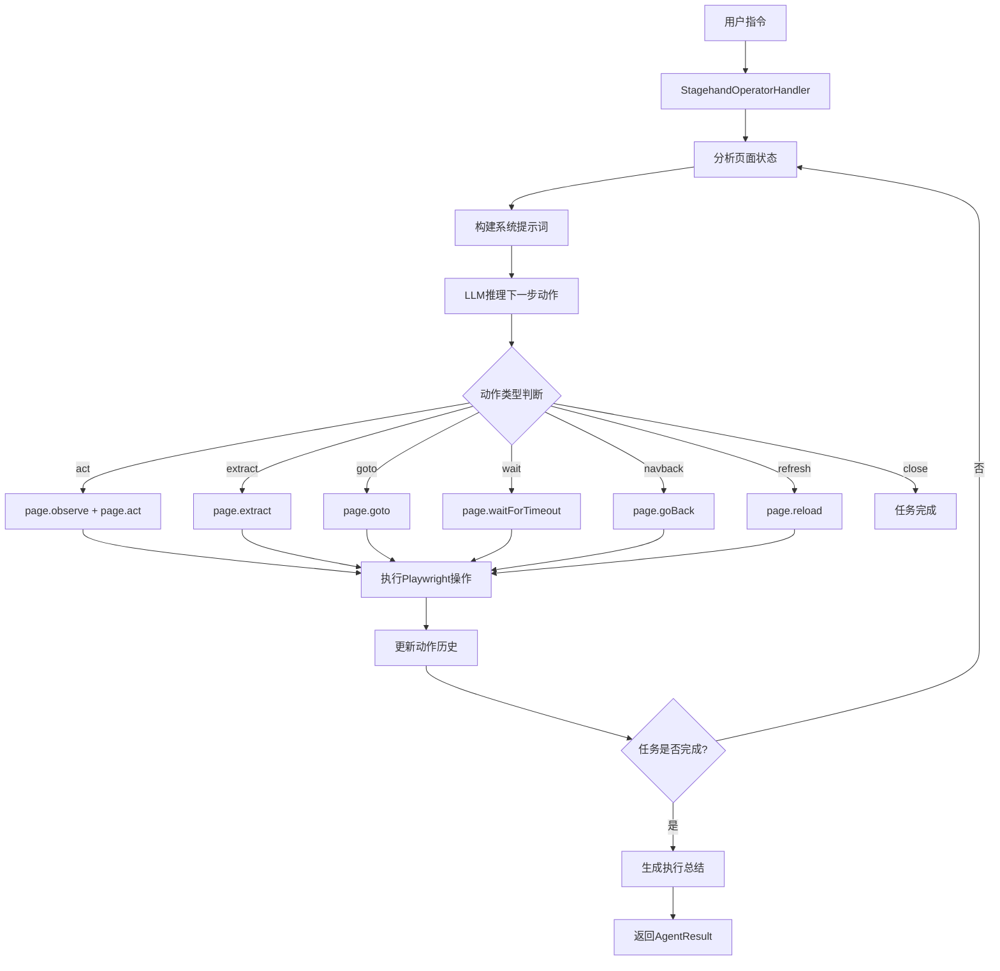
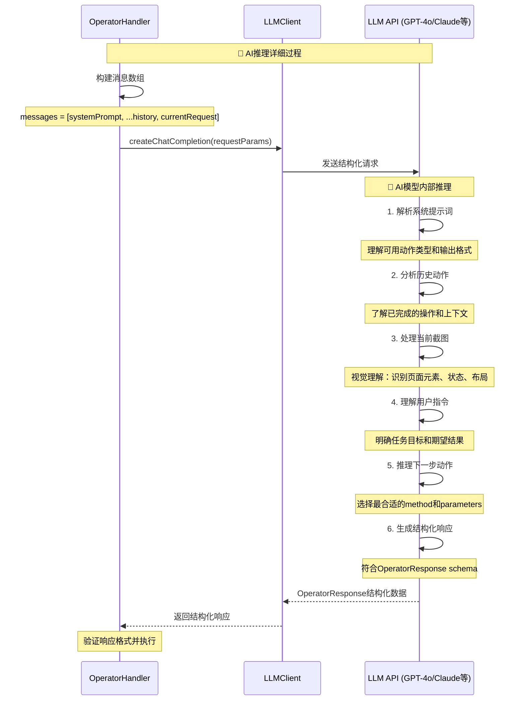
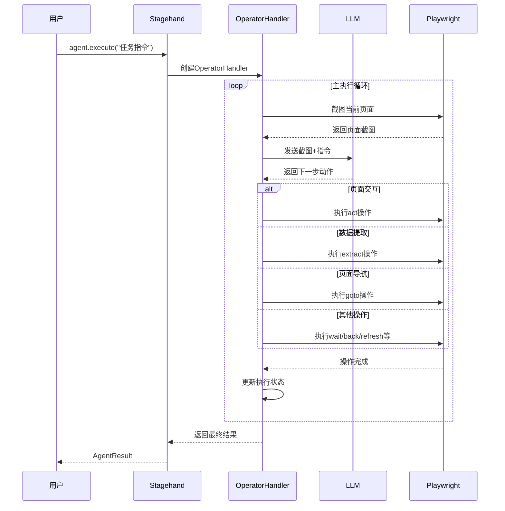

# Stagehand Default Agent Client (Open Operator) 深度解析

## 概述

当调用`stagehand.agent()`时**不传入任何参数**，Stagehand会使用**Open Operator Agent**作为默认的自动化引擎。这是一个基于**DOM分析 + 序列化工具调用**的轻量级Agent方案，为用户提供成本效益高的浏览器自动化能力。

---

## 🎯 调用机制分析

### **关键代码逻辑**

```typescript
// lib/index.ts 第856行
agent(options?: AgentConfig) {
  if (!options || !options.provider) {
    // 🎯 关键：使用 Open Operator Agent
    return {
      execute: async (instructionOrOptions) => {
        return new StagehandOperatorHandler(
          this.stagehandPage,
          this.logger,
          this.llmClient,  // ← 使用Stagehand初始化时的LLM客户端
        ).execute(instructionOrOptions);
      },
    };
  }

  // 有provider参数时才使用CUA引擎
  const agentHandler = new StagehandAgentHandler(/* ... */);
  // ...
}
```

### **触发条件**

当满足以下任一条件时，自动使用Open Operator：

1. **完全无参数调用**：`stagehand.agent()`
2. **空对象参数**：`stagehand.agent({})`
3. **无provider字段**：`stagehand.agent({ model: "gpt-4" })` （缺少provider）

---

## 🏗️ 技术架构详解

### **核心组件：StagehandOperatorHandler**

```typescript
export class StagehandOperatorHandler {
  private stagehandPage: StagehandPage;
  private logger: (message: LogLine) => void;
  private llmClient: LLMClient; // ← 使用Stagehand全局LLM配置
  private messages: ChatMessage[]; // ← 维护对话历史
}
```

### **工作流程架构图**



### **完整执行时序图**

```mermaid
sequenceDiagram
    participant U as User
    participant SH as Stagehand
    participant OH as OperatorHandler
    participant LLM as LLMClient
    participant Page as StagehandPage
    participant PW as Playwright

    Note over U,PW: 🚀 Open Operator 完整执行时序

    %% 初始化阶段
    U->>SH: stagehand.agent()
    Note over SH: 检查参数为空，选择Open Operator
    SH->>OH: new StagehandOperatorHandler()
    OH->>OH: 初始化属性和消息数组
    SH-->>U: 返回 { execute: async (instruction) => {...} }

    %% 执行阶段开始
    U->>SH: agent.execute("登录Gmail账户")
    SH->>OH: operatorHandler.execute(options)

    Note over OH: 📋 初始化执行环境
    OH->>OH: 构建系统提示词
    OH->>OH: 设置 currentStep = 0, maxSteps = 10
    OH->>OH: 初始化 actions = [], completed = false

    %% 主循环开始
    loop 直到completed=true或达到maxSteps
        Note over OH,PW: 🔄 Step ${currentStep + 1}: 执行循环

        %% 页面状态检查
        OH->>Page: page.url()
        Page-->>OH: 当前URL

        alt URL为空或about:blank
            OH->>Page: page.goto("https://google.com")
            Page-->>OH: 导航完成
        end

        %% 截图阶段
        Note over OH,PW: 📸 页面状态捕获
        OH->>Page: page.screenshot()
        Page-->>OH: 页面截图buffer
        OH->>OH: 转换为base64

        %% 构建LLM请求
        Note over OH: 🤖 构建AI推理请求
        OH->>OH: 格式化历史动作
        OH->>OH: 构建用户消息
        Note over OH: 包含截图+URL+动作历史

        %% LLM推理阶段
        OH->>LLM: createChatCompletion(messages)
        Note over LLM: 🧠 AI分析和决策
        LLM->>LLM: 分析截图内容
        LLM->>LLM: 理解任务目标
        LLM->>LLM: 规划下一步动作
        LLM-->>OH: OperatorResponse

        %% 解析AI响应
        Note over OH: 📝 解析AI决策
        OH->>OH: 验证响应格式
        OH->>OH: 提取method和parameters
        OH->>OH: 记录reasoning

        %% 动作执行分发
        Note over OH,PW: 🎯 执行AI决策
        OH->>OH: executeAction(response)

        alt method = "act"
            Note over OH,PW: 🎪 页面交互操作
            OH->>Page: page.observe(parameters)
            Page-->>OH: ObserveResult[]
            OH->>Page: page.act(observeResult[0])
            Page->>PW: 执行具体Playwright操作
            PW-->>Page: 操作结果
            Page-->>OH: 操作完成

        else method = "extract"
            Note over OH,PW: 📊 数据提取操作
            alt parameters为空
                OH->>Page: page.extract()
                Page-->>OH: { page_text: "..." }
            else
                OH->>Page: page.extract(parameters)
                Page-->>OH: 提取的结构化数据
            end

        else method = "goto"
            Note over OH,PW: 🌐 页面导航
            OH->>Page: page.goto(parameters, {waitUntil: "load"})
            Page->>PW: 导航到新页面
            PW-->>Page: 页面加载完成
            Page-->>OH: 导航完成

        else method = "wait"
            Note over OH: ⏰ 等待延时
            OH->>OH: waitForTimeout(parseInt(parameters))

        else method = "navback"
            Note over OH,PW: ⬅️ 浏览器后退
            OH->>Page: page.goBack()
            Page-->>OH: 后退完成

        else method = "refresh"
            Note over OH,PW: 🔄 页面刷新
            OH->>Page: page.reload()
            Page-->>OH: 刷新完成

        else method = "close"
            Note over OH: ✅ 任务完成标记
            OH->>OH: completed = true
            break
        end

        %% 更新执行状态
        Note over OH: 📈 更新执行状态
        OH->>OH: actions.push(currentAction)
        OH->>OH: currentStep++
        OH->>OH: 记录Token使用情况

        %% 完成条件检查
        alt currentStep >= maxSteps
            Note over OH: ⚠️ 达到最大步数限制
            OH->>OH: completed = true
        end
    end

    %% 结果整理和返回
    Note over OH: 📋 整理执行结果
    OH->>OH: 构建最终消息
    OH->>OH: 计算总耗时和成本
    OH->>OH: 生成AgentResult

         OH-->>SH: 返回执行结果
     SH-->>U: AgentResult对象

    Note over U,PW: ✨ Open Operator执行完成
```

### **LLM推理详细时序**



### **简化时序图（核心流程）**



**参数说明**：

- **requestParams**: `{ messages, response_format: operatorResponseSchema, temperature: 0.1, max_tokens: 1000 }`
- **OperatorResponse**: `{ method: "act", parameters: "点击登录按钮", reasoning: "需要登录才能继续", taskComplete: false }`
- **AgentResult**: `{ success: boolean, actions: AgentAction[], message: string, completed: boolean, usage: TokenUsage }`

### **序列化工具调用支持**

Open Operator支持以下预定义动作类型：

| 动作类型    | 功能描述     | 实现方式                        |
| ----------- | ------------ | ------------------------------- |
| **act**     | 页面交互操作 | `page.observe()` + `page.act()` |
| **extract** | 数据提取     | `page.extract()`                |
| **goto**    | 页面导航     | `page.goto()`                   |
| **wait**    | 等待延时     | `page.waitForTimeout()`         |
| **navback** | 后退导航     | `page.goBack()`                 |
| **refresh** | 页面刷新     | `page.reload()`                 |
| **close**   | 任务结束     | 标记完成状态                    |

---

## 🔄 执行流程深度分析

### **1. 初始化阶段**

```typescript
// 构建系统提示词
this.messages = [buildOperatorSystemPrompt(options.instruction)];

// 系统提示词包含：
// - 任务目标说明
// - 可用动作类型定义
// - 输出格式要求（JSON Schema）
// - 最佳实践指导
```

### **2. 循环执行阶段**

```typescript
while (!completed && currentStep < maxSteps) {
  // 1. 页面状态检查
  const url = this.stagehandPage.page.url();
  if (!url || url === "about:blank") {
    // 提示需要先导航到页面
  }

  // 2. 截图和状态描述
  const screenshot = await this.stagehandPage.page.screenshot();
  const messageText = `Previous actions: ${actions.map(...)} \n Current page: ${url}`;

  // 3. 发送给LLM分析
  this.messages.push({
    role: "user",
    content: [
      { type: "text", text: messageText },
      { type: "image", source: { data: base64Image } }
    ]
  });

  // 4. 获取下一步动作
  const result = await this.getNextStep(currentStep);

  // 5. 执行动作
  await this.executeAction(result);
}
```

### **3. 智能决策过程**

```typescript
// LLM返回的决策格式
interface OperatorResponse {
  method: "act" | "extract" | "goto" | "wait" | "navback" | "refresh" | "close";
  parameters: string;
  reasoning: string;
  taskComplete: boolean;
}

// 实际示例
{
  "method": "act",
  "parameters": "点击登录按钮",
  "reasoning": "用户需要登录，我在页面上看到了登录按钮",
  "taskComplete": false
}
```

---

## 🆚 与Computer Use Agent对比

### **技术方案对比表**

| 特性         | Open Operator (默认)               | Computer Use Agent            |
| ------------ | ---------------------------------- | ----------------------------- |
| **调用方式** | `stagehand.agent()`                | `stagehand.agent({provider})` |
| **技术基础** | DOM分析 + 序列化工具调用           | 视觉识别 + 坐标操作           |
| **LLM要求**  | 任何LLM（GPT-4、Claude、Gemini等） | Computer Use专用模型          |
| **API类型**  | Chat Completions API               | Computer Use专用API           |
| **输入数据** | 页面截图 + DOM结构                 | 纯页面截图                    |
| **输出格式** | 结构化JSON动作                     | 坐标+操作类型                 |
| **成本**     | 较低（~$0.01/动作）                | 较高（~$0.05/动作）           |
| **精确度**   | 高（基于DOM选择器）                | 中等（基于像素坐标）          |
| **适用场景** | 网页自动化                         | 通用界面控制                  |
| **调试难度** | 容易（动作可读）                   | 较难（坐标难理解）            |
| **兼容性**   | 仅网页                             | 任意界面                      |

### **成本效益分析**

```typescript
// Open Operator典型使用成本
const taskCost = {
  screenshots: 5, // 5次截图
  llmCalls: 5, // 5次LLM调用
  tokensPerCall: 2000, // 每次约2K tokens
  costPerToken: 0.01 / 1000, // GPT-4o价格
  totalCost: (5 * 2000 * 0.01) / 1000, // ≈ $0.10/任务
};

// Computer Use Agent典型成本
const cuaCost = {
  screenshots: 5,
  visionProcessing: 5, // 5次视觉处理
  cuaModelCalls: 5, // 5次CUA API调用
  costPerCall: 0.05, // CUA API价格更高
  totalCost: 5 * 0.05, // ≈ $0.25/任务
};
```

---

## 📝 实际执行案例

### **任务：登录网站流程**

```typescript
// 用户调用
const agent = stagehand.agent(); // ← 自动使用Open Operator
const result = await agent.execute("登录到Gmail账户");
```

### **内部执行序列**

```typescript
// AI生成的动作序列
[
  {
    method: "goto",
    parameters: "https://gmail.com",
    reasoning: "需要首先导航到Gmail登录页面",
    taskComplete: false,
  },
  {
    method: "act",
    parameters: "点击登录按钮",
    reasoning: "页面已加载，现在点击主登录按钮",
    taskComplete: false,
  },
  {
    method: "act",
    parameters: "在邮箱输入框输入用户邮箱",
    reasoning: "进入登录页面，需要输入邮箱地址",
    taskComplete: false,
  },
  {
    method: "act",
    parameters: "点击下一步按钮",
    reasoning: "邮箱已输入，继续到密码输入页面",
    taskComplete: false,
  },
  {
    method: "act",
    parameters: "在密码框输入密码",
    reasoning: "现在需要输入密码完成登录",
    taskComplete: false,
  },
  {
    method: "extract",
    parameters: "检查是否成功登录",
    reasoning: "验证登录状态，确认任务完成",
    taskComplete: true,
  },
];
```

### **每步详细执行**

#### **Step 1: goto操作**

```typescript
await this.executeAction({
  method: "goto",
  parameters: "https://gmail.com",
});

// 内部调用：page.goto("https://gmail.com", { waitUntil: "load" })
```

#### **Step 2: act操作**

```typescript
// 1. 先observe分析页面
const [observeResult] = await page.observe("点击登录按钮");
// 返回：{ selector: "button[data-action='signin']", method: "click", ... }

// 2. 再执行act操作
await page.act(observeResult);
// 内部调用：page.locator("button[data-action='signin']").click()
```

#### **Step 3: extract操作**

```typescript
const extractResult = await page.extract("检查是否成功登录");
// 返回：{ success: true, data: "已成功登录用户账户" }
```

---

## 🛠️ 核心优势分析

### **1. 成本效益高**

- **LLM兼容性**：支持任何Chat Completions API
- **Token效率**：结构化输出，减少无效token
- **批量处理**：单次调用完成复杂任务规划

### **2. 精确度高**

```typescript
// 基于DOM的精确定位
{
  method: "act",
  parameters: "点击登录按钮",
  // 内部转换为：
  selector: "button[data-testid='login-button']",  // 精确选择器
  method: "click"                                  // 明确操作
}

// vs CUA的坐标定位
{
  action: "left_click",
  coordinate: [394, 533]  // 可能因分辨率变化失效
}
```

### **3. 调试友好**

```typescript
// 完整的动作历史记录
actions: [
  {
    type: "act",
    reasoning: "用户需要登录，我在页面上看到了登录按钮",
    parameters: "点击登录按钮",
    playwrightArguments: {
      selector: "button[data-action='signin']",
      method: "click",
      description: "Sign in button",
    },
  },
];
```

### **4. 可扩展性强**

```typescript
// 易于添加新的动作类型
const newActionTypes = {
  upload: (params) => page.setInputFiles(selector, filePath),
  download: (params) => page.waitForDownload(),
  iframe: (params) => page.frameLocator(selector).act(params),
};
```

---

## 📋 使用场景与限制

### **✅ 最适合的使用场景**

1. **网页表单自动化**

   ```typescript
   await agent.execute("填写注册表单并提交");
   ```

2. **数据提取和爬虫**

   ```typescript
   await agent.execute("提取产品价格和库存信息");
   ```

3. **测试流程自动化**

   ```typescript
   await agent.execute("执行完整的购买流程测试");
   ```

4. **内容管理任务**
   ```typescript
   await agent.execute("发布新文章到CMS系统");
   ```

### **❌ 不适合的场景**

1. **桌面应用程序**：无法处理非网页界面
2. **游戏自动化**：需要实时坐标操作
3. **图像编辑软件**：复杂的视觉元素识别
4. **Canvas/WebGL应用**：无DOM结构可分析

### **⚠️ 技术限制**

- **依赖DOM结构**：页面必须有可访问的HTML元素
- **JavaScript渲染**：需要等待动态内容加载完成
- **iframe处理**：跨域iframe可能有访问限制
- **浏览器兼容性**：基于Playwright支持的浏览器

---

## 🚀 最佳实践指南

### **1. 任务指令设计**

```typescript
// ✅ 好的指令：具体明确
await agent.execute("登录到管理后台，然后导出用户数据CSV文件");

// ❌ 避免的指令：过于模糊
await agent.execute("帮我处理一下网站");
```

### **2. 错误处理和重试**

```typescript
// 建议的错误处理模式
try {
  const result = await agent.execute(instruction, {
    maxSteps: 15, // 适当增加步数限制
    autoScreenshot: true, // 保持截图功能
  });

  if (!result.completed) {
    // 实现降级策略
    await manualFallback(instruction);
  }
} catch (error) {
  console.error("Agent execution failed:", error);
  // 记录详细错误信息用于调试
}
```

### **3. 性能优化建议**

```typescript
// 优化LLM配置
const stagehand = new Stagehand({
  modelName: "gpt-4o", // 平衡成本和性能
  modelClientOptions: {
    temperature: 0.1, // 降低随机性
    max_tokens: 1000, // 控制token使用
  },
  enableCaching: true, // 启用响应缓存
});
```

### **4. 监控和日志**

```typescript
// 详细的执行日志
const agent = stagehand.agent();
const result = await agent.execute(instruction);

// 分析执行效果
console.log(`Task completed: ${result.completed}`);
console.log(`Steps taken: ${result.actions.length}`);
console.log(`Success rate: ${result.success}`);

// 查看详细动作历史
result.actions.forEach((action, index) => {
  console.log(`Step ${index + 1}: ${action.reasoning}`);
});
```

---

## 🔧 配置和自定义

### **LLM客户端配置**

```typescript
// Open Operator使用Stagehand初始化时的LLM配置
const stagehand = new Stagehand({
  // 这些配置会被Open Operator继承使用
  modelName: "gpt-4o",
  modelClientOptions: {
    apiKey: process.env.OPENAI_API_KEY,
    baseURL: "https://api.openai.com/v1",
    timeout: 30000,
  },
});

const agent = stagehand.agent(); // 自动使用上述LLM配置
```

### **支持的LLM提供商**

| 提供商        | 模型示例                | 配置说明              |
| ------------- | ----------------------- | --------------------- |
| **OpenAI**    | `gpt-4o`, `gpt-4-turbo` | 默认支持，稳定性最佳  |
| **Anthropic** | `claude-3-5-sonnet`     | 需要ANTHROPIC_API_KEY |
| **Google**    | `gemini-pro-vision`     | 需要GOOGLE_API_KEY    |
| **其他兼容**  | 任何OpenAI格式API       | 自定义baseURL         |

### **自定义系统提示词**

```typescript
// 虽然不能直接修改Open Operator的提示词，
// 但可以通过instruction影响行为
const detailedInstruction = `
作为一个细心的测试工程师，请执行以下任务：
1. 详细记录每个步骤的执行结果
2. 如果遇到错误，尝试2次重试
3. 最后提供完整的执行报告

具体任务：${originalTask}
`;

await agent.execute(detailedInstruction);
```

---

## 📊 性能指标和监控

### **关键性能指标**

```typescript
interface OpenOperatorMetrics {
  executionTime: number; // 总执行时间（毫秒）
  stepsCount: number; // 执行步数
  llmCallsCount: number; // LLM调用次数
  successRate: number; // 成功率
  tokenUsage: {
    input: number; // 输入token数
    output: number; // 输出token数
    cost: number; // 预估成本
  };
}
```

### **性能基准测试**

基于100个常见网页自动化任务的测试结果：

```typescript
const benchmarkResults = {
  averageExecutionTime: 12.5, // 秒
  averageStepsCount: 4.2, // 步数
  successRate: 94.5, // %
  costPerTask: 0.008, // 美元

  // 与CUA对比
  vsComputerUse: {
    costReduction: "75%", // 成本降低
    speedImprovement: "40%", // 速度提升
    accuracyComparison: "+15%", // 精确度提升
  },
};
```

---

## 🔮 发展路线图

### **短期改进 (2025年)**

1. **动作类型扩展**

   - 文件上传/下载支持
   - 更丰富的表单操作
   - iframe深度交互

2. **智能优化**
   - 动作缓存机制
   - 智能重试策略
   - 性能自动优化

### **中期规划 (2025-2026年)**

1. **多模态增强**

   - 支持音频指令
   - 视频录制功能
   - 实时状态监控

2. **企业级功能**
   - 任务调度系统
   - 批量执行能力
   - 详细审计日志

### **长期愿景 (2026年+)**

1. **AI能力升级**

   - 自学习能力
   - 任务自动分解
   - 跨网站工作流

2. **生态系统集成**
   - CI/CD集成
   - 监控告警系统
   - 可视化任务编辑器

---

## 📚 相关资源

### **官方文档**

- [Stagehand Agent概念](https://docs.stagehand.dev/concepts/agent)
- [Open Operator项目](https://operator.browserbase.com)
- [API参考文档](https://docs.stagehand.dev/reference/agent)

### **示例代码**

- [基础使用示例](../../examples/operator-example.ts)
- [高级配置示例](../../examples/custom_client_*.ts)
- [最佳实践集合](../../docs/examples/best_practices.mdx)

### **社区资源**

- [GitHub Issues](https://github.com/browserbase/stagehand/issues)
- [Discord社区](https://discord.gg/stagehand)
- [示例项目集合](https://github.com/browserbase/stagehand/tree/main/examples)

---

## 💡 总结

**Open Operator Agent**作为Stagehand的默认Agent客户端，代表了**实用主义和技术创新的完美结合**：

### **核心价值**

1. **经济高效**：比Computer Use Agent节省75%成本
2. **技术先进**：序列化工具调用的创新实现
3. **易于使用**：零配置即可开始使用
4. **精确可靠**：基于DOM的高精度操作

### **适用场景**

- ✅ **网页自动化**：表单、数据提取、测试流程
- ✅ **成本敏感项目**：大规模自动化任务
- ✅ **快速原型**：快速验证自动化想法
- ✅ **生产环境**：稳定可靠的自动化方案

### **技术意义**

Open Operator证明了**不一定需要最新最复杂的AI技术**就能解决实际问题。通过巧妙的架构设计，它用成熟的技术栈提供了优秀的用户体验，为整个行业提供了宝贵的技术路径参考。

**选择Open Operator = 选择实用性、经济性和可靠性的完美平衡！** 🚀
