# OpenAICUAClient 分析文档

## 概述

`OpenAICUAClient`是Stagehand框架中用于与OpenAI Computer Use Assistant API交互的核心客户端类。它实现了Computer Use代理功能，允许AI模型通过视觉理解和操作控制浏览器界面。

## 类结构与继承

```typescript
export class OpenAICUAClient extends AgentClient
```

- **父类**: `AgentClient` - 提供基础的代理客户端接口
- **实现方式**: 使用OpenAI官方Responses API进行Computer Use功能

## 核心属性

### 连接配置

- `apiKey: string` - OpenAI API密钥
- `organization?: string` - OpenAI组织ID
- `baseURL: string` - API基础URL（支持自定义端点）
- `client: OpenAI` - OpenAI SDK客户端实例

### 状态管理

- `lastResponseId?: string` - 上一次响应ID，用于保持对话连续性
- `currentViewport: {width: number, height: number}` - 当前视窗尺寸
- `currentUrl?: string` - 当前页面URL
- `environment: string` - 运行环境（browser/mac/windows/ubuntu）

### 功能提供者

- `screenshotProvider?: () => Promise<string>` - 截图功能提供者
- `actionHandler?: (action: AgentAction) => Promise<void>` - 动作执行处理器
- `reasoningItems: Map<string, ResponseItem>` - 推理过程缓存

## 整体架构图

下图展示了OpenAICUAClient在Stagehand框架中的位置及其与其他组件的关系：

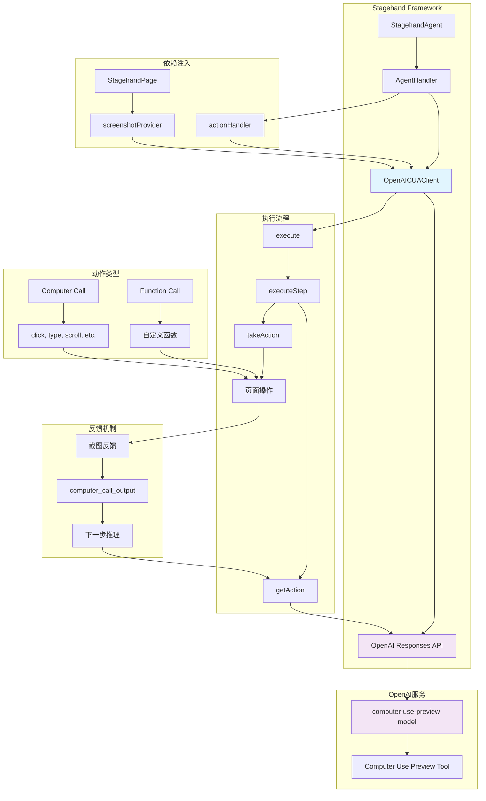

## 核心方法分析

### 1. 构造函数

```typescript
constructor(
  type: AgentType,
  modelName: string,
  userProvidedInstructions?: string,
  clientOptions?: Record<string, unknown>
)
```

**功能**:

- 初始化OpenAI客户端配置
- 处理API密钥、组织ID、基础URL等参数
- 支持环境变量和直接传参两种配置方式

**支持的clientOptions**:

- `apiKey`: API密钥
- `organization`: 组织ID
- `baseURL`: 自定义API端点
- `environment`: 运行环境

### 2. 主执行方法 - execute()

```typescript
async execute(executionOptions: AgentExecutionOptions): Promise<AgentResult>
```

**工作流程**:

1. **初始化** - 创建初始输入项目，设置计数器
2. **循环执行** - 在maxSteps限制内循环执行步骤
3. **步骤处理** - 调用executeStep()处理单个步骤
4. **结果累积** - 收集动作、消息和使用统计
5. **完成判断** - 检查任务是否完成或达到最大步数

**执行流程图**:

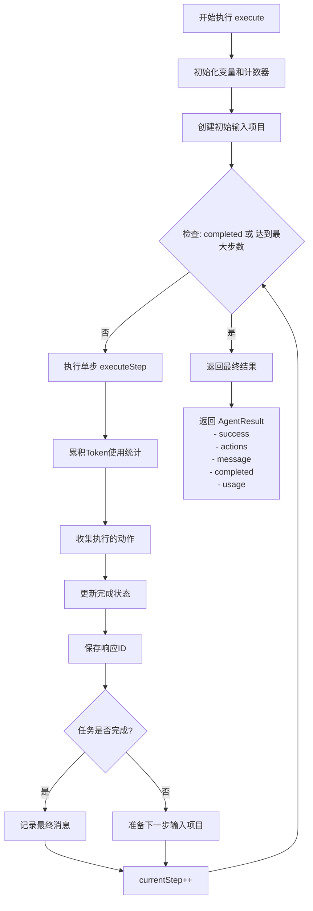

**返回值**:

```typescript
{
  success: boolean,        // 执行成功标志
  actions: AgentAction[],  // 执行的动作列表
  message: string,         // 最终消息
  completed: boolean,      // 任务完成标志
  usage: {                 // Token使用统计
    input_tokens: number,
    output_tokens: number,
    inference_time_ms: number
  }
}
```

### 3. 单步执行 - executeStep()

```typescript
async executeStep(
  inputItems: ResponseInputItem[],
  previousResponseId: string | undefined,
  logger: (message: LogLine) => void
): Promise<{...}>
```

**核心流程**:

1. **获取动作** - 调用getAction()获取AI决策
2. **解析响应** - 提取computer_call和function_call
3. **转换动作** - 转换为标准AgentAction格式
4. **执行动作** - 调用takeAction()执行操作
5. **状态更新** - 准备下一步的输入项目

**单步执行流程图**:

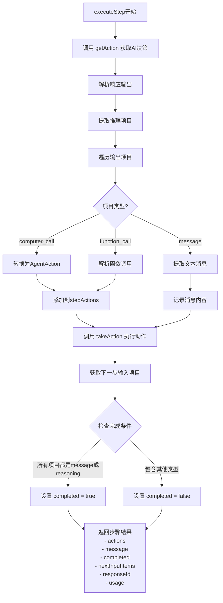

### 4. 动作获取 - getAction()

```typescript
async getAction(
  inputItems: ResponseInputItem[],
  previousResponseId?: string
): Promise<{...}>
```

**关键特性**:

- 使用OpenAI Responses API
- 支持Computer Use Preview工具
- 自动截断长消息
- 维护对话连续性（通过previous_response_id）

**请求参数**:

```typescript
{
  model: this.modelName,
  tools: [{
    type: "computer_use_preview",
    display_width: this.currentViewport.width,
    display_height: this.currentViewport.height,
    environment: this.environment
  }],
  input: inputItems,
  truncation: "auto",
  previous_response_id?: previousResponseId
}
```

### 5. 动作执行 - takeAction()

```typescript
async takeAction(
  output: ResponseItem[],
  logger: (message: LogLine) => void
): Promise<ResponseInputItem[]>
```

**处理流程**:

1. **遍历输出** - 处理所有响应项目
2. **Computer Call处理**:
   - 转换为AgentAction
   - 调用actionHandler执行
   - 捕获执行后截图
   - 创建computer_call_output响应
3. **Function Call处理**:
   - 解析函数参数
   - 执行函数调用
   - 返回执行结果
4. **错误处理** - 捕获异常并提供错误截图

**动作执行流程图**:

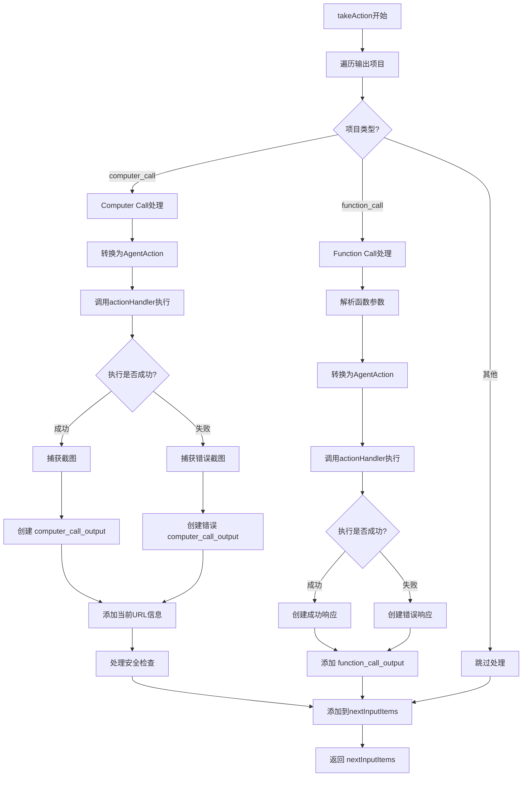

## OpenAI API响应机制详解

### Computer Call和Function Call的产生过程

很多开发者对OpenAI Computer Use API如何决定返回`computer_call`还是`function_call`感到困惑。让我详细解释这个过程：

**AI决策流程图**:

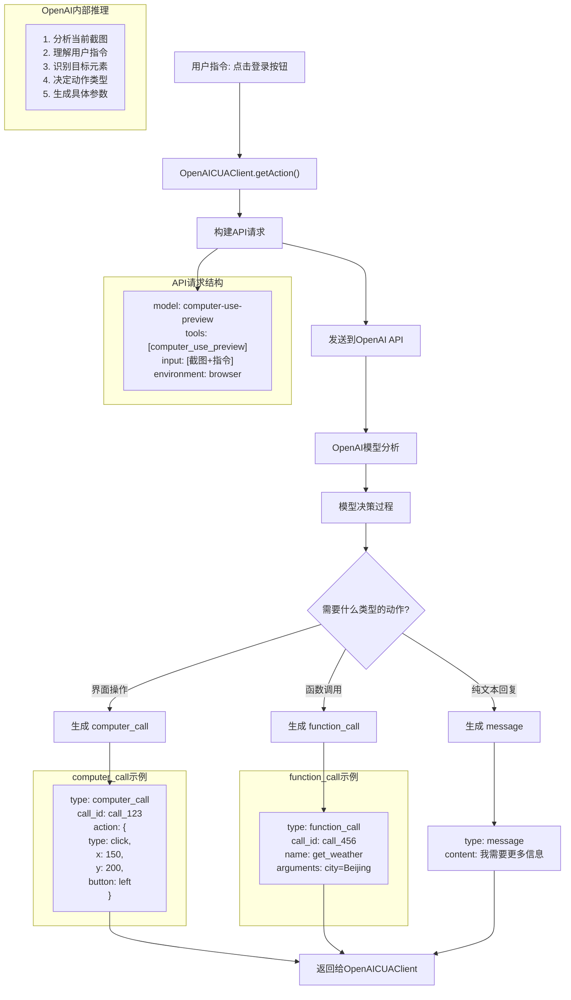

**响应处理流程图**:

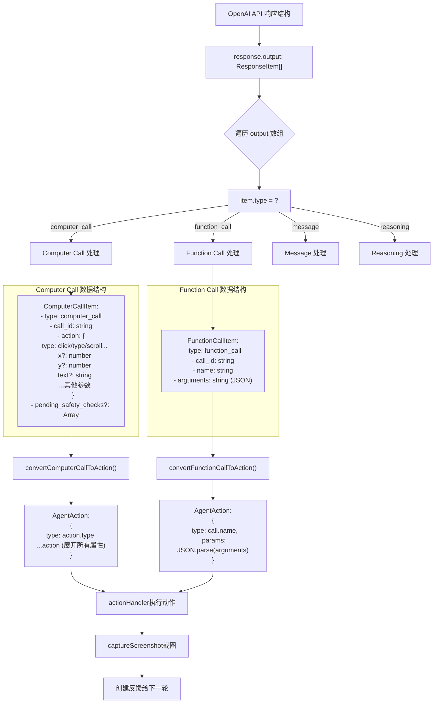

### 关键理解点

#### 1. Computer Call的触发条件

- **用途**: 直接的界面操作（点击、输入、滚动等）
- **决策依据**: 需要与当前可见界面元素交互
- **数据来源**: 基于截图的视觉分析
- **典型场景**: "点击按钮"、"输入文本"、"滚动页面"

#### 2. Function Call的触发条件

- **用途**: 调用预定义的功能函数
- **决策依据**: 需要执行非界面操作或复杂逻辑
- **数据来源**: 基于函数定义和参数需求
- **典型场景**: "获取天气信息"、"计算数学公式"、"查询数据库"

#### 3. 实际响应示例

**Computer Call示例**:

```json
{
  "type": "computer_call",
  "call_id": "call_abc123",
  "action": {
    "type": "click",
    "x": 150,
    "y": 200,
    "button": "left"
  }
}
```

**Function Call示例**:

```json
{
  "type": "function_call",
  "call_id": "call_def456",
  "name": "get_weather",
  "arguments": "{\"city\": \"Beijing\", \"unit\": \"celsius\"}"
}
```

**Message示例**:

```json
{
  "type": "message",
  "content": "我已经找到了登录按钮，准备点击它。"
}
```

### OpenAI Computer Use Preview模型的工作原理

#### 1. 视觉理解能力

- **多模态输入**: 同时处理文本指令和屏幕截图
- **元素识别**: 能够识别按钮、输入框、链接等UI元素
- **空间定位**: 计算精确的点击坐标
- **上下文理解**: 结合当前页面状态理解用户意图

#### 2. 决策机制

```typescript
// OpenAI内部推理过程（伪代码）
function decideActionType(instruction, screenshot, tools) {
  // 1. 分析截图内容
  const elements = analyzeScreenshot(screenshot);

  // 2. 理解用户指令
  const intent = parseInstruction(instruction);

  // 3. 匹配可用工具
  if (needsDirectUIInteraction(intent, elements)) {
    return createComputerCall(intent, elements);
  } else if (needsFunctionCall(intent, tools)) {
    return createFunctionCall(intent, tools);
  } else {
    return createMessage(intent);
  }
}
```

#### 3. Computer Call生成逻辑

当模型识别到需要界面操作时，会：

1. **定位目标元素**: 在截图中找到对应的UI元素
2. **计算坐标**: 确定精确的点击位置
3. **选择动作类型**: click、type、scroll、drag等
4. **生成参数**: x、y坐标，按钮类型，输入文本等

#### 4. Function Call生成逻辑

当模型判断需要调用函数时，会：

1. **识别函数名**: 根据任务需求选择合适的函数
2. **提取参数**: 从指令中解析出函数所需参数
3. **格式化调用**: 生成标准的函数调用格式

### API请求和响应的完整流程

#### 发送给OpenAI的数据

```typescript
{
  model: "computer-use-preview",
  tools: [{
    type: "computer_use_preview",
    display_width: this.currentViewport.width,
    display_height: this.currentViewport.height,
    environment: this.environment
  }],
  input: [
    {
      role: "system",
      content: "你是一个网页操作助手..."
    },
    {
      role: "user",
      content: "请点击登录按钮"
    },
    {
      type: "computer_call_output",
      call_id: "previous_call",
      output: {
        type: "input_image",
        image_url: "data:image/png;base64,iVBORw0KGgoAAAA..."
      }
    }
  ]
}
```

#### 从OpenAI接收的数据

```typescript
{
  id: "resp_abc123",
  output: [
    {
      type: "reasoning",
      id: "reasoning_1",
      content: "我需要分析截图找到登录按钮..."
    },
    {
      type: "computer_call",
      call_id: "call_abc123",
      action: {
        type: "click",
        x: 150,
        y: 200,
        button: "left"
      }
    }
  ],
  usage: {
    input_tokens: 1250,
    output_tokens: 45
  }
}
```

## 动作转换机制

### Computer Call转换

```typescript
private convertComputerCallToAction(call: ComputerCallItem): AgentAction | null
```

**转换策略**:

- 直接展开action对象的所有属性
- 保持原始的坐标、按钮等参数结构
- 支持所有Computer Use标准动作类型

**Computer Call详细处理流程**:

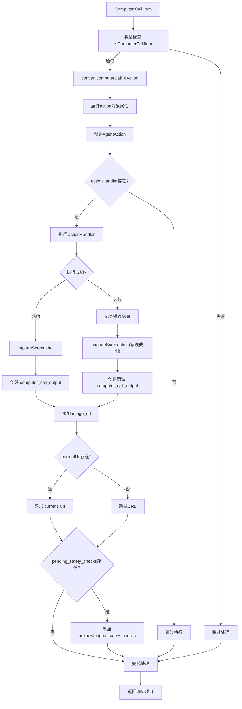

### Function Call转换

```typescript
private convertFunctionCallToAction(call: FunctionCallItem): AgentAction | null
```

**处理方式**:

- JSON解析函数参数
- 包装为标准AgentAction格式
- 错误容忍机制

## 截图机制

### 截图提供者模式

```typescript
setScreenshotProvider(provider: () => Promise<string>): void
```

**设计特点**:

- 依赖注入模式，支持不同截图实现
- 返回base64编码的PNG图像
- 用于AI视觉理解和决策

### 截图捕获

```typescript
async captureScreenshot(options?: {
  base64Image?: string;
  currentUrl?: string;
}): Promise<string>
```

**功能**:

- 支持选项参数覆盖
- 使用注入的截图提供者
- 自动添加data URI前缀
- 完善的错误处理

## 视窗和环境管理

### 视窗设置

```typescript
setViewport(width: number, height: number): void
setCurrentUrl(url: string): void
```

### 环境配置

支持的环境类型：

- `browser` - 浏览器环境（默认）
- `mac` - macOS桌面环境
- `windows` - Windows桌面环境
- `ubuntu` - Ubuntu桌面环境

## 错误处理策略

### 1. 网络错误处理

- API调用失败时抛出原始错误
- 保持错误信息的完整性

### 2. 动作执行错误

- 捕获执行异常
- 提供错误截图作为视觉反馈
- 继续后续流程而不中断

### 3. 截图错误处理

- 截图失败时使用文本错误信息
- 防止因截图问题导致整个流程中断

## 安全检查机制

### 安全检查确认

```typescript
acknowledged_safety_checks?: Array<{
  id: string;
  code: string;
  message: string;
}>
```

**功能**:

- 处理OpenAI安全检查提示
- 自动确认安全检查项目
- 确保流程连续性

## 使用统计追踪

### Token使用统计

```typescript
usage: {
  input_tokens: number,
  output_tokens: number,
  inference_time_ms: number
}
```

**追踪内容**:

- 输入token数量
- 输出token数量
- 推理时间（毫秒）
- 累积统计所有步骤

## 与Stagehand框架的集成

### 1. 依赖注入

- `screenshotProvider` - 由StagehandPage提供
- `actionHandler` - 由AgentHandler提供

### 2. 类型兼容

- 使用统一的AgentAction类型
- 兼容Stagehand的日志系统
- 支持框架的错误类型

### 3. 配置集成

- 支持环境变量配置
- 与stagehand.config.ts配置系统集成

## 最佳实践

### 1. 初始化配置

```typescript
const client = new OpenAICUAClient(
  "computer_use",
  "computer-use-preview",
  "You are a helpful assistant...",
  {
    apiKey: process.env.OPENAI_API_KEY,
    environment: "browser",
  },
);
```

### 2. 设置提供者

```typescript
client.setScreenshotProvider(() => page.screenshot({ encoding: "base64" }));
client.setActionHandler(async (action) => {
  // 执行动作逻辑
});
```

### 3. 执行任务

```typescript
const result = await client.execute({
  options: {
    instruction: "完成具体任务",
    maxSteps: 10,
  },
  logger: console.log,
});
```

## 注意事项

### 1. API兼容性

- 依赖OpenAI Computer Use Preview功能
- 需要支持Responses API的模型
- 当前主要支持 `computer-use-preview` 模型

### 2. 性能考虑

- 每步都需要截图，网络开销较大
- Token消耗随复杂度增加
- 推理时间取决于任务复杂度

### 3. 错误恢复

- 单步失败不会终止整个任务
- 提供视觉错误反馈
- 支持部分完成的任务结果

## 关键代码流程分析

### 执行循环核心逻辑

```typescript
while (!completed && currentStep < maxSteps) {
  // 1. 执行单步
  const result = await this.executeStep(inputItems, previousResponseId, logger);

  // 2. 累积统计
  totalInputTokens += result.usage.input_tokens;
  totalOutputTokens += result.usage.output_tokens;
  totalInferenceTime += result.usage.inference_time_ms;

  // 3. 收集动作
  actions.push(...result.actions);

  // 4. 更新状态
  completed = result.completed;
  previousResponseId = result.responseId;

  // 5. 准备下一步
  if (!completed) {
    inputItems = result.nextInputItems;
  }

  currentStep++;
}
```

### Computer Call处理流程

```typescript
// 1. 类型检查
if (item.type === "computer_call" && this.isComputerCallItem(item)) {
  // 2. 转换动作
  const action = this.convertComputerCallToAction(item);

  // 3. 执行动作
  if (action && this.actionHandler) {
    await this.actionHandler(action);
  }

  // 4. 捕获截图
  const screenshot = await this.captureScreenshot();

  // 5. 创建响应
  const outputItem = {
    type: "computer_call_output",
    call_id: item.call_id,
    output: {
      type: "input_image",
      image_url: screenshot,
    },
  };

  // 6. 添加上下文信息
  if (this.currentUrl) {
    outputItem.output.current_url = this.currentUrl;
  }
}
```

## 与其他Agent客户端的对比

### vs AnthropicCUAClient

| 特性     | OpenAICUAClient      | AnthropicCUAClient       |
| -------- | -------------------- | ------------------------ |
| API协议  | Responses API        | Messages API             |
| 工具类型 | computer_use_preview | computer_use             |
| 模型支持 | computer-use-preview | claude-3-7-sonnet-latest |
| 环境支持 | 4种环境              | 浏览器为主               |
| 安全检查 | 内置支持             | 较少限制                 |

### vs OperatorHandler

| 特性     | OpenAICUAClient    | OperatorHandler       |
| -------- | ------------------ | --------------------- |
| 复杂度   | 高（Computer Use） | 中（Sequential Tool） |
| 成本     | 高                 | 低                    |
| 视觉能力 | 强（每步截图）     | 弱（按需截图）        |
| 适用场景 | 复杂视觉任务       | 通用自动化            |

## 未来扩展方向

### 1. 多模态支持

- **视频流处理**: 支持连续视频流分析
- **音频交互**: 集成语音识别和合成
- **多屏幕支持**: 处理多显示器环境

### 2. 性能优化

- **智能截图缓存**: 避免重复截图
- **增量更新机制**: 只传输变化区域
- **压缩优化**: 优化图像传输

### 3. 功能扩展

- **自定义工具集成**: 支持用户定义工具
- **插件系统**: 模块化功能扩展
- **更多环境类型**: 支持移动端、嵌入式设备

### 4. 企业级特性

- **审计日志**: 详细的操作记录
- **权限控制**: 细粒度访问控制
- **监控告警**: 实时状态监控

## 总结

`OpenAICUAClient`作为Stagehand框架中Computer Use功能的核心实现，提供了强大的AI视觉操作能力。它通过OpenAI的Computer Use Preview API，实现了真正的"看屏幕、做决策、执行操作"的智能代理功能。

**主要优势**:

- 强大的视觉理解能力
- 完整的错误处理机制
- 灵活的依赖注入设计
- 丰富的环境支持

**适用场景**:

- 复杂的UI自动化任务
- 需要视觉识别的操作
- 多步骤的智能决策流程
- 高精度的用户交互模拟

### 总结：Computer Call vs Function Call

| 特征         | Computer Call             | Function Call         |
| ------------ | ------------------------- | --------------------- |
| **触发条件** | 需要直接操作界面元素      | 需要调用预定义功能    |
| **数据依赖** | 依赖当前截图分析          | 依赖函数定义和参数    |
| **坐标信息** | 包含精确的x,y坐标         | 不包含坐标信息        |
| **执行方式** | 模拟鼠标/键盘操作         | 调用JavaScript函数    |
| **反馈机制** | 执行后截图反馈            | 简单的成功/失败状态   |
| **典型动作** | click, type, scroll, drag | 自定义业务逻辑函数    |
| **参数结构** | action对象                | arguments字符串(JSON) |

**关键要点**:

1. **OpenAI的computer-use-preview模型**具有强大的视觉理解能力，能够"看懂"截图并生成精确的操作指令
2. **Computer Call**是模型的核心功能，专门用于界面操作，包含了所有必要的坐标和参数信息
3. **Function Call**是扩展功能，允许调用自定义函数来执行复杂的业务逻辑
4. **模型决策**基于当前截图、用户指令和可用工具的综合分析
5. **反馈循环**通过截图确保模型能够看到操作结果，形成闭环控制

这种设计使得OpenAI Computer Use API能够真正实现"看屏幕、做决策、执行操作"的智能自动化！🎯

这个分析为开发者提供了深入理解和使用OpenAICUAClient的完整指南。

## 流程图说明

本文档包含了以下流程图，帮助理解OpenAICUAClient的工作原理：

### 1. 🏗️ 整体架构图

展示了OpenAICUAClient在Stagehand框架中的位置，以及与其他组件（StagehandAgent、AgentHandler、OpenAI API等）的关系。

### 2. 🔄 主执行流程图 (execute)

描述了从任务开始到完成的完整执行循环，包括初始化、步骤执行、状态更新和结果返回。

### 3. ⚡ 单步执行流程图 (executeStep)

详细展示了单个执行步骤的内部流程，从获取AI决策到准备下一步输入的完整过程。

### 4. 🎯 动作执行流程图 (takeAction)

说明了如何处理AI返回的不同类型动作（Computer Call、Function Call），包括执行和错误处理。

### 5. 🖥️ Computer Call详细处理流程

深入展示了Computer Call从接收到完成的详细处理步骤，包括类型检查、动作执行、截图反馈等。

这些流程图相互配合，形成了对OpenAICUAClient完整工作机制的可视化说明，便于开发者快速理解和调试。

## OpenAI Computer Use API 决策机制深度解析

### getAction 如何决定返回 computer_call 还是 function_call？

这是OpenAI Computer Use API的核心机制之一。虽然在代码中我们只定义了一个工具 `computer_use_preview`，但OpenAI模型内部有智能决策系统来确定返回哪种响应类型。

#### 1. 工具配置的关键

```typescript
// 在 getAction 方法中，只定义了一个工具
tools: [
  {
    type: "computer_use_preview",
    display_width: this.currentViewport.width,
    display_height: this.currentViewport.height,
    environment: this.environment,
  },
];
```

**重要理解**：`computer_use_preview` 不是一个简单的工具，而是一个**多模态智能决策系统**，它包含了：

- 视觉理解能力
- UI元素识别能力
- 操作决策能力
- 函数调用判断能力

#### 2. OpenAI模型的内部决策流程

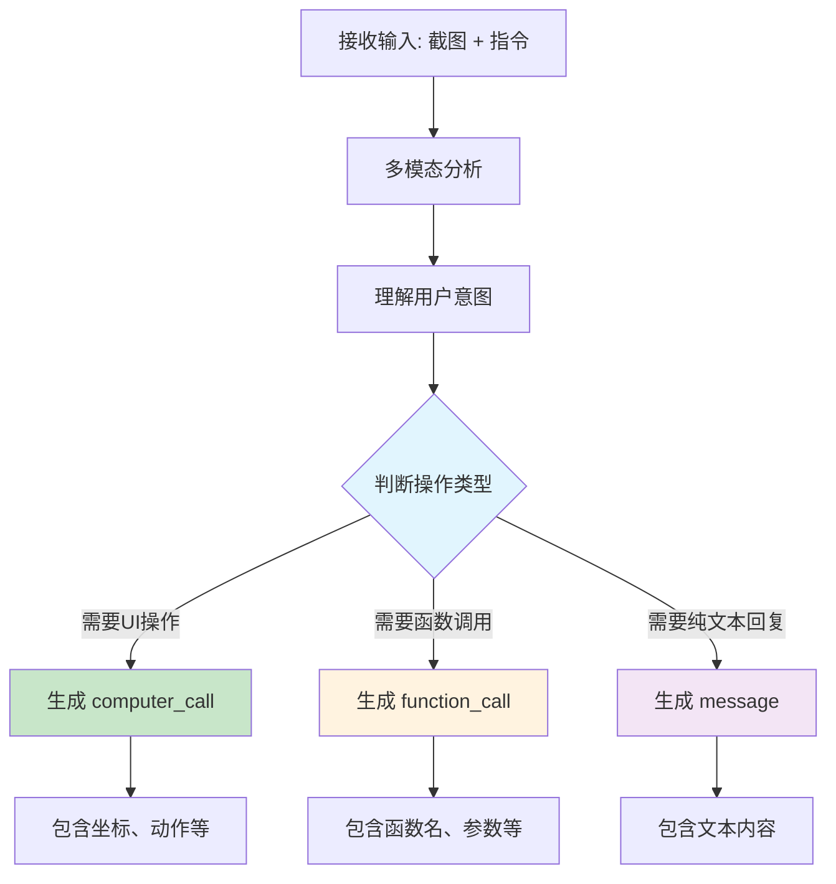

#### 3. 决策的关键因素

##### 3.1 视觉上下文分析

OpenAI模型会分析当前屏幕截图，识别：

- **可点击元素**：按钮、链接、输入框等
- **UI组件位置**：精确的x,y坐标
- **页面结构**：表单、菜单、对话框等
- **文本内容**：标签、提示信息等

##### 3.2 指令意图识别

模型分析用户指令，判断是否需要：

- **直接UI操作**：点击、输入、滚动等 → `computer_call`
- **业务逻辑调用**：数据查询、计算、API调用等 → `function_call`
- **信息查询**：状态检查、信息提取等 → `message`

##### 3.3 上下文历史分析

模型考虑对话历史，包括：

- 之前的操作结果
- 当前操作的连续性
- 任务的完成状态

#### 4. 具体的决策示例

| 用户指令                   | 页面状态         | 决策结果                          | 原因                               |
| -------------------------- | ---------------- | --------------------------------- | ---------------------------------- |
| "点击登录按钮"             | 页面显示登录按钮 | `computer_call`                   | 需要直接UI操作，模型识别到按钮位置 |
| "获取当前页面标题"         | 任意页面         | `function_call`                   | 需要调用页面信息提取函数           |
| "当前页面是什么？"         | 任意页面         | `message` + 可能的`function_call` | 需要分析页面内容，可能需要函数辅助 |
| "在搜索框输入'OpenAI'"     | 页面有搜索框     | `computer_call`                   | 需要定位搜索框并输入文本           |
| "保存当前页面信息到数据库" | 任意页面         | `function_call`                   | 需要调用数据保存函数               |

#### 5. computer_call vs function_call 的本质区别

##### computer_call (UI操作)

```json
{
  "type": "computer_call",
  "call_id": "call_123",
  "action": {
    "type": "click",
    "x": 150,
    "y": 200,
    "button": "left"
  }
}
```

- **用于**：直接的屏幕操作
- **包含**：坐标、动作类型、文本内容
- **依赖**：视觉理解和空间定位
- **反馈**：操作后的新截图

##### function_call (函数调用)

```json
{
  "type": "function_call",
  "call_id": "call_456",
  "name": "extract_page_info",
  "arguments": "{\"selector\": \"title\"}"
}
```

- **用于**：业务逻辑和数据处理
- **包含**：函数名、参数
- **依赖**：预定义的函数接口
- **反馈**：函数执行结果

#### 6. 高级决策场景

##### 6.1 混合操作场景

某些复杂指令可能需要多个步骤：

```
用户: "登录网站并获取用户信息"
1. computer_call: 点击登录按钮
2. computer_call: 输入用户名密码
3. computer_call: 点击提交
4. function_call: 提取用户信息
```

##### 6.2 智能回退机制

当UI操作失败时，模型可能切换策略：

```
尝试: computer_call (点击按钮)
失败: 按钮不可点击
回退: function_call (查找替代方案)
```

#### 7. 影响决策的配置参数

##### 7.1 环境设置

```typescript
environment: "browser"; // 影响可用操作类型
```

##### 7.2 视窗信息

```typescript
display_width: 1024,
display_height: 768  // 影响坐标计算和UI识别
```

##### 7.3 历史上下文

```typescript
previous_response_id: "resp_123"; // 保持对话连贯性
```

#### 8. 开发建议

##### 8.1 指令优化

```typescript
// 不够明确
"做点什么";

// 更明确的指令
"点击页面上的'提交'按钮"; // 会生成 computer_call
"提取当前页面的标题文本"; // 会生成 function_call
```

##### 8.2 错误处理

```typescript
// 预期 computer_call 但收到 function_call 时的处理
if (item.type === "function_call" && expectedComputerCall) {
  // 可能是模型判断UI操作不可行
  // 执行函数调用作为备选方案
}
```

##### 8.3 性能优化

```typescript
// 利用模型的智能决策，避免强制指定操作类型
// 让模型自主选择最合适的操作方式
```

#### 9. 关键理解要点

1. **单一工具，多种输出**：`computer_use_preview` 是一个智能决策系统，不是单纯的工具
2. **视觉驱动决策**：模型基于视觉理解来判断最适合的操作类型
3. **上下文感知**：决策考虑当前状态、历史操作和目标任务
4. **自适应策略**：模型可以根据情况动态调整操作策略
5. **无需手动指定**：开发者不需要（也不应该）手动指定返回类型

这种设计使得OpenAI Computer Use API能够智能地在UI操作和函数调用之间做出最优选择，实现真正的多模态智能自动化。

## 截图传递给 Computer-Use-Preview 模型的完整流程分析

### 概述

在OpenAI Computer Use API中，截图是AI模型进行视觉理解和决策的核心数据。理解截图如何传递给`computer-use-preview`模型对于掌握整个系统的工作原理至关重要。

### 截图传递的完整链路

#### 1. 截图提供者设置阶段

**位置**: `lib/handlers/agentHandler.ts` (第58行)

```typescript
// AgentHandler 设置截图提供者
this.agentClient.setScreenshotProvider(async () => {
  const screenshot = await this.stagehandPage.page.screenshot({
    fullPage: false,
  });
  return screenshot.toString("base64");
});
```

**关键点**：

- AgentHandler 给 OpenAICUAClient 设置了一个截图回调函数
- 回调函数使用 Playwright 的 `page.screenshot()` 获取当前页面截图
- 截图以 base64 格式返回，便于API传输

#### 2. 截图传递的关键时机

##### 🎯 初始执行时的截图传递

**时机**: 每次调用 `getAction()` 获取AI决策时

```typescript
// 在 OpenAICUAClient.getAction() 方法中
async getAction(
  inputItems: ResponseInputItem[],
  previousResponseId?: string
): Promise<OpenAIResponse>
```

**传递流程**:

1. `inputItems` 数组包含对话历史和截图信息
2. 截图以 `computer_call_output` 类型的项目传递
3. 发送给 OpenAI Responses API

##### 🔄 执行循环中的截图传递

**主要传递点**: 在 `OpenAICUAClient.takeAction()` 方法中

```typescript
// takeAction 方法中的核心流程
if (item.type === "computer_call") {
  // 1. 执行操作
  await this.actionHandler(action);

  // 2. 获取操作后的截图
  const screenshot = await this.captureScreenshot();

  // 3. 包装为 computer_call_output
  const outputItem: ComputerCallOutputItem = {
    type: "computer_call_output",
    call_id: item.call_id,
    output: {
      type: "input_image",
      image_url: screenshot, // 这里就是传递给AI的截图
    },
  };

  // 4. 添加到下一轮输入
  nextInputItems.push(outputItem);
}
```

#### 3. 截图传递的详细流程图

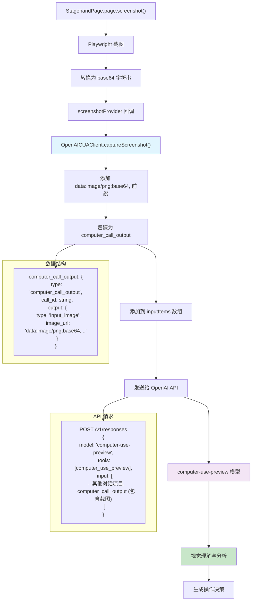

#### 4. 截图数据在API中的结构

##### 发送给OpenAI的完整请求结构

```typescript
{
  model: "computer-use-preview",
  tools: [{
    type: "computer_use_preview",
    display_width: this.currentViewport.width,
    display_height: this.currentViewport.height,
    environment: this.environment
  }],
  input: [
    // 系统消息
    {
      role: "system",
      content: "You are a helpful assistant..."
    },
    // 用户指令
    {
      role: "user",
      content: "点击登录按钮"
    },
    // 当前页面截图 - 关键数据
    {
      type: "computer_call_output",
      call_id: "previous_call",
      output: {
        type: "input_image",
        image_url: "data:image/png;base64,iVBORw0KGgoAAAANSUhEUgAAA..." // 完整的base64截图
      }
    }
  ],
  previous_response_id: "resp_previous_123"
}
```

##### OpenAI模型如何处理截图

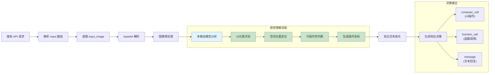

#### 5. 关键代码位置详解

##### 5.1 截图提供者注入

```typescript
// 位置: lib/handlers/agentHandler.ts:58
this.agentClient.setScreenshotProvider(async () => {
  const screenshot = await this.stagehandPage.page.screenshot({
    fullPage: false, // 只截取当前视窗，不是整个页面
  });
  return screenshot.toString("base64"); // 转换为base64格式
});
```

##### 5.2 截图捕获实现

```typescript
// 位置: lib/agent/OpenAICUAClient.ts:600-626
async captureScreenshot(options?: {
  base64Image?: string;
  currentUrl?: string;
}): Promise<string> {
  if (options?.base64Image) {
    // 如果提供了base64图像，直接使用
    return options.base64Image.startsWith("data:image/png;base64,")
      ? options.base64Image
      : `data:image/png;base64,${options.base64Image}`;
  }

  try {
    if (!this.screenshotProvider) {
      throw new Error("Screenshot provider not set");
    }

    // 调用注入的截图提供者
    const base64Image = await this.screenshotProvider();

    // 确保有正确的data URI前缀
    return base64Image.startsWith("data:image/png;base64,")
      ? base64Image
      : `data:image/png;base64,${base64Image}`;
  } catch (error) {
    // 截图失败时的错误处理
    return `Error capturing screenshot: ${error}`;
  }
}
```

##### 5.3 截图包装为API输入

```typescript
// 位置: lib/agent/OpenAICUAClient.ts:377+ (takeAction方法中)
if (item.type === "computer_call") {
  const action = this.convertComputerCallToAction(item);

  if (action && this.actionHandler) {
    try {
      // 执行动作
      await this.actionHandler(action);
    } catch (actionError) {
      // 动作执行失败也要截图，用于AI理解失败原因
    }
  }

  // 获取执行后的截图
  const screenshot = await this.captureScreenshot();

  // 创建 computer_call_output 项目
  const outputItem: ComputerCallOutputItem = {
    type: "computer_call_output",
    call_id: item.call_id,
    output: {
      type: "input_image",
      image_url: screenshot, // 传递给下一轮AI分析的截图
    },
  };

  // 添加当前URL信息
  if (this.currentUrl) {
    outputItem.output.current_url = this.currentUrl;
  }

  // 添加到下一轮输入
  nextInputItems.push(outputItem);
}
```

#### 6. 截图传递的时序图

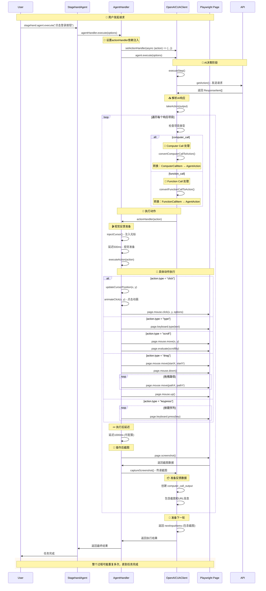

### 🔍 关键转换代码详解

#### 3.1 ActionHandler设置 - 依赖注入的关键

**位置**: `lib/handlers/agentHandler.ts:67-106`

```typescript
// 🎯 关键：在这里建立了AI响应到Playwright命令的桥梁
this.agentClient.setActionHandler(async (action) => {
  // 默认动作间延迟1秒
  const defaultDelay = 1000;
  const waitBetweenActions =
    (this.options.clientOptions?.waitBetweenActions as number) || defaultDelay;

  try {
    // 1. 注入光标 (视觉反馈)
    await this.injectCursor();

    // 2. 执行前延迟 (500ms)
    await new Promise((resolve) => setTimeout(resolve, 500));

    // 3. 🚀 核心：执行动作转换
    await this.executeAction(action);

    // 4. 执行后延迟 (可配置)
    await new Promise((resolve) => setTimeout(resolve, waitBetweenActions));

    // 5. 📸 操作后截图
    await this.captureAndSendScreenshot();
  } catch (error) {
    // 错误处理...
  }
});
```

#### 3.2 Computer Call转换 - AI视觉操作转换

**位置**: `lib/agent/OpenAICUAClient.ts:571-583`

```typescript
private convertComputerCallToAction(call: ComputerCallItem): AgentAction | null {
  const { action } = call;

  // 🎯 关键：直接展开action对象的所有属性
  // 这确保了x, y, button等属性直接可访问
  return {
    type: action.type as string,
    ...action, // 展开所有属性
  };
}

// 转换示例：
// ComputerCallItem.action: { type: "click", x: 150, y: 200, button: "left" }
// ↓
// AgentAction: { type: "click", x: 150, y: 200, button: "left" }
```

#### 3.3 Function Call转换 - AI函数调用转换

**位置**: `lib/agent/OpenAICUAClient.ts:584-598`

```typescript
private convertFunctionCallToAction(call: FunctionCallItem): AgentAction | null {
  try {
    const args = JSON.parse(call.arguments);

    return {
      type: call.name,
      params: args,
    };
  } catch (error) {
    console.error("Error parsing function call arguments:", error);
    return null;
  }
}

// 转换示例：
// FunctionCallItem: { name: "goto", arguments: '{"url": "https://example.com"}' }
// ↓
// AgentAction: { type: "goto", params: { url: "https://example.com" } }
```

#### 3.4 executeAction - AgentAction到Playwright命令

**位置**: `lib/handlers/agentHandler.ts:201-449`

```typescript
private async executeAction(action: AgentAction): Promise<ActionExecutionResult> {
  try {
    switch (action.type) {
      case "click": {
        const { x, y, button = "left" } = action;

        // 1. 更新光标位置
        await this.updateCursorPosition(x as number, y as number);

        // 2. 点击动画
        await this.animateClick(x as number, y as number);
        await new Promise(resolve => setTimeout(resolve, 300));

        // 3. 🎯 核心：执行Playwright点击命令
        await this.stagehandPage.page.mouse.click(x as number, y as number, {
          button: button as "left" | "right",
        });

        // 4. 处理新标签页
        const newOpenedTab = await Promise.race([
          new Promise<Page | null>(resolve => {
            this.stagehandPage.context.once("page", page => resolve(page));
            setTimeout(() => resolve(null), 1500);
          }),
        ]);

        if (newOpenedTab) {
          await newOpenedTab.close();
          await this.stagehandPage.page.goto(newOpenedTab.url());
        }

        return { success: true };
      }

      case "type": {
        const { text } = action;
        // 🎯 直接调用Playwright键盘输入
        await this.stagehandPage.page.keyboard.type(text as string);
        return { success: true };
      }

      case "scroll": {
        const { x, y, scroll_x = 0, scroll_y = 0 } = action;
        // 🎯 Playwright鼠标移动 + JavaScript滚动
        await this.stagehandPage.page.mouse.move(x as number, y as number);
        await this.stagehandPage.page.evaluate(
          ({ scrollX, scrollY }) => window.scrollBy(scrollX, scrollY),
          { scrollX: scroll_x as number, scrollY: scroll_y as number }
        );
        return { success: true };
      }

      case "drag": {
        const { path } = action;
        if (Array.isArray(path) && path.length >= 2) {
          const start = path[0];

          // 🎯 Playwright拖拽操作序列
          await this.stagehandPage.page.mouse.move(start.x, start.y);
          await this.stagehandPage.page.mouse.down();

          for (let i = 1; i < path.length; i++) {
            await this.stagehandPage.page.mouse.move(path[i].x, path[i].y);
          }

          await this.stagehandPage.page.mouse.up();
        }
        return { success: true };
      }

      case "keypress": {
        const { keys } = action;
        if (Array.isArray(keys)) {
          for (const key of keys) {
            // 🎯 特殊按键映射和Playwright按键执行
            if (key.includes("ENTER")) {
              await this.stagehandPage.page.keyboard.press("Enter");
            } else if (key.includes("SPACE")) {
              await this.stagehandPage.page.keyboard.press(" ");
            }
            // ... 更多按键映射
            else {
              const playwrightKey = this.convertKeyName(key);
              await this.stagehandPage.page.keyboard.press(playwrightKey);
            }
          }
        }
        return { success: true };
      }

      case "function": {
        const { name, arguments: args = {} } = action;

        // 🎯 特殊函数处理
        if (name === "goto" && "url" in args) {
          await this.stagehandPage.page.goto(args.url as string);
          this.updateClientUrl();
          return { success: true };
        } else if (name === "back") {
          await this.stagehandPage.page.goBack();
          this.updateClientUrl();
          return { success: true };
        }
        // ... 更多函数处理

        return { success: false, error: `Unsupported function: ${name}` };
      }

      default:
        return {
          success: false,
          error: `Unsupported action type: ${action.type}`
        };
    }
  } catch (error) {
    // 错误处理和日志记录
    return { success: false, error: error.message };
  }
}
```

### 🎯 支持的动作类型映射表

| AI动作类型       | AgentAction属性              | Playwright命令                     | 说明         |
| ---------------- | ---------------------------- | ---------------------------------- | ------------ |
| **click**        | `{x, y, button}`             | `page.mouse.click(x, y, {button})` | 鼠标点击     |
| **double_click** | `{x, y}`                     | `page.mouse.dblclick(x, y)`        | 双击         |
| **type**         | `{text}`                     | `page.keyboard.type(text)`         | 文本输入     |
| **keypress**     | `{keys: string[]}`           | `page.keyboard.press(key)`         | 按键操作     |
| **scroll**       | `{x, y, scroll_x, scroll_y}` | `page.evaluate(scrollBy)`          | 页面滚动     |
| **drag**         | `{path: Point[]}`            | `mouse.down() → move() → up()`     | 拖拽操作     |
| **move**         | `{x, y}`                     | `page.mouse.move(x, y)`            | 鼠标移动     |
| **function**     | `{name, arguments}`          | 自定义函数处理                     | 特殊函数调用 |

### 💡 关键设计亮点

#### 4.1 依赖注入架构

- **解耦**: OpenAICUAClient不直接依赖Playwright
- **灵活**: 可以轻松替换不同的执行器实现
- **测试友好**: 可以注入mock执行器进行测试

#### 4.2 视觉反馈系统

- **光标注入**: 实时显示AI操作位置
- **点击动画**: 视觉化点击效果
- **执行延迟**: 便于观察AI操作过程

#### 4.3 错误容错机制

- **截图失败**: 不影响主流程执行
- **动作失败**: 提供错误截图供AI分析
- **光标注入失败**: 静默忽略，不中断操作

#### 4.4 新标签页处理

- **自动检测**: 监听新标签页打开事件
- **智能处理**: 关闭新标签页，在当前页面导航
- **URL同步**: 确保客户端URL状态同步

### 🔧 性能优化考虑

#### 5.1 操作间延迟

```typescript
// 可配置的延迟设置
const waitBetweenActions =
  (this.options.clientOptions?.waitBetweenActions as number) || 1000;
```

#### 5.2 视觉动画

```typescript
// 点击动画延迟
await new Promise((resolve) => setTimeout(resolve, 300));
```

#### 5.3 截图策略

- **操作后截图**: 每次动作执行后自动截图
- **错误截图**: 失败时也截图供AI分析
- **异步处理**: 截图失败不阻塞主流程

### 📊 完整数据流转示例

#### OpenAI响应 → Playwright命令的具体例子

```typescript
// 1. OpenAI API 返回
{
  type: "computer_call",
  call_id: "call_123",
  action: {
    type: "click",
    x: 150,
    y: 200,
    button: "left"
  }
}

// 2. convertComputerCallToAction 转换
{
  type: "click",
  x: 150,
  y: 200,
  button: "left"
}

// 3. executeAction 执行
await this.stagehandPage.page.mouse.click(150, 200, { button: "left" });
```

### 🎯 总结

AI答案转化为Playwright命令的完整流程体现了Stagehand框架的核心设计理念：

1. **智能解析**: 将AI的抽象指令转换为具体动作
2. **视觉友好**: 提供丰富的视觉反馈和动画效果
3. **错误容错**: 完善的错误处理和恢复机制
4. **高度解耦**: 通过依赖注入实现组件间的松耦合
5. **扩展性强**: 支持自定义动作类型和执行器

这个机制让AI真正具备了"看得懂页面、做得出操作"的能力，实现了从AI理解到浏览器操作的完美闭环！🚀

## AI答案转化为Playwright命令的完整调用链分析

### 概述

这是Stagehand框架中最核心的机制之一：将OpenAI模型返回的抽象AI指令转换为具体的Playwright浏览器操作命令。整个转换过程涉及多个组件协作，形成了完整的执行链路。

### 🔄 完整的调用链路

#### 1. 核心组件及其职责

| 组件                | 文件位置                       | 主要职责                                    |
| ------------------- | ------------------------------ | ------------------------------------------- |
| **OpenAICUAClient** | `lib/agent/OpenAICUAClient.ts` | 与OpenAI API交互，解析AI响应                |
| **AgentHandler**    | `lib/handlers/agentHandler.ts` | 动作执行器，将AgentAction转为Playwright命令 |
| **StagehandPage**   | `lib/StagehandPage.ts`         | Playwright页面封装，提供底层操作能力        |

#### 2. 数据转换流程

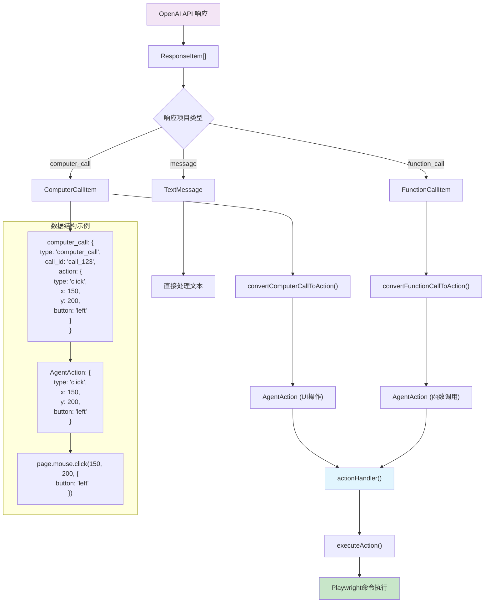

### 📋 完整的调用时序图


### 🔍 关键转换代码详解

#### 3.1 ActionHandler设置 - 依赖注入的关键

**位置**: `lib/handlers/agentHandler.ts:67-106`

```typescript
// 🎯 关键：在这里建立了AI响应到Playwright命令的桥梁
this.agentClient.setActionHandler(async (action) => {
  // 默认动作间延迟1秒
  const defaultDelay = 1000;
  const waitBetweenActions =
    (this.options.clientOptions?.waitBetweenActions as number) || defaultDelay;

  try {
    // 1. 注入光标 (视觉反馈)
    await this.injectCursor();

    // 2. 执行前延迟 (500ms)
    await new Promise((resolve) => setTimeout(resolve, 500));

    // 3. 🚀 核心：执行动作转换
    await this.executeAction(action);

    // 4. 执行后延迟 (可配置)
    await new Promise((resolve) => setTimeout(resolve, waitBetweenActions));

    // 5. 📸 操作后截图
    await this.captureAndSendScreenshot();
  } catch (error) {
    // 错误处理...
  }
});
```

#### 3.2 Computer Call转换 - AI视觉操作转换

**位置**: `lib/agent/OpenAICUAClient.ts:571-583`

```typescript
private convertComputerCallToAction(call: ComputerCallItem): AgentAction | null {
  const { action } = call;

  // 🎯 关键：直接展开action对象的所有属性
  // 这确保了x, y, button等属性直接可访问
  return {
    type: action.type as string,
    ...action, // 展开所有属性
  };
}

// 转换示例：
// ComputerCallItem.action: { type: "click", x: 150, y: 200, button: "left" }
// ↓
// AgentAction: { type: "click", x: 150, y: 200, button: "left" }
```

#### 3.3 Function Call转换 - AI函数调用转换

**位置**: `lib/agent/OpenAICUAClient.ts:584-598`

```typescript
private convertFunctionCallToAction(call: FunctionCallItem): AgentAction | null {
  try {
    const args = JSON.parse(call.arguments);

    return {
      type: call.name,
      params: args,
    };
  } catch (error) {
    console.error("Error parsing function call arguments:", error);
    return null;
  }
}

// 转换示例：
// FunctionCallItem: { name: "goto", arguments: '{"url": "https://example.com"}' }
// ↓
// AgentAction: { type: "goto", params: { url: "https://example.com" } }
```

#### 3.4 executeAction - AgentAction到Playwright命令

**位置**: `lib/handlers/agentHandler.ts:201-449`

```typescript
private async executeAction(action: AgentAction): Promise<ActionExecutionResult> {
  try {
    switch (action.type) {
      case "click": {
        const { x, y, button = "left" } = action;

        // 1. 更新光标位置
        await this.updateCursorPosition(x as number, y as number);

        // 2. 点击动画
        await this.animateClick(x as number, y as number);
        await new Promise(resolve => setTimeout(resolve, 300));

        // 3. 🎯 核心：执行Playwright点击命令
        await this.stagehandPage.page.mouse.click(x as number, y as number, {
          button: button as "left" | "right",
        });

        // 4. 处理新标签页
        const newOpenedTab = await Promise.race([
          new Promise<Page | null>(resolve => {
            this.stagehandPage.context.once("page", page => resolve(page));
            setTimeout(() => resolve(null), 1500);
          }),
        ]);

        if (newOpenedTab) {
          await newOpenedTab.close();
          await this.stagehandPage.page.goto(newOpenedTab.url());
        }

        return { success: true };
      }

      case "type": {
        const { text } = action;
        // 🎯 直接调用Playwright键盘输入
        await this.stagehandPage.page.keyboard.type(text as string);
        return { success: true };
      }

      case "scroll": {
        const { x, y, scroll_x = 0, scroll_y = 0 } = action;
        // 🎯 Playwright鼠标移动 + JavaScript滚动
        await this.stagehandPage.page.mouse.move(x as number, y as number);
        await this.stagehandPage.page.evaluate(
          ({ scrollX, scrollY }) => window.scrollBy(scrollX, scrollY),
          { scrollX: scroll_x as number, scrollY: scroll_y as number }
        );
        return { success: true };
      }

      case "drag": {
        const { path } = action;
        if (Array.isArray(path) && path.length >= 2) {
          const start = path[0];

          // 🎯 Playwright拖拽操作序列
          await this.stagehandPage.page.mouse.move(start.x, start.y);
          await this.stagehandPage.page.mouse.down();

          for (let i = 1; i < path.length; i++) {
            await this.stagehandPage.page.mouse.move(path[i].x, path[i].y);
          }

          await this.stagehandPage.page.mouse.up();
        }
        return { success: true };
      }

      case "keypress": {
        const { keys } = action;
        if (Array.isArray(keys)) {
          for (const key of keys) {
            // 🎯 特殊按键映射和Playwright按键执行
            if (key.includes("ENTER")) {
              await this.stagehandPage.page.keyboard.press("Enter");
            } else if (key.includes("SPACE")) {
              await this.stagehandPage.page.keyboard.press(" ");
            }
            // ... 更多按键映射
            else {
              const playwrightKey = this.convertKeyName(key);
              await this.stagehandPage.page.keyboard.press(playwrightKey);
            }
          }
        }
        return { success: true };
      }

      case "function": {
        const { name, arguments: args = {} } = action;

        // 🎯 特殊函数处理
        if (name === "goto" && "url" in args) {
          await this.stagehandPage.page.goto(args.url as string);
          this.updateClientUrl();
          return { success: true };
        } else if (name === "back") {
          await this.stagehandPage.page.goBack();
          this.updateClientUrl();
          return { success: true };
        }
        // ... 更多函数处理

        return { success: false, error: `Unsupported function: ${name}` };
      }

      default:
        return {
          success: false,
          error: `Unsupported action type: ${action.type}`
        };
    }
  } catch (error) {
    // 错误处理和日志记录
    return { success: false, error: error.message };
  }
}
```

### 🎯 支持的动作类型映射表

| AI动作类型       | AgentAction属性              | Playwright命令                     | 说明         |
| ---------------- | ---------------------------- | ---------------------------------- | ------------ |
| **click**        | `{x, y, button}`             | `page.mouse.click(x, y, {button})` | 鼠标点击     |
| **double_click** | `{x, y}`                     | `page.mouse.dblclick(x, y)`        | 双击         |
| **type**         | `{text}`                     | `page.keyboard.type(text)`         | 文本输入     |
| **keypress**     | `{keys: string[]}`           | `page.keyboard.press(key)`         | 按键操作     |
| **scroll**       | `{x, y, scroll_x, scroll_y}` | `page.evaluate(scrollBy)`          | 页面滚动     |
| **drag**         | `{path: Point[]}`            | `mouse.down() → move() → up()`     | 拖拽操作     |
| **move**         | `{x, y}`                     | `page.mouse.move(x, y)`            | 鼠标移动     |
| **function**     | `{name, arguments}`          | 自定义函数处理                     | 特殊函数调用 |

### 💡 关键设计亮点

#### 4.1 依赖注入架构

- **解耦**: OpenAICUAClient不直接依赖Playwright
- **灵活**: 可以轻松替换不同的执行器实现
- **测试友好**: 可以注入mock执行器进行测试

#### 4.2 视觉反馈系统

- **光标注入**: 实时显示AI操作位置
- **点击动画**: 视觉化点击效果
- **执行延迟**: 便于观察AI操作过程

#### 4.3 错误容错机制

- **截图失败**: 不影响主流程执行
- **动作失败**: 提供错误截图供AI分析
- **光标注入失败**: 静默忽略，不中断操作

#### 4.4 新标签页处理

- **自动检测**: 监听新标签页打开事件
- **智能处理**: 关闭新标签页，在当前页面导航
- **URL同步**: 确保客户端URL状态同步

### 🔧 性能优化考虑

#### 5.1 操作间延迟

```typescript
// 可配置的延迟设置
const waitBetweenActions =
  (this.options.clientOptions?.waitBetweenActions as number) || 1000;
```

#### 5.2 视觉动画

```typescript
// 点击动画延迟
await new Promise((resolve) => setTimeout(resolve, 300));
```

#### 5.3 截图策略

- **操作后截图**: 每次动作执行后自动截图
- **错误截图**: 失败时也截图供AI分析
- **异步处理**: 截图失败不阻塞主流程

### 📊 完整数据流转示例

#### OpenAI响应 → Playwright命令的具体例子

```typescript
// 1. OpenAI API 返回
{
  type: "computer_call",
  call_id: "call_123",
  action: {
    type: "click",
    x: 150,
    y: 200,
    button: "left"
  }
}

// 2. convertComputerCallToAction 转换
{
  type: "click",
  x: 150,
  y: 200,
  button: "left"
}

// 3. executeAction 执行
await this.stagehandPage.page.mouse.click(150, 200, { button: "left" });
```

### 🎯 总结

AI答案转化为Playwright命令的完整流程体现了Stagehand框架的核心设计理念：

1. **智能解析**: 将AI的抽象指令转换为具体动作
2. **视觉友好**: 提供丰富的视觉反馈和动画效果
3. **错误容错**: 完善的错误处理和恢复机制
4. **高度解耦**: 通过依赖注入实现组件间的松耦合
5. **扩展性强**: 支持自定义动作类型和执行器

这个机制让AI真正具备了"看得懂页面、做得出操作"的能力，实现了从AI理解到浏览器操作的完美闭环！🚀
