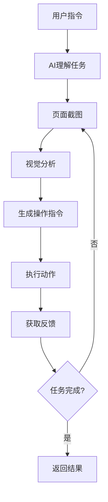

# Computer-Using Agent (CUA) 技术全面解析

## 概述

Computer-Using Agent (CUA，计算机使用代理) 是AI技术的重大突破，让AI可以像人类一样"看"屏幕并直接操控计算机界面。2025年3月11日，OpenAI正式发布了这项技术，标志着AI从"对话助手"向"数字劳动力"的革命性转变。

---

## 🚀 OpenAI Computer Use 发布概况

### **发布信息**

- **发布日期**：2025年3月11日
- **技术名称**：Computer-Using Agent (CUA)
- **模型名称**：`computer-use-preview-2025-03-11`
- **API支持**：Responses API（非Chat Completions API）
- **当前状态**：Beta测试阶段

### **核心能力**

- **直接控制计算机**：启动应用、导航网站、执行复杂任务
- **视觉理解**：结合GPT-4o视觉能力，"看懂"界面内容
- **智能推理**：具备规划和推理能力，适应界面变化
- **自然语言控制**：用普通话描述任务，AI自动分解执行

---

## 🔍 CUA 技术原理

### **工作流程**



### **核心技术组件**

1. **多模态AI模型**：处理视觉和文本信息
2. **计算机视觉**：识别界面元素和布局
3. **动作规划**：将高层指令分解为具体操作
4. **反馈循环**：基于结果调整后续动作

### **操作指令类型**

#### **1. 鼠标操作**

- **左键点击**：`left_click + coordinate: [x, y]`
- **右键点击**：`right_click + coordinate: [x, y]`
- **双击**：`double_click + coordinate: [x, y]`
- **拖拽**：`drag + start: [x1, y1] + end: [x2, y2]`
- **鼠标悬停**：`hover + coordinate: [x, y]`
- **滚动**：`scroll + direction + distance`

#### **2. 键盘操作**

- **文本输入**：`type + text: "要输入的内容"`
- **按键**：`key_press + key: "Enter|Tab|Escape|Space|..."`
- **组合键**：`key_press + keys: ["Ctrl", "C"]`
- **功能键**：`key_press + key: "F1|F2|..."`

#### **3. 系统操作**

- **截图**：`screenshot`
- **等待**：`wait + duration: milliseconds`
- **窗口操作**：`window_focus`, `window_minimize`

#### **4. 复合操作**

- **文本选择**：`select_text + start: [x1, y1] + end: [x2, y2]`
- **区域截图**：`screenshot_region + area: [x, y, width, height]`

#### **5. 特殊操作**

- **OCR文本识别**：基于视觉理解文本内容
- **元素检测**：自动识别按钮、输入框等UI元素
- **状态判断**：检测界面状态变化

---

## 🎯 stagehand.agent 完整指令详解

### **Q: stagehand.agent只能返回像素坐标么？**

**A: 绝对不是！** `stagehand.agent`基于CUA技术，支持丰富的指令类型，远超传统的坐标点击。

### **完整指令类型示例**

#### **1. 鼠标操作指令**

```typescript
// 示例1：点击操作
{
  "type": "tool_use",
  "name": "computer",
  "input": {
    "action": "left_click",
    "coordinate": [394, 533]  // 精确坐标
  }
}

// 示例2：右键菜单
{
  "action": "right_click",
  "coordinate": [200, 300]
}

// 示例3：拖拽操作
{
  "action": "drag",
  "startCoordinate": [100, 100],
  "endCoordinate": [300, 200]
}

// 示例4：滚动操作
{
  "action": "scroll",
  "coordinate": [640, 360],
  "scrollDirection": "down",
  "scrollDistance": 3
}
```

#### **2. 键盘输入指令**

```typescript
// 示例1：文本输入
{
  "action": "type",
  "text": "hello@example.com"
}

// 示例2：特殊按键
{
  "action": "key_press",
  "key": "Enter"
}

// 示例3：组合键
{
  "action": "key_combination",
  "keys": ["cmd", "c"]  // 复制操作
}

// 示例4：功能键
{
  "action": "key_press",
  "key": "F5"  // 刷新页面
}
```

#### **3. 智能识别指令**

```typescript
// AI自动识别元素类型和位置
await agent.execute("在搜索框输入 'Stagehand'");
// → AI识别搜索框位置 → 点击 → 输入文本

await agent.execute("点击提交按钮");
// → AI识别按钮位置和样式 → 执行点击

await agent.execute("滚动到页面底部");
// → AI计算滚动距离 → 执行滚动操作
```

#### **4. 复合任务指令**

```typescript
// 复杂表单填写任务
await agent.execute(`
填写注册表单：
- 姓名：张三
- 邮箱：zhangsan@example.com  
- 密码：123456
- 确认密码：123456
然后点击注册按钮
`);

// AI会自动分解为多个子指令：
// 1. 识别姓名输入框 → 点击 → 输入
// 2. 识别邮箱输入框 → 点击 → 输入
// 3. 识别密码输入框 → 点击 → 输入
// 4. 识别确认密码框 → 点击 → 输入
// 5. 识别注册按钮 → 点击
```

### **实际执行日志案例**

基于您的h5小说测试案例，我们可以看到AI生成的实际指令：

```typescript
// 任务：测试所有付费套餐选项
instructions: "测试这个付费弹框上的所有支付套餐选项"

// AI生成的执行序列：
Step 1: { action: "screenshot" }                    // 获取当前界面
Step 2: { action: "left_click", coordinate: [394, 413] }  // 3日特惠选项
Step 3: { action: "left_click", coordinate: [514, 413] }  // 季卡会员选项
Step 4: { action: "left_click", coordinate: [635, 413] }  // 年卡会员选项
Step 5: { action: "left_click", coordinate: [394, 533] }  // 7590币选项

// 每次点击后AI都会：
// 1. 自动截图观察界面变化
// 2. 分析高亮状态和按钮文本更新
// 3. 继续下一个操作
```

### **智能特性对比**

| 特性         | 传统坐标脚本 | stagehand.agent  |
| ------------ | ------------ | ---------------- |
| **指令类型** | 仅坐标点击   | 20+种操作类型    |
| **元素识别** | 手动定位     | AI自动识别       |
| **文本处理** | 无           | OCR + 语义理解   |
| **适应性**   | 界面变化失效 | 动态适应界面     |
| **任务理解** | 无           | 理解复杂任务意图 |
| **错误恢复** | 无           | 智能重试和调整   |

---

## 📊 Responses API vs Chat Completions API

### **API对比表**

| 特性             | Chat Completions API   | Responses API   |
| ---------------- | ---------------------- | --------------- |
| **设计目标**     | 对话交互               | Agent执行       |
| **主要用途**     | 文本生成、基础工具调用 | 复杂任务自动化  |
| **Computer Use** | ❌ 不支持              | ✅ **核心功能** |
| **工具集成**     | 分离的API              | 统一API         |
| **状态管理**     | 无                     | Response ID链接 |
| **响应格式**     | 简单文本               | 结构化工具调用  |

### **Responses API优势**

- **统一工具生态**：一个API支持多种工具
- **结构化响应**：text块 + tool_use块
- **状态链接**：通过response_id维护对话状态
- **Computer Use原生支持**：专为CUA设计

### **API调用示例**

```typescript
// Responses API - CUA调用
const response = await openai.responses.create({
  model: "computer-use-preview-2025-03-11",
  tools: [{ type: "computer" }],
  messages: [...],
});

// 返回结构化响应
{
  "type": "tool_use",
  "name": "computer",
  "input": {
    "action": "left_click",
    "coordinate": [394, 533]
  }
}
```

---

## 🎯 CUA 操作指令生成过程

### **从高层指令到具体操作**

```typescript
// 1. 用户输入高层指令
"我需要你帮我测试这个付费弹框上的所有支付套餐选项"

// 2. AI视觉分析页面截图
DEBUG: Screenshot captured, length: 130714

// 3. 生成具体操作指令
{
  "type": "tool_use",
  "id": "toolu_bdrk_0164KLda7ryX1apKExWVhtxa",
  "name": "computer",
  "input": {
    "action": "left_click",
    "coordinate": [394, 533]
  }
}

// 4. 执行并获取反馈
DEBUG: Computer action type: left_click
DEBUG: Screenshot captured, length: 130714
```

### **智能决策能力**

CUA不仅生成操作指令，还具备：

- **语义理解**：理解"测试所有选项"的含义
- **视觉识别**：识别界面中的可点击元素
- **坐标精准定位**：计算准确的点击坐标
- **状态感知**：观察操作后的界面变化
- **任务规划**：按逻辑顺序执行多个步骤

---

## 🆚 CUA vs 传统自动化对比

### **传统RPA/自动化工具**

```typescript
// 传统方式：预定义脚本
await page.click("#button-id"); // 依赖固定选择器
await page.type("#input", "text"); // 界面变化就失效
```

**特点：**

- 基于预编程的选择器
- 界面变化时容易失效
- 无法处理未预见的情况
- 需要人工维护脚本

### **CUA方式**

```typescript
// CUA方式：AI理解和适应
await agent.execute("点击登录按钮"); // AI自动识别按钮位置
```

**特点：**

- 基于视觉理解
- 适应界面变化
- 具备推理能力
- 自我修正和学习

---

## 🏗️ Stagehand中的CUA实现

### **双引擎架构**

Stagehand提供了两套完整方案：

#### **1. 传统方案：page.act**

```typescript
// DOM分析 + 传统LLM
await page.act("点击支付按钮");
// 内部：分析DOM → 生成XPath → Playwright执行
```

#### **2. CUA方案：stagehand.agent**

```typescript
// 视觉识别 + CUA模型
const agent = stagehand.agent({
  provider: "anthropic",
  model: "computer-use-preview",
});
await agent.execute("点击支付按钮");
// 内部：截图 → AI视觉分析 → 坐标点击
```

### **技术对比**

| 方案         | page.act    | stagehand.agent |
| ------------ | ----------- | --------------- |
| **输入**     | DOM结构     | 页面截图        |
| **AI类型**   | 文本LLM     | CUA模型         |
| **定位**     | XPath选择器 | 像素坐标        |
| **适用范围** | 仅网页      | 任意界面        |
| **精度**     | 高          | 中等            |
| **性能**     | 快          | 较慢            |

---

## 📝 实际案例分析

### **h5小说付费弹框测试案例**

基于您提供的日志，我们可以看到Anthropic CUA的实际工作过程：

#### **任务描述**

```
我需要你帮我测试这个付费弹框上的所有支付套餐选项。请按照以下步骤操作：
1. 首先点击第一个套餐选项，观察界面变化
2. 然后依次点击其他套餐选项
3. 观察每次点击后的UI反馈
4. 不要点击实际的支付按钮
```

#### **执行过程**

```typescript
// AI分析并生成4个精确的点击操作
actions: [
  { type: "screenshot", action: "screenshot" },
  { x: 394, y: 413, action: "left_click" }, // 3日特惠选项
  { x: 514, y: 413, action: "left_click" }, // 季卡会员选项
  { x: 635, y: 413, action: "left_click" }, // 年卡会员选项
  { x: 394, y: 533, action: "left_click" }, // 7590币选项
];
```

#### **智能行为体现**

1. **理解任务目标**：准确理解"测试所有选项"的要求
2. **视觉识别**：精确识别4个不同的套餐选项位置
3. **状态观察**：每次点击后观察界面高亮变化
4. **安全执行**：遵循"不点击支付按钮"的约束
5. **详细报告**：生成完整的测试结果总结

#### **测试结果总结**

```
1. 3日特惠-连续包月: ¥7.90 - 首次特惠连续包月
2. 季卡会员: ¥49.90 - 90天全站免费看
3. 年卡会员: ¥89.90 - 全年超值免费看
4. 7590币: ¥25.90 - 多送5000星辰币

每个选项都正常工作，点击后会高亮显示，支付按钮会更新对应价格。
```

---

## 🔧 技术实现细节

### **AnthropicCUAClient 工作流程**

```typescript
class AnthropicCUAClient {
  async execute(instruction: string) {
    let step = 0;
    const maxSteps = 10;

    while (!completed && step < maxSteps) {
      // 1. 截图
      await this.screenshotProvider.getScreenshot();

      // 2. 发送给Anthropic AI分析
      const response = await this.getAction(messages);

      // 3. 解析AI响应
      const actions = this.parseToolUse(response);

      // 4. 执行操作
      await this.takeAction(actions);

      // 5. 获取执行结果反馈
      step++;
    }
  }
}
```

### **OpenAICUAClient vs AnthropicCUAClient**

| 特性         | OpenAI        | Anthropic          |
| ------------ | ------------- | ------------------ |
| **API类型**  | Responses API | Messages API       |
| **数据格式** | computer_call | tool_use           |
| **坐标格式** | x, y分离      | coordinate: [x, y] |
| **特色功能** | 无            | Thinking模式       |

---

## 🚧 技术挑战与限制

### **当前限制**

- **精度问题**：坐标定位可能不够精确
- **性能开销**：图像处理和AI推理较慢
- **成本较高**：多模态模型费用高昂
- **调试困难**：难以理解AI的决策过程

### **安全考虑**

- **访问控制**：限制在安全环境中使用
- **操作确认**：重要操作需要人工确认
- **审计日志**：记录所有AI操作历史
- **异常处理**：防止AI执行危险操作

---

## 🔮 发展趋势预测

### **短期（2025-2026）**

- 更多AI厂商加入CUA竞争
- 精度和速度显著提升
- 成本逐步下降
- 安全机制不断完善

### **中期（2026-2028）**

- CUA成为标准化技术
- 集成到主流操作系统
- 支持移动设备和VR/AR
- 实现跨平台统一控制

### **长期（2028+）**

- 完全替代传统RPA
- AI Agent生态系统成熟
- 自主学习和适应能力
- 人机协作新模式

---

## 💡 最佳实践建议

### **开发建议**

1. **混合策略**：结合CUA和传统自动化
2. **渐进部署**：从低风险场景开始
3. **充分测试**：建立完善的测试机制
4. **监控告警**：实时监控AI行为

### **使用场景**

✅ **适合CUA：**

- 跨平台自动化
- 复杂UI交互
- 遗留系统集成
- 探索性任务

❌ **不适合CUA：**

- 高频批量操作
- 亚像素级精度要求
- 实时性要求极高
- 资源严格受限

---

## 📋 总结

Computer-Using Agent代表了AI自动化技术的重大飞跃：

**技术突破：**

- 从文本理解到视觉识别
- 从预编程到智能适应
- 从单一场景到通用控制

**应用价值：**

- 降低自动化门槛
- 提高系统适应性
- 扩展应用边界

**未来影响：**

- 重塑自动化行业
- 推动AI实用化
- 创造新的工作模式

CUA技术还在快速发展中，Stagehand项目通过提供完整的开源实现，为开发者探索这项前沿技术提供了宝贵的平台和经验。
