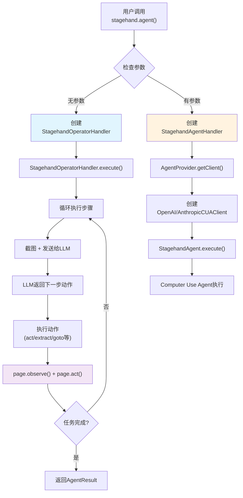
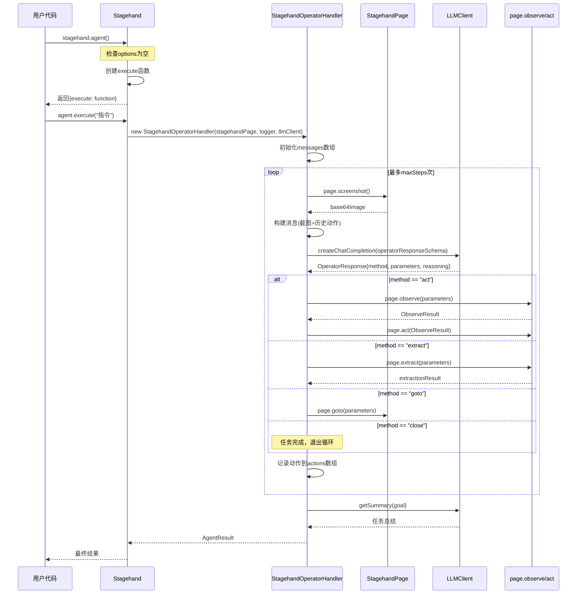
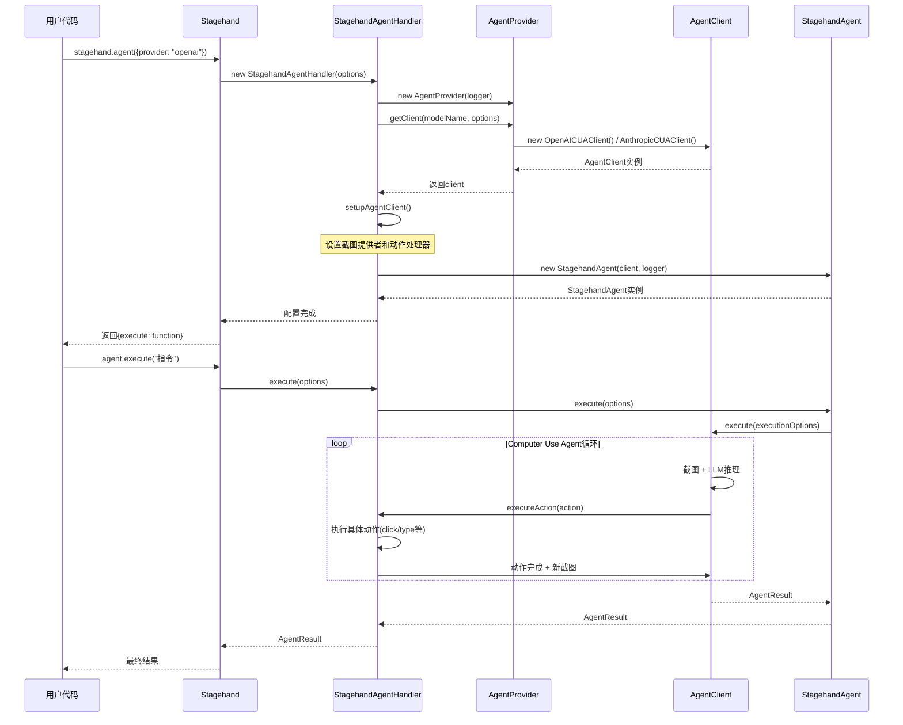
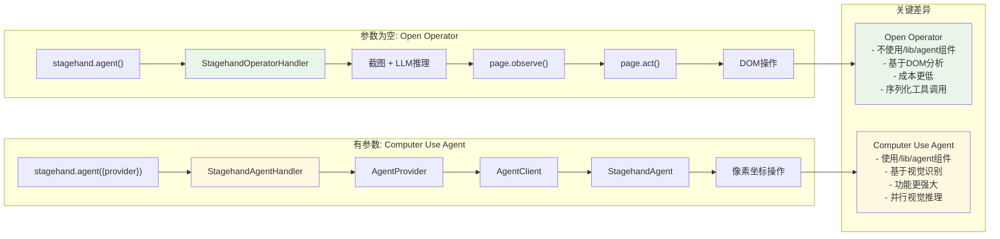

# Stagehand.agent() 调用关系分析

## 🔍 概述

当调用 `stagehand.agent()` 时，根据是否传入参数，会走**完全不同**的两条路径：

- **参数为空**：使用 Open Operator 模式，**不涉及** `/lib/agent` 文件夹中的任何组件
- **有参数**：使用 Computer Use Agent 模式，**完全依赖** `/lib/agent` 文件夹中的组件

## 📊 调用路径对比

### 1. 核心分支逻辑

```typescript
// lib/index.ts - agent方法
agent(options?: AgentConfig) {
  if (!options || !options.provider) {
    // 路径A：Open Operator模式（不使用/lib/agent文件夹的组件）
    return {
      execute: async (instructionOrOptions: string | AgentExecuteOptions) => {
        return new StagehandOperatorHandler(
          this.stagehandPage,
          this.logger,
          this.llmClient,
        ).execute(instructionOrOptions);
      },
    };
  }

  // 路径B：Computer Use Agent模式（使用/lib/agent文件夹的组件）
  const agentHandler = new StagehandAgentHandler(/*...*/);
  return { execute: agentHandler.execute };
}
```

### 2. 两种模式架构图



## 🔄 Open Operator 模式详细调用序列

### 参数为空时的完整调用链



## 🆚 Computer Use Agent 模式调用序列

### 有参数时的完整调用链



## 🔍 关键差异分析

### 1. 组件使用差异



### 2. 具体调用路径对比

| 特性                   | Open Operator 模式                                  | Computer Use Agent 模式                           |
| ---------------------- | --------------------------------------------------- | ------------------------------------------------- |
| **触发条件**           | `stagehand.agent()` 或 `stagehand.agent(undefined)` | `stagehand.agent({provider: "openai/anthropic"})` |
| **核心处理器**         | `StagehandOperatorHandler`                          | `StagehandAgentHandler`                           |
| **是否使用/lib/agent** | ❌ 完全不使用                                       | ✅ 完全依赖                                       |
| **依赖组件**           | 仅依赖 `StagehandOperatorHandler`                   | 依赖整个 `/lib/agent` 组件链                      |
| **执行方式**           | 序列化工具调用 + DOM操作                            | 并行视觉推理 + 像素坐标操作                       |
| **截图使用**           | 用于LLM理解页面状态                                 | 用于AI视觉识别和操作                              |
| **动作执行**           | `page.observe()` → `page.act()`                     | 直接像素坐标操作                                  |
| **成本**               | 较低 (~$0.01/动作)                                  | 较高 (~$0.05/动作)                                |

## 💡 核心发现

### 1. 架构隔离

**重要发现**：当 `stagehand.agent()` 参数为空时，`/lib/agent` 文件夹中的所有组件（`AgentProvider`、`AgentClient`、`StagehandAgent`、`OpenAICUAClient`、`AnthropicCUAClient`）都**完全不参与**调用链！

### 2. 调用路径总结

- **参数为空**：

  ```
  stagehand.agent() → StagehandOperatorHandler → 完全独立的执行路径
  ```

- **有参数**：
  ```
  stagehand.agent({provider}) → StagehandAgentHandler → AgentProvider → AgentClient → StagehandAgent
  ```

### 3. 截图需求分析

**两种模式都需要截图，但用途不同**：

- **Open Operator**：截图 → LLM理解 → 决策下一步动作 → DOM操作执行
- **Computer Use Agent**：截图 → AI视觉识别 → 直接生成像素坐标 → 直接操作

### 4. 设计哲学

这种设计体现了 Stagehand 的**双引擎架构**哲学：

1. **实用主义**：Open Operator 证明了不需要最先进的 AI 技术也能解决大多数问题
2. **技术前瞻**：Computer Use Agent 展示了 AI 视觉识别的强大能力
3. **用户友好**：统一的 API 接口，用户无需了解底层差异
4. **成本效益**：让用户根据需求选择合适的引擎

## 🎯 最佳实践建议

### 何时使用 Open Operator（无参数）

```typescript
// 适用场景：
const agent = stagehand.agent();
await agent.execute("填写表单并提交");
await agent.execute("搜索产品并添加到购物车");
await agent.execute("提取页面上的所有链接");
```

- ✅ 结构化网页操作
- ✅ 成本敏感场景
- ✅ 快速原型开发
- ✅ 大批量自动化任务

### 何时使用 Computer Use Agent（有参数）

```typescript
// 适用场景：
const agent = stagehand.agent({
  provider: "openai",
  model: "computer-use-preview",
});
await agent.execute("在复杂的图形界面中找到并点击特定按钮");
await agent.execute("处理动态加载的复杂页面");
```

- ✅ 复杂的视觉识别需求
- ✅ 动态内容处理
- ✅ 非标准界面操作
- ✅ 对精确度要求极高的场景

---

_本文档详细分析了 Stagehand 双引擎架构的调用关系，为开发者选择合适的执行模式提供了全面的参考。_
