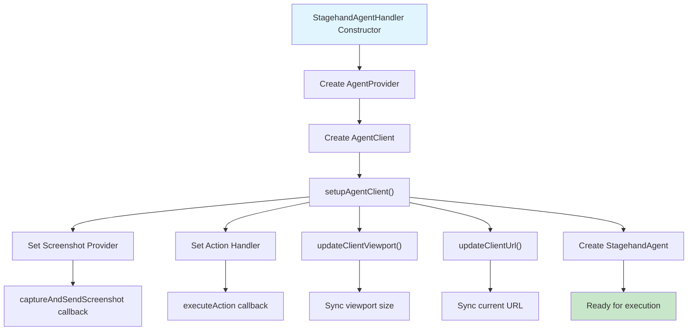
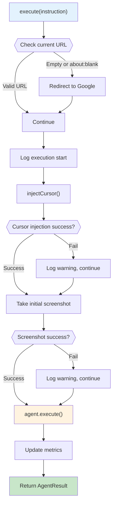
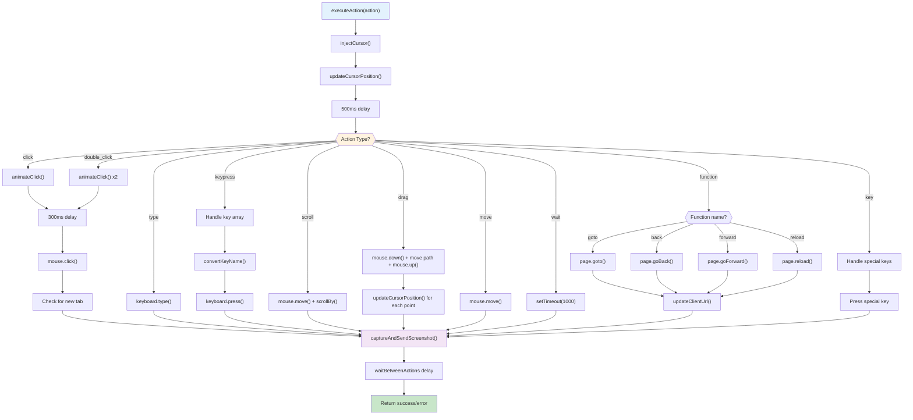
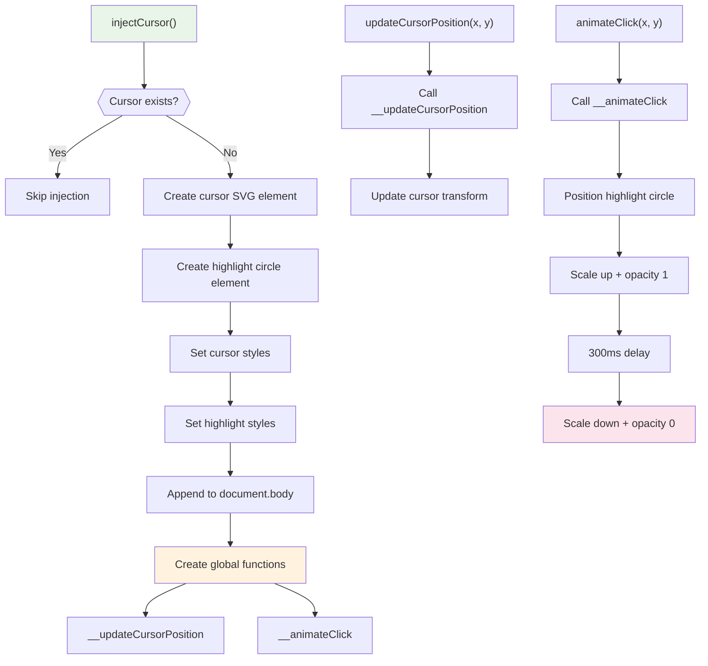
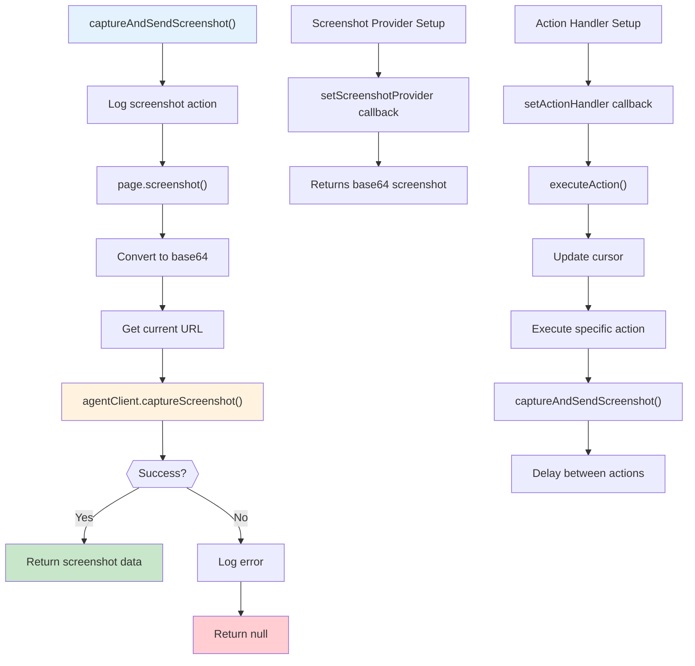
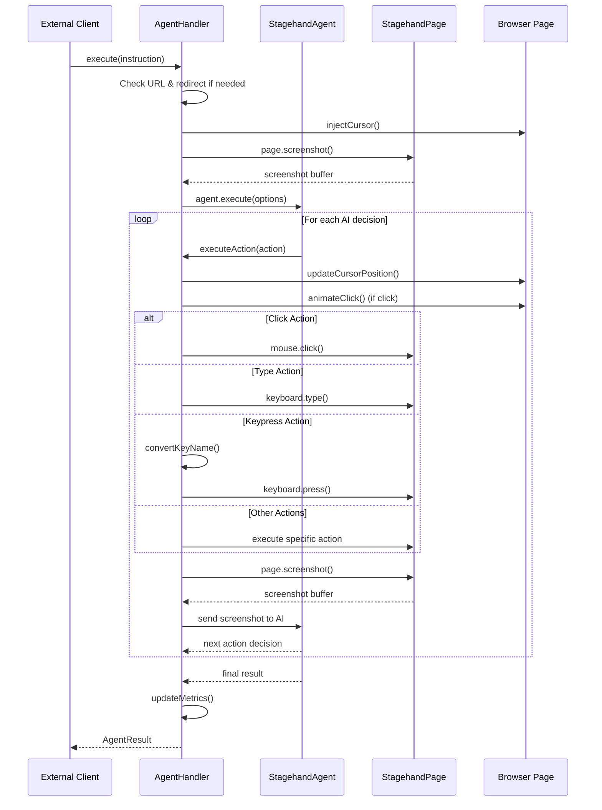

# StagehandAgentHandler 分析文档

## 概述

`StagehandAgentHandler` 是 Stagehand 框架中的核心代理处理器，负责管理 AI 代理在浏览器页面上的自动化操作。它是连接 AI 决策和浏览器操作的关键桥梁。

## 1. 整体功能

### 主要职责

- **智能代理执行**：管理 AI 代理在浏览器页面上的自动化操作
- **动作执行**：将 AI 代理的决策转换为具体的浏览器操作（点击、输入、滚动等）
- **视觉反馈**：提供光标动画和点击效果，增强用户体验
- **截图管理**：自动截图并发送给 AI 代理进行视觉分析

### 核心特性

- 异步处理确保不阻塞浏览器
- 基于视觉反馈的 AI 决策机制
- 完善的错误处理和日志记录
- 丰富的动作类型支持
- 用户友好的视觉反馈系统

## 2. 主要函数功能分析

### 2.1 构造函数

```typescript
constructor(stagehand, stagehandPage, logger, options);
```

**功能**：初始化代理处理器，设置所有必要的组件

- 创建 `AgentProvider` 实例
- 生成 `AgentClient` 客户端
- 初始化 `StagehandAgent` 代理

### 2.2 核心设置函数

```typescript
private setupAgentClient(): void
```

**功能**：配置代理客户端的核心功能

- 设置截图提供者（为 AI 提供页面视觉信息）
- 配置动作处理器（执行 AI 决策的动作）
- 同步视口和 URL 信息

### 2.3 主执行函数

```typescript
async execute(optionsOrInstruction): Promise<AgentResult>
```

**功能**：执行 AI 代理任务的主入口
**执行流程**：

1. 处理空白页面重定向到 Google
2. 注入视觉光标
3. 拍摄初始截图
4. 执行代理任务
5. 更新使用指标

### 2.4 动作执行函数

```typescript
private async executeAction(action): Promise<ActionExecutionResult>
```

**功能**：执行具体的浏览器动作
**支持的动作类型**：

- `click` / `double_click` - 点击操作
- `type` - 文本输入
- `keypress` - 按键操作
- `scroll` - 页面滚动
- `drag` - 拖拽操作
- `move` - 鼠标移动
- `wait` - 等待延迟
- `function` - 函数调用（导航、刷新等）
- `key` - 特殊按键处理

### 2.5 视觉反馈函数

#### injectCursor()

```typescript
private async injectCursor(): Promise<void>
```

**功能**：在页面中注入自定义 SVG 光标和高亮动画元素

- 创建可视化光标元素
- 添加点击高亮圆圈动画
- 注入全局函数用于位置更新

#### updateCursorPosition(x, y)

```typescript
private async updateCursorPosition(x: number, y: number): Promise<void>
```

**功能**：更新页面上光标的位置

#### animateClick(x, y)

```typescript
private async animateClick(x: number, y: number): Promise<void>
```

**功能**：在指定位置播放点击动画效果

### 2.6 截图管理函数

```typescript
async captureAndSendScreenshot(): Promise<unknown>
```

**功能**：截取页面并转换为 base64 格式发送给 AI 代理

- 拍摄当前页面截图
- 转换为 base64 编码
- 发送给 AI 代理进行视觉分析

### 2.7 辅助函数

#### updateClientViewport() / updateClientUrl()

**功能**：同步页面状态信息到客户端

#### convertKeyName(key)

**功能**：转换按键名称格式，支持多种按键格式转换

#### getAgent() / getClient()

**功能**：获取代理和客户端实例的访问器

## 3. 流程调用关系图表

### 3.1 整体架构和初始化流程



### 3.2 任务执行主流程



### 3.3 动作执行详细流程



### 3.4 视觉反馈系统流程



### 3.5 截图管理流程



### 3.6 完整数据流和控制流



## 4. 支持的动作类型

### 4.1 鼠标动作

- **click**: 单击操作，支持左右键和坐标定位
- **double_click**: 双击操作
- **move**: 光标移动
- **drag**: 拖拽操作，支持路径跟踪

### 4.2 键盘动作

- **type**: 文本输入
- **keypress**: 按键组合，支持特殊键
- **key**: 单键操作（Anthropic 格式）

### 4.3 导航动作

- **function**:
  - `goto`: URL 导航
  - `back`: 浏览器后退
  - `forward`: 浏览器前进
  - `reload`: 页面刷新

### 4.4 页面动作

- **scroll**: 页面滚动
- **wait**: 暂停执行
- **screenshot**: 视觉反馈（自动捕获）

## 5. 错误处理机制

### 5.1 错误分类处理

- **非关键错误**（光标、动画、截图）：记录警告，继续执行
- **关键错误**（动作执行失败）：记录错误，抛出异常
- **系统错误**：记录详细信息，终止执行

### 5.2 日志记录系统

- **Level 0**: 错误信息
- **Level 1**: 警告和普通信息
- **分类记录**: 按功能模块分类记录日志

## 6. 设计特点总结

### 6.1 核心优势

1. **异步处理**：所有操作都是异步的，确保不阻塞浏览器
2. **错误容忍**：非关键功能失败时系统继续运行
3. **视觉驱动**：基于截图的 AI 视觉分析和决策
4. **用户体验**：提供光标和动画增强视觉反馈
5. **灵活配置**：支持多种动作类型和参数配置

### 6.2 技术特色

- **视觉反馈系统**：自定义 SVG 光标和动画效果
- **智能截图**：自动截图并发送给 AI 进行视觉分析
- **动作抽象**：将高级 AI 指令转换为具体浏览器操作
- **状态同步**：实时同步页面状态给 AI 代理

### 6.3 应用场景

- 网页自动化测试
- AI 驱动的浏览器操作
- 智能表单填写
- 复杂网页交互自动化
- 可视化 RPA（机器人流程自动化）

---

_本文档详细分析了 StagehandAgentHandler 的实现机制和调用流程，为理解和扩展该系统提供了完整的参考资料。_
