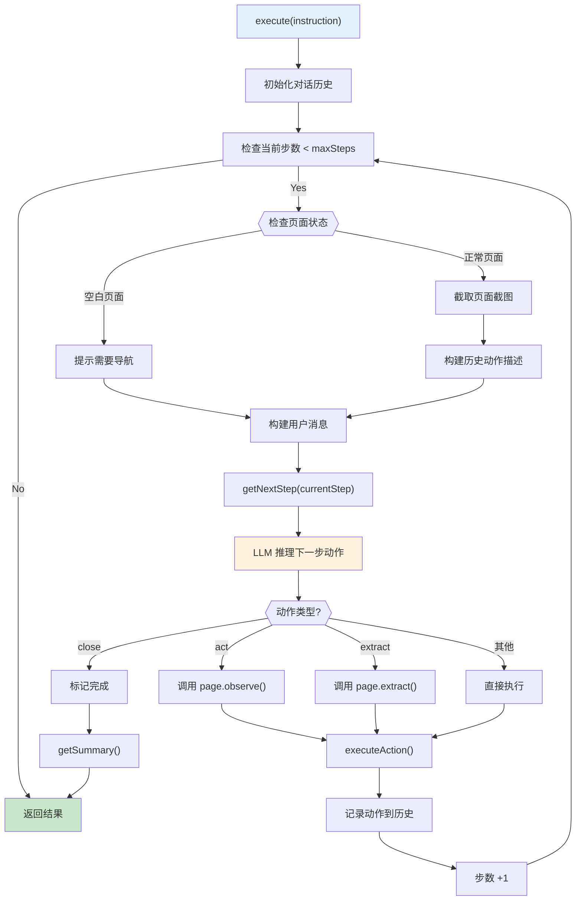
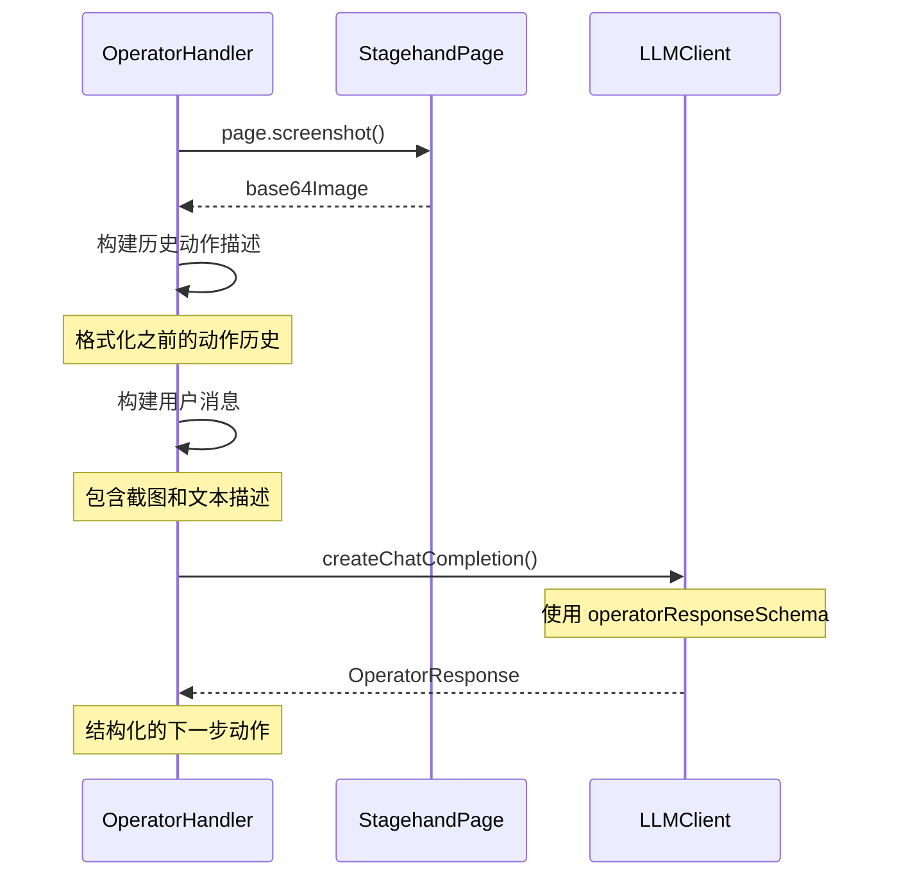
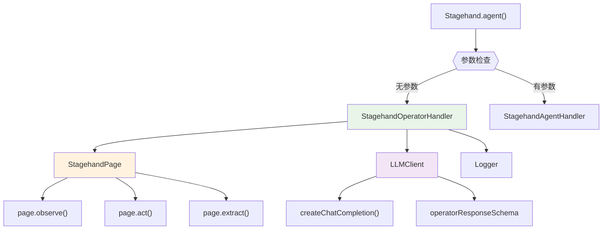

# StagehandOperatorHandler 分析文档

## 概述

`StagehandOperatorHandler` 是 Stagehand 框架中实现 **Open Operator** 功能的核心类。它负责处理基础 Agent 模式的自动化任务执行，使用序列化工具调用（Sequential Tool Calling）的方式来完成复杂的浏览器操作。

## 1. 核心功能

### 1.1 主要职责

- **智能决策**：基于页面截图和历史动作，通过 LLM 推理下一步动作
- **动作执行**：支持多种浏览器操作（点击、提取、导航等）
- **状态管理**：维护对话历史和动作序列
- **任务总结**：生成执行结果的智能摘要

### 1.2 设计特点

- ✅ **轻量级**：相比 Computer Use Agent，资源消耗更少
- ✅ **通用性**：支持任何 LLM 提供商，不限于特定 API
- ✅ **可控性**：基于预定义的动作类型，行为更可预测
- ✅ **调试友好**：详细的动作历史和推理过程

## 2. 类结构分析

### 2.1 类定义和属性

```typescript
export class StagehandOperatorHandler {
  private stagehandPage: StagehandPage; // 页面操作对象
  private logger: (message: LogLine) => void; // 日志记录器
  private llmClient: LLMClient; // LLM 客户端
  private messages: ChatMessage[]; // 对话历史
}
```

### 2.2 核心方法概览

```typescript
// 主执行方法
public async execute(instructionOrOptions: string | AgentExecuteOptions): Promise<AgentResult>

// 获取下一步动作
private async getNextStep(currentStep: number): Promise<OperatorResponse>

// 生成任务总结
private async getSummary(goal: string): Promise<string>

// 执行具体动作
private async executeAction(action: OperatorResponse, playwrightArguments?: ObserveResult, extractionResult?: unknown): Promise<unknown>
```

## 3. 执行流程分析

### 3.1 完整执行流程图



### 3.2 执行流程详解

#### 第一阶段：初始化

```typescript
const options =
  typeof instructionOrOptions === "string"
    ? { instruction: instructionOrOptions }
    : instructionOrOptions;

this.messages = [buildOperatorSystemPrompt(options.instruction)];
let completed = false;
let currentStep = 0;
const maxSteps = options.maxSteps || 10;
const actions: AgentAction[] = [];
```

#### 第二阶段：循环执行

```typescript
while (!completed && currentStep < maxSteps) {
  // 1. 检查页面状态
  const url = this.stagehandPage.page.url();

  // 2. 构建消息（截图 + 历史动作）
  // 3. LLM 推理下一步动作
  const result = await this.getNextStep(currentStep);

  // 4. 预处理特定动作
  if (result.method === "act") {
    [playwrightArguments] = await this.stagehandPage.page.observe(result.parameters);
  }

  // 5. 执行动作
  await this.executeAction(result, playwrightArguments, extractionResult);

  // 6. 记录历史
  actions.push({...});
  currentStep++;
}
```

#### 第三阶段：总结

```typescript
return {
  success: true,
  message: await this.getSummary(options.instruction),
  actions,
  completed: actions[actions.length - 1].taskCompleted as boolean,
};
```

## 4. 支持的动作类型

### 4.1 动作类型分类

```mermaid
mindmap
  root)OperatorHandler动作类型(
    页面操作
      act
        使用 page.observe() 预处理
        执行 page.act() 操作
        支持点击、输入、滚动等
      extract
        数据提取操作
        支持结构化提取
        支持全页面文本提取

    导航操作
      goto
        页面导航
        waitUntil: "load"
      navback
        浏览器后退
        page.goBack()
      refresh
        页面刷新
        page.reload()

    流程控制
      wait
        等待延迟
        setTimeout(ms)
      close
        任务完成标记
        设置 completed = true
```

### 4.2 动作执行实现

```typescript
private async executeAction(action: OperatorResponse, playwrightArguments?: ObserveResult, extractionResult?: unknown): Promise<unknown> {
  const { method, parameters } = action;
  const page = this.stagehandPage.page;

  switch (method) {
    case "act":
      if (!playwrightArguments) {
        throw new StagehandMissingArgumentError("No arguments provided to `act()`");
      }
      await page.act(playwrightArguments);
      break;

    case "extract":
      if (parameters === null || parameters === undefined) {
        const extractionResultObj = await page.extract();
        return extractionResultObj.page_text;
      } else {
        return await page.extract(parameters);
      }

    case "goto":
      await page.goto(parameters, { waitUntil: "load" });
      break;

    case "wait":
      await page.waitForTimeout(parseInt(parameters));
      break;

    case "navback":
      await page.goBack();
      break;

    case "refresh":
      await page.reload();
      break;

    case "close":
      return; // 任务完成，退出循环

    default:
      throw new StagehandError(`Cannot execute unknown action: ${method}`);
  }
}
```

## 5. LLM 交互机制

### 5.1 消息构建流程



### 5.2 历史动作格式化

```typescript
let messageText = `Previous actions were: ${actions
  .map((action) => {
    let result: string = "";
    if (action.type === "act") {
      const args = action.playwrightArguments as ObserveResult;
      result = `Performed a "${args.method}" action ${
        args.arguments.length > 0
          ? `with arguments: ${args.arguments.map((arg) => `"${arg}"`).join(", ")}`
          : ""
      } on "${args.description}"`;
    } else if (action.type === "extract") {
      result = `Extracted data: ${action.extractionResult}`;
    }
    return `[${action.type}] ${action.reasoning}. Result: ${result}`;
  })
  .join("\n")}\n\n${messageText}`;
```

### 5.3 响应数据结构

```typescript
// lib/types/operator.ts 中定义的响应格式
interface OperatorResponse {
  method: "act" | "extract" | "goto" | "wait" | "navback" | "refresh" | "close";
  parameters: string;
  reasoning: string;
  taskComplete: boolean;
}

interface OperatorSummary {
  answer: string;
}
```

## 6. 与其他组件的关系

### 6.1 组件依赖关系



### 6.2 在 Stagehand 中的集成

```typescript
// lib/index.ts 中的集成逻辑
agent(options?: AgentConfig): { execute: Function } {
  if (!options || !options.provider) {
    // 使用 Open Operator
    return {
      execute: async (instructionOrOptions: string | AgentExecuteOptions) => {
        return new StagehandOperatorHandler(
          this.stagehandPage,
          this.logger,
          this.llmClient,
        ).execute(instructionOrOptions);
      },
    };
  }

  // 使用 Computer Use Agent
  const agentHandler = new StagehandAgentHandler(/* ... */);
  return { execute: agentHandler.execute.bind(agentHandler) };
}
```

## 7. 使用场景和最佳实践

### 7.1 适用场景

**✅ 推荐使用 OperatorHandler 的场景：**

- 简单到中等复杂度的自动化任务
- 成本敏感的应用（相比 Computer Use 更便宜）
- 需要使用第三方 LLM 提供商
- 调试和开发阶段（行为更可预测）
- 不需要复杂视觉推理的任务

**❌ 不推荐使用的场景：**

- 需要精确像素级操作的任务
- 高度动态的页面内容
- 需要复杂视觉理解的场景
- 要求最高准确率的关键任务

### 7.2 配置建议

```typescript
// 基础配置
const agent = stagehand.agent();
const result = await agent.execute({
  instruction: "搜索相关信息并提取结果",
  maxSteps: 15, // 适中的步数限制
});

// 复杂任务配置
const result = await agent.execute({
  instruction: "完成多步骤表单填写",
  maxSteps: 25, // 增加步数限制
});
```

### 7.3 错误处理模式

```typescript
try {
  const result = await agent.execute({
    instruction: "执行任务",
    maxSteps: 20,
  });

  if (result.completed) {
    console.log("任务完成:", result.message);
    console.log("执行步数:", result.actions.length);
  } else {
    console.log("任务未完成，可能需要增加 maxSteps");
  }
} catch (error) {
  if (error instanceof StagehandMissingArgumentError) {
    console.error("参数缺失错误:", error.message);
  } else {
    console.error("执行错误:", error);
  }
}
```

## 8. 性能特点

### 8.1 优势

1. **成本效益**：

   - 使用普通对话模型而非特殊 Computer Use API
   - 支持更多 LLM 提供商选择
   - 更低的 token 消耗

2. **稳定性**：

   - 基于预定义动作类型，行为可预测
   - 较少依赖复杂的视觉推理
   - 更好的错误处理机制

3. **调试友好**：
   - 详细的动作历史记录
   - 清晰的推理过程
   - 易于理解的执行步骤

### 8.2 局限性

1. **精度限制**：

   - 依赖 `page.observe()` 的准确性
   - 不能进行像素级精确操作
   - 对复杂页面布局的理解有限

2. **动作类型限制**：
   - 仅支持预定义的动作类型
   - 不能执行复杂的组合操作
   - 某些特殊交互可能无法处理

## 9. 与 Computer Use Agent 的对比

| 特性           | OperatorHandler         | Computer Use Agent       |
| -------------- | ----------------------- | ------------------------ |
| **实现方式**   | Sequential Tool Calling | 直接视觉推理             |
| **LLM 要求**   | 任何对话模型            | 专用 Computer Use 模型   |
| **成本**       | 较低                    | 较高                     |
| **精度**       | 中等                    | 高                       |
| **调试难度**   | 简单                    | 复杂                     |
| **适用场景**   | 标准自动化任务          | 复杂视觉任务             |
| **提供商支持** | 广泛                    | 有限（OpenAI/Anthropic） |

## 10. 总结

`StagehandOperatorHandler` 是 Stagehand 框架中的重要组件，它提供了一种轻量级、成本效益高的自动化方案。通过序列化工具调用的方式，它能够处理大多数常见的浏览器自动化任务，同时保持良好的可控性和调试友好性。

### 核心价值

- **平衡性**：在功能性和复杂性之间找到最佳平衡点
- **通用性**：支持任何 LLM 提供商，不受特定 API 限制
- **实用性**：专注于解决实际的自动化需求
- **经济性**：提供成本效益高的自动化解决方案

对于大多数浏览器自动化需求，`StagehandOperatorHandler` 提供了一个可靠、经济、易于使用的解决方案。

---

_本文档详细分析了 StagehandOperatorHandler 的实现机制和使用指南，为开发者提供了全面的参考资料。_
