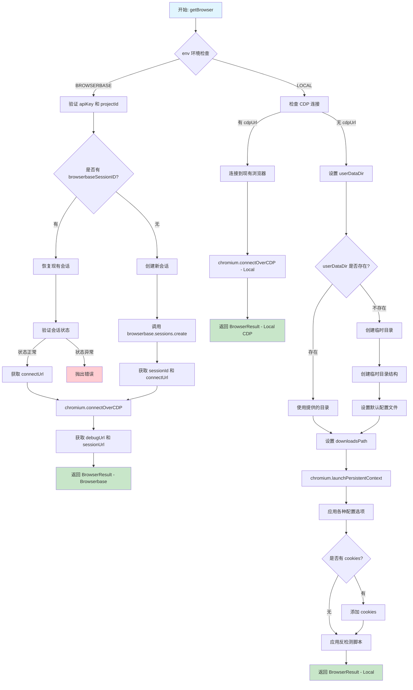
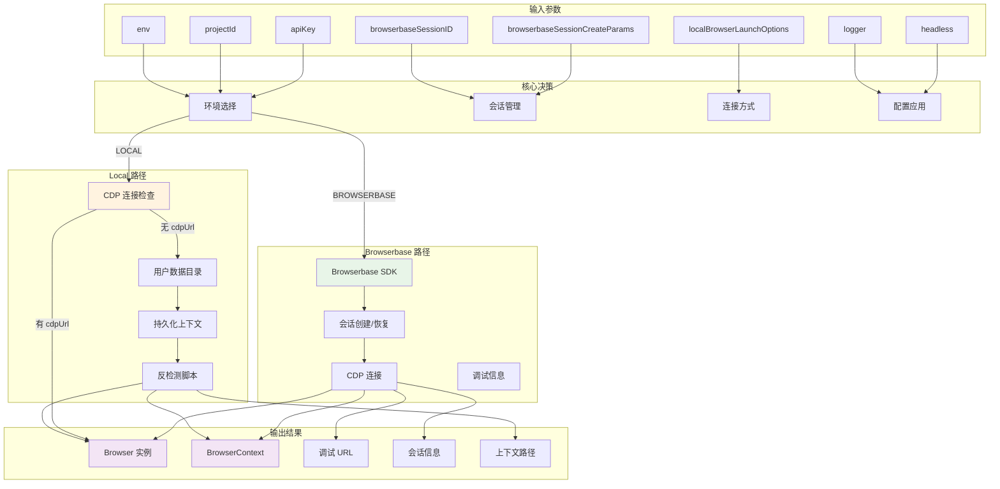
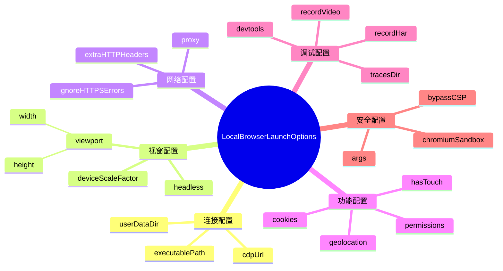
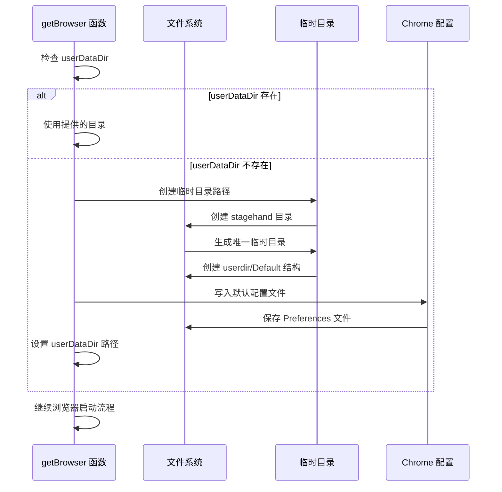
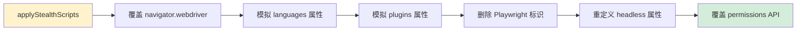
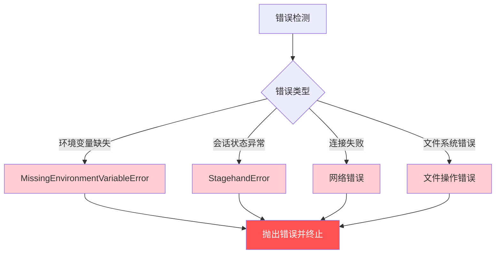

# Stagehand getBrowser 函数分析

## 函数概述

`getBrowser` 函数是 Stagehand 的核心函数，负责根据不同的环境配置（LOCAL 或 BROWSERBASE）创建和管理浏览器实例。

## 函数签名

```typescript
async function getBrowser(
  apiKey: string | undefined,
  projectId: string | undefined,
  env: "LOCAL" | "BROWSERBASE" = "LOCAL",
  headless: boolean = false,
  logger: (message: LogLine) => void,
  browserbaseSessionCreateParams?: Browserbase.Sessions.SessionCreateParams,
  browserbaseSessionID?: string,
  localBrowserLaunchOptions?: LocalBrowserLaunchOptions,
): Promise<BrowserResult>;
```

## 主要流程图



## 架构关系图



## 详细配置选项

### LocalBrowserLaunchOptions 配置



## 用户数据目录处理流程



## 反检测脚本应用



## 错误处理机制



## 返回值结构

```typescript
interface BrowserResult {
  browser: Browser | undefined;
  context: BrowserContext | undefined;
  debugUrl?: string; // Browserbase 专用
  sessionUrl?: string; // Browserbase 专用
  sessionId?: string; // Browserbase 专用
  contextPath?: string; // Local 专用
  env: "LOCAL" | "BROWSERBASE";
}
```

## 关键决策点

1. **环境选择**：根据 `env` 参数决定使用本地浏览器还是 Browserbase
2. **连接方式**：本地环境可选择 CDP 连接或新建浏览器
3. **会话管理**：Browserbase 支持会话恢复和新建
4. **配置应用**：大量可选配置项的默认值处理
5. **错误处理**：不同场景的错误类型和处理方式

## 性能优化建议

1. **本地开发**：使用 CDP 连接减少启动时间
2. **生产环境**：使用 Browserbase 提供的云端浏览器
3. **用户数据**：合理配置 userDataDir 避免冲突
4. **资源管理**：确保正确的清理和关闭流程
