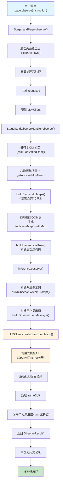
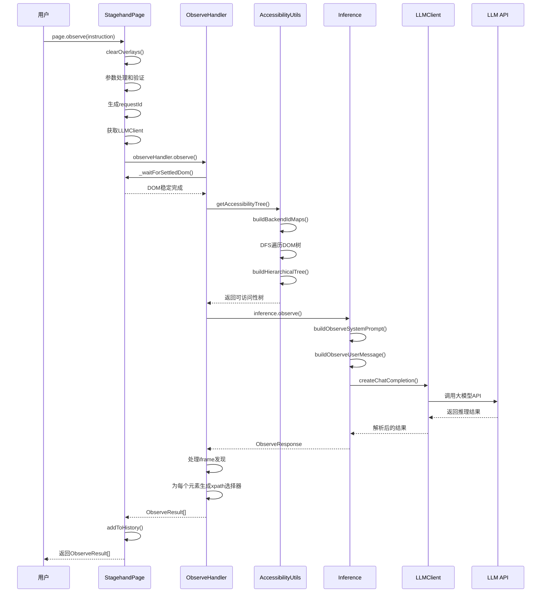
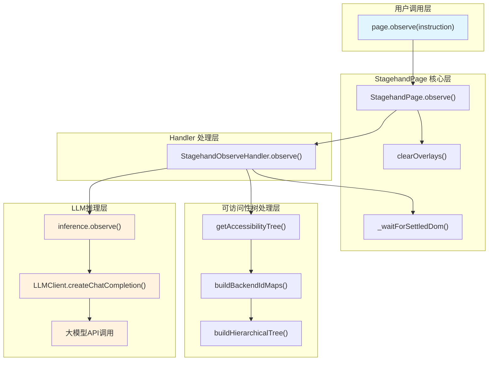
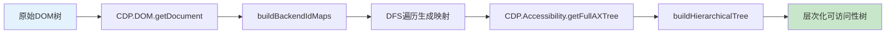

# Stagehand page.observe 调用链路分析

本文档详细分析了 Stagehand 中 `page.observe` 方法的完整调用链路，包括流程图、时序图和核心实现原理。

## 1. page.observe 调用链路

### 1.1 流程图



### 1.2 时序图



### 1.3 调用链路详细说明

#### 入口点：StagehandPage.observe()

- **位置**：`lib/StagehandPage.ts:840-964`
- **功能**：用户调用的主入口，负责参数处理和流程控制

#### 核心处理：StagehandObserveHandler.observe()

- **位置**：`lib/handlers/observeHandler.ts:33-217`
- **功能**：执行观察逻辑的核心处理器

#### DOM分析：getAccessibilityTree()

- **位置**：`lib/a11y/utils.ts:500-601`
- **功能**：
  1. `buildBackendIdMaps()` - 构建 CDP backendNodeId 到 HTML 标签和 XPath 的映射
  2. DFS 遍历 DOM 树生成 `tagNameMap` 和 `xpathMap`
  3. `buildHierarchicalTree()` - 构建层次化的可访问性树结构

#### LLM推理：inference.observe()

- **位置**：`lib/inference.ts:235-387`
- **功能**：
  1. 构建系统提示词和用户提示词
  2. 调用大模型API进行推理
  3. 解析返回结果为 `ObserveResult[]`

## 2. page.observe 核心组件架构



## 3. 数据处理流程

### 3.1 DOM 到可访问性树的转换



### 3.2 LLM 推理数据流

```mermaid
graph LR
    A[可访问性树] --> B[构建系统提示词]
    B --> C[构建用户提示词]
    C --> D[LLM API调用]
    D --> E[解析推理结果]
    E --> F[生成ObserveResult[]]
    F --> G[添加xpath选择器]

    style A fill:#ffecb3
    style D fill:#fff3e0
    style F fill:#c8e6c9
```

## 4. 关键特性分析

### 4.1 可访问性树构建

**buildBackendIdMaps 功能**：

- 使用 CDP (Chrome DevTools Protocol) 获取完整 DOM 信息
- 通过 DFS 遍历生成 `backendNodeId` 到标签名和 XPath 的映射
- 支持跨 frame 的元素定位

**buildHierarchicalTree 功能**：

- 过滤掉结构性节点（如 generic、none 等角色）
- 保留交互性元素和有意义的文本内容
- 构建适合 LLM 理解的层次化结构

### 4.2 iframe 支持

```typescript
// 支持 iframe 内容观察
const results = await page.observe("Find buttons in iframes", {
  iframes: true,
});
```

- 自动发现页面中的 iframe 元素
- 递归分析 iframe 内容
- 统一返回格式，透明化 iframe 边界

### 4.3 智能元素过滤

**cleanStructuralNodes 逻辑**：

- 移除纯装饰性元素
- 合并冗余的文本节点
- 保留用户可交互的关键元素

## 5. 配置选项详解

### 5.1 基本配置

```typescript
interface ObserveOptions {
  instruction?: string; // 观察指令
  modelName?: string; // 指定 LLM 模型
  modelClientOptions?: object; // 模型客户端配置
  domSettleTimeoutMs?: number; // DOM 稳定等待时间
  returnAction?: boolean; // 是否返回可执行动作
  drawOverlay?: boolean; // 是否绘制覆盖层（调试用）
  iframes?: boolean; // 是否分析 iframe 内容
}
```

### 5.2 高级用法示例

```typescript
// 基本用法
const elements = await page.observe("Find all clickable buttons");

// 指定模型
const elements = await page.observe({
  instruction: "Find form inputs",
  modelName: "gpt-4",
  modelClientOptions: { temperature: 0.1 },
});

// iframe 支持
const elements = await page.observe({
  instruction: "Find elements in nested frames",
  iframes: true,
  domSettleTimeoutMs: 3000,
});

// 返回执行动作
const actions = await page.observe({
  instruction: "Find elements to click",
  returnAction: true,
});
```

## 6. 性能优化策略

### 6.1 DOM 分析优化

1. **增量更新**：

   - 检测 DOM 变化，只重新分析变更部分
   - 复用已生成的 XPath 映射

2. **选择性分析**：

   ```typescript
   // 只分析特定区域
   const elements = await page.observe("Find buttons in header", {
     selector: "header",
   });
   ```

3. **并行处理**：
   - iframe 分析并行进行
   - DOM 遍历与 LLM 推理流水线化

### 6.2 LLM 调用优化

1. **请求缓存**：

   ```typescript
   // 启用 LLM 缓存
   const stagehand = new Stagehand({
     ...config,
     enableCaching: true,
   });
   ```

2. **批量处理**：

   - 一次 observe 调用返回多个相关元素
   - 减少重复的页面分析开销

3. **模型选择**：
   - 简单任务使用较小模型（如 gpt-3.5-turbo）
   - 复杂场景使用更强模型（如 gpt-4）

## 7. 错误处理机制

### 7.1 常见错误类型

1. **DOM 分析错误**：

   - CDP 连接失败
   - 页面加载超时
   - iframe 访问权限问题

2. **LLM 推理错误**：

   - API 调用失败
   - 响应格式错误
   - 推理超时

3. **元素定位错误**：
   - XPath 生成失败
   - 元素已被移除
   - 动态内容变化

### 7.2 错误恢复策略

```typescript
try {
  const elements = await page.observe("Find buttons");
} catch (error) {
  if (error instanceof StagehandDomProcessError) {
    // DOM 处理错误，等待页面稳定后重试
    await page.waitForTimeout(2000);
    const elements = await page.observe("Find buttons");
  } else if (error instanceof LLMTimeoutError) {
    // LLM 超时，使用默认策略
    const elements = await page.observe("Find buttons", {
      modelName: "gpt-3.5-turbo", // 使用更快的模型
    });
  }
}
```

## 8. 实际应用示例

### 8.1 基本观察模式

```typescript
// 观察交互元素
const buttons = await page.observe("Find all clickable buttons");
const links = await page.observe("Find navigation links");
const inputs = await page.observe("Find form input fields");

// 观察特定内容
const prices = await page.observe("Find product prices");
const titles = await page.observe("Find article titles");
```

### 8.2 组合使用模式

```typescript
// 先观察，后执行（推荐缓存模式）
const [loginButton] = await page.observe("Find the login button");
await page.act(loginButton);

// 批量观察和处理
const allButtons = await page.observe("Find all buttons on the page");
for (const button of allButtons) {
  console.log(`Button: ${button.description}`);
  // 可选择性执行
  if (button.description.includes("submit")) {
    await page.act(button);
  }
}
```

### 8.3 复杂场景处理

```typescript
// 处理动态内容
await page.goto("https://spa-app.com");
await page.waitForTimeout(2000); // 等待 SPA 加载
const elements = await page.observe("Find content after loading", {
  domSettleTimeoutMs: 5000,
});

// 处理多层 iframe
const iframeElements = await page.observe("Find elements in payment iframe", {
  iframes: true,
});

// 自定义观察策略
const specificElements = await page.observe({
  instruction: "Find elements with data-testid attributes",
  returnAction: true,
  drawOverlay: true, // 调试模式
});
```

## 9. 调试技巧

### 9.1 启用调试信息

```typescript
const stagehand = new Stagehand({
  ...config,
  verbose: 2, // 启用详细日志
  headless: false, // 显示浏览器窗口
});
```

### 9.2 可视化调试

```typescript
// 启用元素覆盖层
const elements = await page.observe("Find buttons", {
  drawOverlay: true,
});

// 查看可访问性树结构
console.log(formatSimplifiedTree(accessibilityTree));
```

### 9.3 性能分析

```typescript
// 监控 LLM 调用性能
stagehand.on("llm_call", (event) => {
  console.log(`LLM call took ${event.duration}ms`);
  console.log(`Tokens used: ${event.tokens}`);
});
```

## 10. 最佳实践

### 10.1 指令编写建议

1. **具体明确**：

   ```typescript
   // 好的指令
   await page.observe("Find the blue 'Submit' button in the form");

   // 避免模糊指令
   await page.observe("Find something clickable");
   ```

2. **上下文相关**：

   ```typescript
   // 提供上下文
   await page.observe("Find the 'Add to Cart' button for the iPhone product");
   ```

3. **动作导向**：
   ```typescript
   // 明确意图
   await page.observe("Find the search input field to enter keywords");
   ```

### 10.2 性能优化建议

1. **合理使用缓存**：重复操作时缓存 ObserveResult
2. **批量处理**：一次获取多个相关元素
3. **选择合适的模型**：根据复杂度选择 LLM 模型
4. **设置合理超时**：根据页面特性调整等待时间

### 10.3 错误处理建议

1. **检查返回结果**：验证 ObserveResult 的有效性
2. **处理空结果**：观察可能返回空数组
3. **重试机制**：对于临时性错误实施重试

## 11. 总结

Stagehand 的 `page.observe` 方法通过精密的技术架构，实现了从**页面DOM**到**可执行动作**的智能转换：

1. **深度 DOM 分析**：通过 CDP 协议获取完整页面信息，构建层次化可访问性树
2. **智能 LLM 推理**：利用大模型理解页面结构和用户意图，精确定位目标元素
3. **跨 Frame 支持**：透明化处理 iframe 内容，提供统一的观察体验
4. **性能优化策略**：通过缓存、并行处理等技术手段平衡智能性与效率
5. **丰富的配置选项**：支持多种观察模式和自定义策略

这种设计使得 `page.observe` 既能处理简单的元素查找任务，又能应对复杂的现代 Web 应用场景，为后续的 `page.act` 操作提供准确可靠的元素定位基础。
