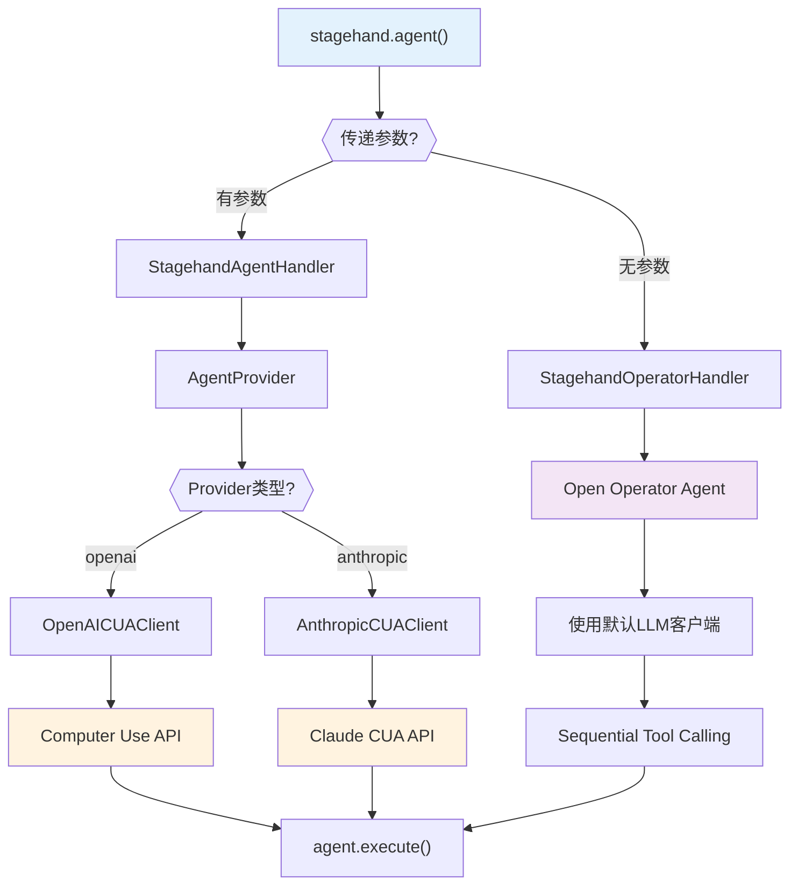
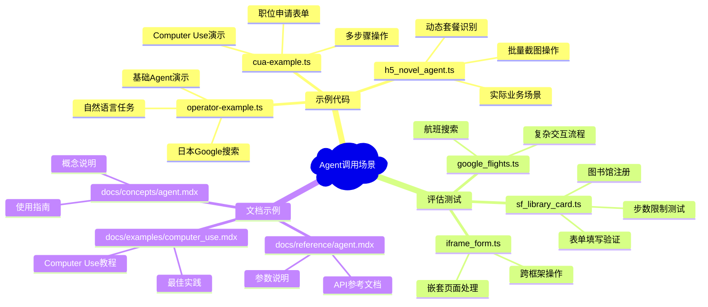
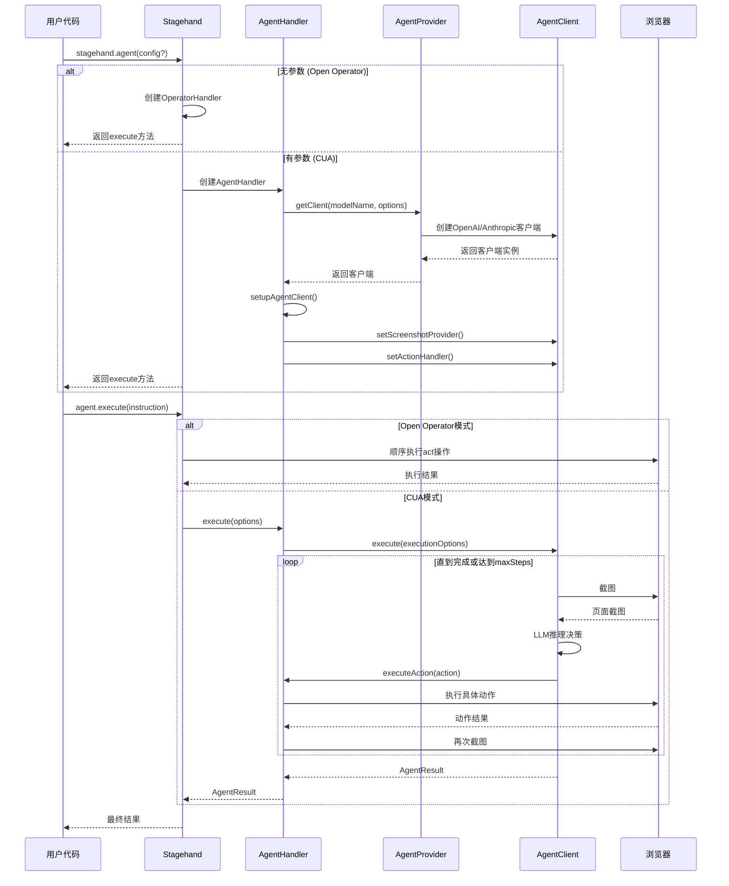

# Stagehand工程中Agent调用分析报告

## 概述

本文档详细分析了Stagehand工程中agent的调用方式、模式和机制。通过遍历整个工程，深入了解agent的使用场景和实现架构。

## 1. Agent调用的核心架构

Stagehand中的agent调用采用了双分支架构设计，根据是否传递参数决定使用不同的处理器：



### 1.1 核心类关系

- **Stagehand**: 主入口类，提供 `agent()` 方法
- **StagehandOperatorHandler**: 处理基础Agent模式（Open Operator）
- **StagehandAgentHandler**: 处理Computer Use Agent模式
- **AgentProvider**: 负责创建对应的Agent客户端
- **AgentClient**: 抽象基类，定义统一接口
- **OpenAICUAClient/AnthropicCUAClient**: 具体的CUA实现

## 2. Agent调用的三种主要模式

### 2.1 基础Agent模式（Open Operator）

**使用方式：**

```typescript
// 最简单的调用方式
const agent = stagehand.agent();
const result = await agent.execute("任务指令");
```

**特点：**

- ✅ 不需要传递任何参数
- ✅ 使用内置的Open Operator逻辑
- ✅ 基于Sequential Tool Calling
- ✅ 使用Stagehand配置中的默认LLM
- ✅ 适合简单的自动化任务

**实际调用链：**

```
stagehand.agent()
  → StagehandOperatorHandler
  → 使用page.act()顺序执行动作
```

**代码示例：**

```typescript
// examples/operator-example.ts
const agent = stagehand.agent();
const result = await agent.execute({
  instruction: "Go to Google Japan and interact with it in Japanese.",
  maxSteps: 20,
});
```

### 2.2 Computer Use Agent模式（CUA）

**OpenAI Computer Use：**

```typescript
const agent = stagehand.agent({
  provider: "openai",
  model: "computer-use-preview",
  instructions: "You are a helpful assistant that can use a web browser.",
  options: {
    apiKey: process.env.OPENAI_API_KEY,
    baseURL: "https://api.openai.com/v1",
  },
});
```

**Anthropic Computer Use：**

```typescript
const agent = stagehand.agent({
  provider: "anthropic",
  model: "claude-3-7-sonnet-latest",
  instructions: "You are a helpful assistant that can use a web browser.",
  options: {
    apiKey: process.env.ANTHROPIC_API_KEY,
    thinkingBudget: 20000,
  },
});
```

**实际调用链：**

```
stagehand.agent(config)
  → StagehandAgentHandler
  → AgentProvider.getClient()
  → OpenAICUAClient/AnthropicCUAClient
  → Computer Use API
```

**特点：**

- 🎯 支持复杂的视觉推理
- 🎯 基于截图的决策制定
- 🎯 自动光标和动画反馈
- 🎯 支持多步骤复杂任务
- 🎯 可自定义系统提示词

### 2.3 API远程模式

当设置 `useAPI: true` 时，agent调用会转发到远程Browserbase API：

```typescript
if (this.usingAPI) {
  return await this.apiClient.agentExecute(options, executeOptions);
}
```

**特点：**

- ☁️ 云端执行，无需本地资源
- ☁️ 自动API密钥管理
- ☁️ 支持Browserbase的高级功能

## 3. 工程中的具体调用场景



### 3.1 示例代码场景

#### operator-example.ts - 基础Agent演示

```typescript
const INSTRUCTION =
  "Go to Google Japan and interact with it in Japanese. Tell me (in English) an authentic recipe that I can make with ingredients found in American grocery stores.";

const agent = stagehand.agent();
const result = await agent.execute({
  instruction: INSTRUCTION,
  maxSteps: 20,
});
```

#### cua-example.ts - Computer Use演示

```typescript
const agent = stagehand.agent({
  provider: "openai",
  model: "computer-use-preview",
  instructions: "You are a helpful assistant that can use a web browser.",
});

const instruction =
  "Apply for the first engineer position with mock data. Don't submit the form.";
const result = await agent.execute({
  instruction,
  maxSteps: 20,
});
```

#### h5_novel_agent.ts - 实际业务场景

```typescript
const agent = stagehand.agent();
const INSTRUCTION = `
请完成以下任务，套餐数量是动态的（可能1-6个不等）：

**第一步：动态识别套餐**
1. 扫描页面，找到所有data-e2e属性以"payment-pop-item"开头的元素
2. 确定实际的套餐总数（可能是1个，也可能是6个，或者其他数量）

**第二步：逐个测试套餐**
对于每个发现的套餐，执行以下操作：
- 点击该套餐选项
- 等待1秒钟观察变化
- 截图一张（命名为package_序号.png）
`;

const result = await agent.execute({
  instruction: INSTRUCTION,
  maxSteps: 30,
});
```

### 3.2 评估测试场景

#### sf_library_card.ts - 表单填写验证

```typescript
const agent = stagehand.agent({
  model: modelName,
  provider: modelName.startsWith("claude") ? "anthropic" : "openai",
  instructions: `You are a helpful assistant that can help me with my tasks.`,
});

const agentResult = await agent.execute({
  instruction: "Fill in the 'Residential Address' field with '166 Geary St'",
  maxSteps: 3,
});
```

## 4. Agent执行流程分析



### 4.1 执行流程详解

1. **初始化阶段**

   - 根据参数选择适当的Handler
   - 创建对应的Agent客户端
   - 设置截图提供者和动作处理器

2. **执行阶段**

   - 循环执行直到任务完成或达到maxSteps
   - 每步都会截图、推理、执行动作
   - 提供视觉反馈和错误处理

3. **完成阶段**
   - 返回执行结果和动作历史
   - 更新使用指标
   - 清理资源

## 5. Agent配置参数详解

### 5.1 支持的Provider和Model组合

```typescript
// lib/agent/AgentProvider.ts
const modelToAgentProviderMap: Record<string, AgentType> = {
  "computer-use-preview": "openai",
  "computer-use-preview-2025-03-11": "openai",
  "claude-3-7-sonnet-latest": "anthropic",
  "claude-sonnet-4-20250514": "anthropic",
};
```

### 5.2 AgentConfig接口详解

```typescript
interface AgentConfig {
  provider?: "openai" | "anthropic"; // LLM提供商
  model?: string; // 模型名称
  instructions?: string; // 系统提示词
  options?: {
    // 客户端选项
    apiKey?: string; // API密钥
    baseURL?: string; // 基础URL
    organization?: string; // OpenAI组织ID
    environment?: string; // OpenAI环境设置
    thinkingBudget?: number; // Anthropic思考预算
    waitBetweenActions?: number; // 动作间延迟
    [key: string]: unknown;
  };
}
```

### 5.3 AgentExecuteOptions接口详解

```typescript
interface AgentExecuteOptions {
  instruction: string; // 【必需】任务指令
  maxSteps?: number; // 最大执行步数，默认10
  autoScreenshot?: boolean; // 是否自动截图，默认true
  waitBetweenActions?: number; // 动作间延迟毫秒，默认1000
  context?: string; // 额外的上下文信息
}
```

### 5.4 AgentResult返回值详解

```typescript
interface AgentResult {
  message: string; // 执行结果消息
  actions: AgentAction[]; // 执行的动作列表
  usage?: {
    // 使用统计
    input_tokens: number;
    output_tokens: number;
    inference_time_ms: number;
  };
  completed: boolean; // 是否完成
  error?: string; // 错误信息（如果有）
}
```

## 6. 最佳实践和使用建议

### 6.1 选择合适的Agent模式

**使用基础Agent模式的场景：**

- ✅ 简单的导航和数据提取任务
- ✅ 不需要复杂视觉推理的场景
- ✅ 希望使用默认配置快速开始
- ✅ 成本敏感的应用

**使用Computer Use Agent模式的场景：**

- 🎯 复杂的多步骤交互任务
- 🎯 需要视觉推理和截图分析
- 🎯 处理动态生成的页面内容
- 🎯 要求高精度的操作

### 6.2 参数配置建议

**maxSteps设置：**

- 简单任务：3-5步
- 中等复杂任务：10-15步
- 复杂任务：20-30步
- 注意步数过多会增加成本和执行时间

**instructions编写：**

- 明确任务目标和期望结果
- 指定操作的限制和约束
- 提供必要的上下文信息
- 避免过于复杂的多任务指令

**错误处理：**

```typescript
try {
  const result = await agent.execute({
    instruction: "完成任务",
    maxSteps: 15,
  });

  if (result.completed) {
    console.log("任务完成:", result.message);
  } else {
    console.log("任务未完成:", result.error);
  }
} catch (error) {
  console.error("执行出错:", error);
}
```

### 6.3 性能优化建议

1. **合理设置waitBetweenActions**

   - 页面加载较慢时适当增加延迟
   - 静态页面可以减少延迟提高效率

2. **使用缓存机制**

   - 对重复性操作使用observe缓存
   - 避免重复的LLM推理调用

3. **选择合适的模型**
   - 简单任务使用较小的模型
   - 复杂视觉任务使用更强的模型

## 7. 常见问题和解决方案

### 7.1 API密钥配置问题

**问题**：`API key not found for provider`

**解决方案**：

```typescript
// 方案1：环境变量
process.env.OPENAI_API_KEY = "your-api-key";
process.env.ANTHROPIC_API_KEY = "your-api-key";

// 方案2：直接传递
const agent = stagehand.agent({
  provider: "openai",
  model: "computer-use-preview",
  options: {
    apiKey: "your-api-key",
  },
});
```

### 7.2 模型不支持问题

**问题**：`UnsupportedModelError`

**解决方案**：使用支持的模型列表中的模型名称

```typescript
// 支持的模型
const supportedModels = [
  "computer-use-preview", // OpenAI
  "computer-use-preview-2025-03-11", // OpenAI
  "claude-3-7-sonnet-latest", // Anthropic
  "claude-sonnet-4-20250514", // Anthropic
];
```

### 7.3 执行超时问题

**问题**：任务执行时间过长或卡住

**解决方案**：

```typescript
const result = await agent.execute({
  instruction: "任务指令",
  maxSteps: 10, // 限制最大步数
  waitBetweenActions: 2000, // 增加延迟确保页面加载
});
```

## 8. 总结

Stagehand的agent系统提供了灵活且强大的自动化能力：

- **双模式架构**：支持简单的Open Operator和强大的Computer Use Agent
- **多厂商支持**：兼容OpenAI和Anthropic的最新模型
- **完整生态**：从简单示例到复杂业务场景的全覆盖
- **最佳实践**：详细的配置指南和性能优化建议

通过合理选择模式和配置参数，可以有效地完成各种复杂的浏览器自动化任务。

---

_本文档基于Stagehand工程的完整分析，为开发者提供agent使用的全面指南。_
