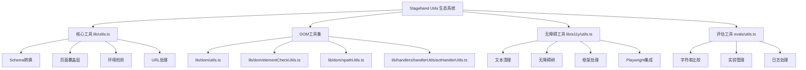
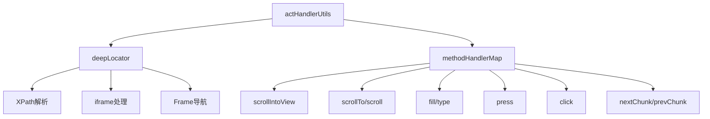
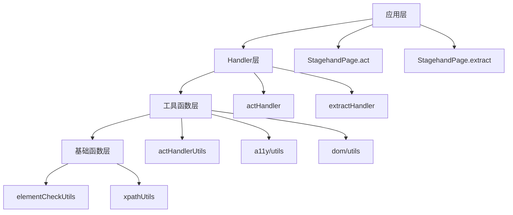

# Stagehand Utils 工具函数分析文档

## 概述

Stagehand 项目包含多个工具函数模块，分布在不同的目录中，提供了从核心数据处理到DOM操作、无障碍支持、评估工具等多种功能。本文档将详细分析这些工具函数模块的架构、功能和使用场景。

## 架构总览



## 1. 核心工具模块 (lib/utils.ts)

### 1.1 功能概览

`lib/utils.ts` 是 Stagehand 项目的核心工具函数库，提供了以下主要功能：

- **Zod Schema 操作**: Schema 验证、转换、URL字段处理
- **Gemini Schema 转换**: 支持 Google Gemini API 的 Schema 格式
- **页面覆盖层管理**: 提供视觉反馈的观察结果高亮
- **环境检测**: 运行时环境识别
- **API密钥管理**: 环境变量加载

### 1.2 核心函数分析

#### Schema 验证与转换

```typescript
// Zod Schema 验证
export function validateZodSchema(schema: z.ZodTypeAny, data: unknown);

// URL字段转换（用于extract方法）
export function transformSchema(
  schema: z.ZodTypeAny,
  currentPath: Array<string | number>,
): [z.ZodTypeAny, ZodPathSegments[]];

// Gemini Schema转换
export function toGeminiSchema(zodSchema: z.ZodTypeAny): Schema;
```

#### 页面视觉反馈

```typescript
// 绘制观察结果覆盖层
export async function drawObserveOverlay(page: Page, results: ObserveResult[]);

// 清除覆盖层
export async function clearOverlays(page: Page);
```

#### URL字段处理机制

**设计原理**: 当使用 `extract` 方法提取链接时，LLM无法直接返回完整URL，因此：

1. 将 `z.string().url()` 字段转换为 `z.number()`
2. LLM返回数字ID而非URL
3. 后续通过映射表将ID转换回实际URL

### 1.3 使用场景

- **Schema验证**: 确保LLM输出符合预期格式
- **视觉调试**: 在开发阶段显示observe结果
- **链接提取**: 处理复杂的URL提取场景
- **多LLM支持**: 统一不同LLM的Schema格式

## 2. DOM 工具集

### 2.1 基础DOM工具 (lib/dom/utils.ts)

#### 功能列表

- **滚动检测**: `canElementScroll()` - 测试元素是否可滚动
- **XPath解析**: `getNodeFromXpath()` - 根据XPath获取DOM节点
- **滚动事件**: `waitForElementScrollEnd()` - 等待滚动结束

#### 实现细节

```typescript
// 滚动能力检测
export function canElementScroll(elem: HTMLElement): boolean {
  // 1. 检查scrollTo方法存在性
  // 2. 尝试滚动测试
  // 3. 检查scrollTop是否变化
  // 4. 恢复原始位置
}
```

### 2.2 元素检查工具 (lib/dom/elementCheckUtils.ts)

简洁的类型守卫函数：

```typescript
export function isElementNode(node: Node): node is Element;
export function isTextNode(node: Node): node is Text;
```

### 2.3 XPath 工具 (lib/dom/xpathUtils.ts)

#### 核心功能

- **XPath生成**: 为DOM元素生成多种类型的XPath
- **字符串转义**: 处理XPath中的特殊字符
- **唯一性检测**: 验证XPath的唯一性

#### XPath生成策略

```typescript
export async function generateXPathsForElement(
  element: ChildNode,
): Promise<string[]>;
```

**返回顺序（按精确度排序）**:

1. **标准XPath**: 基于元素层次结构
2. **ID基础XPath**: 利用元素ID（如果存在）
3. **复杂XPath**: 基于属性组合的智能选择器

#### 属性优先级

```typescript
const attributePriority = [
  "data-qa",
  "data-component",
  "data-role",
  "role",
  "aria-role",
  "type",
  "name",
  "aria-label",
  "placeholder",
  "title",
  "alt",
];
```

### 2.4 动作处理工具 (lib/handlers/handlerUtils/actHandlerUtils.ts)

#### 功能架构



#### 核心功能

**1. iframe处理机制**

```typescript
export function deepLocator(
  root: Page | FrameLocator,
  rawXPath: string,
): Locator;
```

- 智能解析包含iframe的XPath
- 自动处理跨frame导航
- 支持嵌套iframe结构

**2. 方法映射表**

```typescript
export const methodHandlerMap: Record<
  string,
  (ctx: MethodHandlerContext) => Promise<void>
>;
```

**3. 智能滚动**

- `scrollToNextChunk`: 按视口高度向下滚动
- `scrollToPreviousChunk`: 按视口高度向上滚动
- 自动区分body/html和普通元素

## 3. 无障碍工具模块 (lib/a11y/utils.ts)

### 3.1 模块概览

这是最复杂的工具模块，包含1517行代码，主要处理：

- 无障碍树构建和管理
- 跨frame处理
- 文本清理和标准化
- Playwright方法执行

### 3.2 核心功能分析

#### 文本处理

```typescript
// PUA字符清理
export function cleanText(input: string): string

// 空白字符标准化
function normaliseSpaces(s: string): string

// 缓存的小写转换
const lc = (raw: string): string
```

#### 无障碍树构建

```typescript
// 层次树构建
export async function buildHierarchicalTree(
  nodes: AccessibilityNode[],
  tagNameMap: Record<EncodedId, string>,
  logger?: (l: LogLine) => void,
  xpathMap?: Record<EncodedId, string>,
): Promise<TreeResult>;

// 简化树格式化
export function formatSimplifiedTree(
  node: AccessibilityNode & { encodedId?: EncodedId },
  level = 0,
): string;
```

#### Frame处理

```typescript
// 获取Frame的CDP ID
export async function getCDPFrameId(
  sp: StagehandPage,
  frame?: Frame,
): Promise<string | undefined>;

// Frame链解析
export async function resolveFrameChain(
  sp: StagehandPage,
  absPath: string,
): Promise<{ frames: Frame[]; rest: string }>;
```

#### Playwright集成

```typescript
// 统一的Playwright方法执行
export async function performPlaywrightMethod(
  stagehandPage: Page,
  logger: (logLine: LogLine) => void,
  method: string,
  args: unknown[],
  xpath: string,
);
```

### 3.3 设计特色

1. **Unicode处理**: 专门处理私用区字符和NBSP变体
2. **性能优化**: 使用Map缓存降低重复计算
3. **错误恢复**: 完善的错误处理和降级策略
4. **跨frame支持**: 处理复杂的iframe嵌套场景

## 4. 评估工具模块 (evals/utils.ts)

### 4.1 功能定位

专门为评估系统设计的工具函数，支持：

- 字符串模糊匹配
- 实验管理
- 日志格式化

### 4.2 核心功能

#### 字符串比较

```typescript
// 字符串标准化
export function normalizeString(str: string): string;

// 模糊比较（使用Jaro-Winkler算法）
export function compareStrings(
  actual: string,
  expected: string,
  similarityThreshold: number = 0.85,
): { similarity: number; meetsThreshold: boolean };
```

#### 实验管理

```typescript
// 时间戳生成
export function generateTimestamp(): string;

// 实验名称生成
export function generateExperimentName({
  evalName,
  category,
  environment,
}): string;
```

#### 工具函数

```typescript
// 日志转换
export function logLineToString(logLine: LogLine): string;

// 模板字符串处理
export function dedent(
  strings: TemplateStringsArray,
  ...values: unknown[]
): string;
```

## 5. 工具函数使用模式

### 5.1 层次化设计



### 5.2 错误处理策略

1. **渐进式降级**: 优先尝试最精确的方法，失败时自动降级
2. **详细日志**: 每个关键操作都有对应的日志记录
3. **类型安全**: 使用TypeScript类型守卫确保运行时安全

### 5.3 性能优化技术

1. **缓存策略**:
   - 字符串小写转换缓存 (`lowerCache`)
   - XPath结果缓存
2. **惰性加载**: 按需生成复杂数据结构

3. **批量处理**: 一次性处理多个相似操作

## 6. 最佳实践建议

### 6.1 使用指南

1. **选择合适的工具**:

   - DOM操作 → `lib/dom/utils.ts`
   - 文本处理 → `lib/a11y/utils.ts`
   - Schema验证 → `lib/utils.ts`
   - 性能测试 → `evals/utils.ts`

2. **错误处理**:

   ```typescript
   try {
     const result = await someUtilFunction();
   } catch (error) {
     logger({
       category: "error",
       message: "Operation failed",
       auxiliary: { error: error.message },
     });
   }
   ```

3. **性能考虑**:
   - 使用缓存避免重复计算
   - 在处理大量元素时考虑批量操作
   - 适当使用异步操作避免阻塞

### 6.2 扩展建议

1. **添加新工具函数**:

   - 遵循现有的命名约定
   - 提供详细的TypeScript类型
   - 添加适当的错误处理
   - 考虑性能影响

2. **模块组织**:
   - 相关功能放在同一模块
   - 保持模块大小适中
   - 避免循环依赖

## 7. 总结

Stagehand的工具函数体系设计精良，具有以下特点：

1. **模块化**: 功能按领域划分，职责清晰
2. **类型安全**: 充分利用TypeScript的类型系统
3. **性能优化**: 多处使用缓存和优化策略
4. **错误恢复**: 完善的错误处理和降级机制
5. **可扩展性**: 易于添加新功能和修改现有功能

这套工具函数为Stagehand框架提供了坚实的基础，支撑了其在自动化测试和网页操作方面的强大功能。
