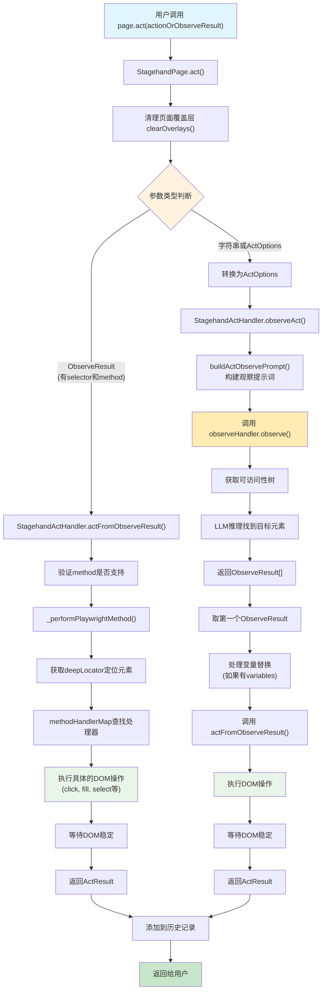
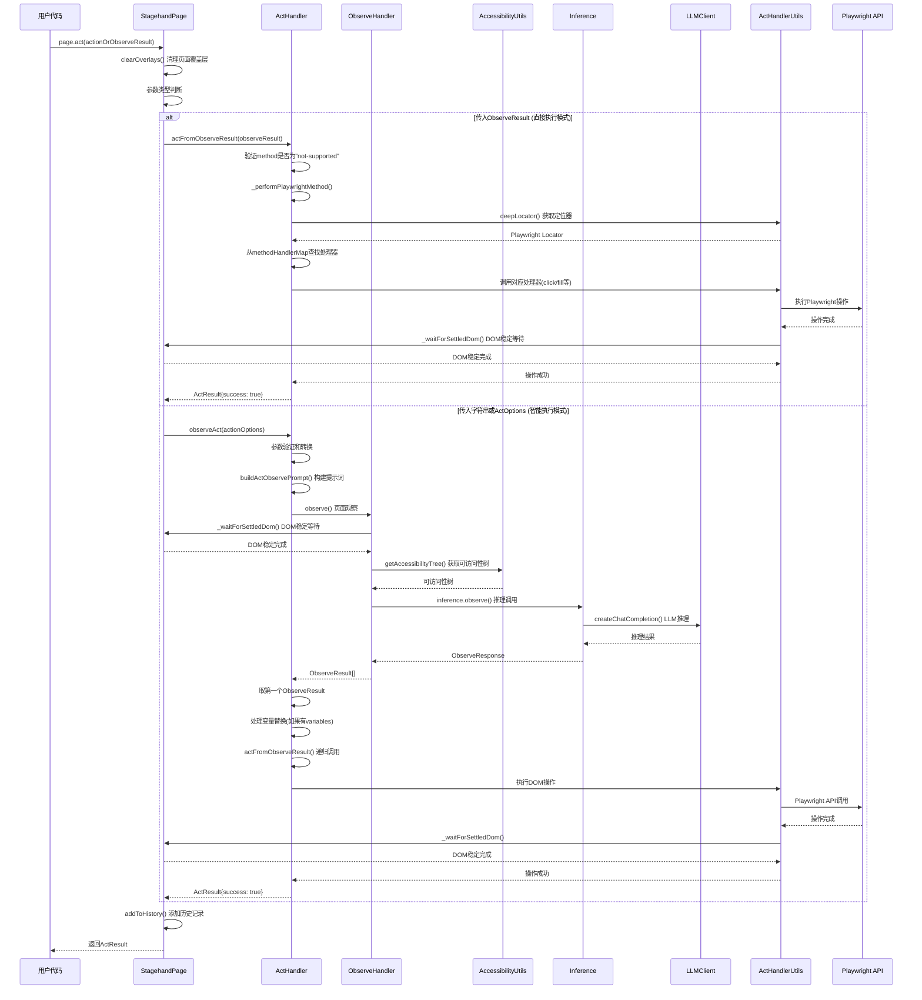
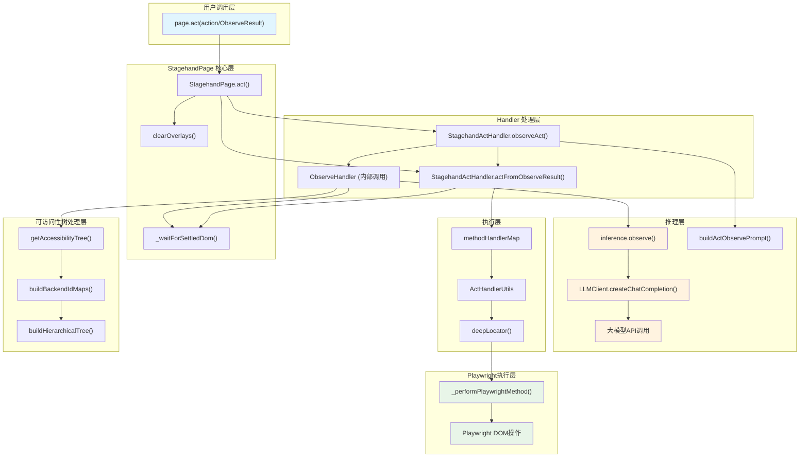
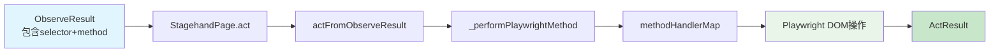
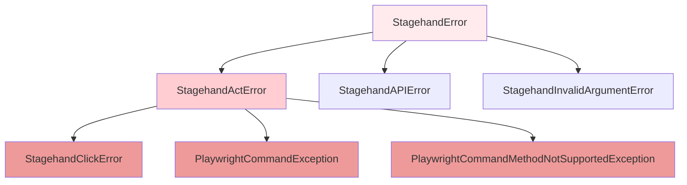

# Stagehand page.act 调用链路深度分析

本文档详细分析了 Stagehand 中 `page.act` 方法的完整调用链路，包括流程图、时序图、架构图和核心实现原理。

## 1. page.act 调用链路概览

### 1.1 核心执行流程图



### 1.2 时序图



### 1.3 核心组件架构图



## 2. 核心组件详细分析

### 2.1 StagehandPage.act() - 统一入口

**位置**：`lib/StagehandPage.ts:618-717`

**核心功能**：

1. **参数类型识别和转换**：支持两种输入类型的统一入口
2. **路由到对应的处理器**：根据参数类型选择执行路径
3. **错误处理和历史记录**：统一的错误处理和操作历史管理

**关键代码逻辑**：

```typescript
// 参数类型判断
if (typeof actionOrOptions === "object" && actionOrOptions !== null) {
  if ("selector" in actionOrOptions && "method" in actionOrOptions) {
    // ObserveResult路径：直接执行
    return this.actHandler.actFromObserveResult(observeResult);
  } else if ("action" in actionOrOptions) {
    // ActOptions路径：智能执行
    // 转到 observeAct 流程
  }
} else if (typeof actionOrOptions === "string") {
  // 字符串转换为 ActOptions
  actionOrOptions = { action: actionOrOptions };
}
```

#### 执行路径A：直接执行 ObserveResult

- **触发条件**：传入的参数包含 `selector` 和 `method` 属性
- **流程**：
  1. `actFromObserveResult()` - 验证方法支持性
  2. `_performPlaywrightMethod()` - 执行具体的 Playwright 操作
  3. `_waitForSettledDom()` - 等待 DOM 稳定

#### 执行路径B：基于指令的执行

- **触发条件**：传入字符串指令或 ActOptions 对象
- **流程**：
  1. `observeAct()` - 构建行为观察提示词
  2. 调用内部 `observe()` - 获取目标元素
  3. 取第一个 `ObserveResult` 执行操作
  4. 支持变量替换（如果定义了 `variables`）

### 2.2 StagehandActHandler - 核心处理器

**位置**：`lib/handlers/actHandler.ts`

#### 2.2.1 actFromObserveResult() - 直接执行模式

**功能**：基于已有的 ObserveResult 直接执行操作

**执行流程**：

1. 验证 method 是否为 "not-supported"
2. 调用 `_performPlaywrightMethod()` 执行操作
3. 错误处理和自愈机制

**自愈机制**：

```typescript
if (
  !this.selfHeal ||
  err instanceof PlaywrightCommandMethodNotSupportedException
) {
  // 直接返回错误
  return { success: false, message: `Failed to perform act: ${err.message}` };
}
// 启用自愈：重新使用智能模式执行
const actCommand = observe.description
  .toLowerCase()
  .startsWith(method.toLowerCase())
  ? observe.description
  : `${method} ${observe.description}`;
return await this.stagehandPage.act({ action: actCommand });
```

#### 2.2.2 observeAct() - 智能执行模式

**功能**：基于自然语言指令，通过 LLM 推理找到目标元素并执行操作

**关键步骤**：

1. **构建提示词**：`buildActObservePrompt()`
2. **页面观察**：调用 `observeHandler.observe()`
3. **变量替换**：处理 `variables` 参数
4. **递归执行**：调用 `actFromObserveResult()`

**超时控制**：

```typescript
if (!actionOrOptions.timeoutMs) {
  return doObserveAndAct();
}
// 使用 Promise.race 实现超时控制
return await Promise.race([
  doObserveAndAct(),
  new Promise<ActResult>((resolve) => {
    setTimeout(() => {
      resolve({
        success: false,
        message: `Action timed out after ${timeoutMs}ms`,
      });
    }, timeoutMs);
  }),
]);
```

### 2.3 \_performPlaywrightMethod() - 执行引擎

**位置**：`lib/handlers/actHandler.ts:280-341`

**核心功能**：

1. 创建 Playwright Locator
2. 查找和调用对应的方法处理器
3. DOM 稳定等待

**方法查找优先级**：

```typescript
// 1. 优先查找 methodHandlerMap 中的自定义处理器
const methodFn = methodHandlerMap[method];
if (methodFn) {
  await methodFn(context);
}
// 2. 其次查找 Playwright 原生 Locator 方法
else if (typeof locator[method as keyof Locator] === "function") {
  await fallbackLocatorMethod(context);
}
// 3. 不支持的方法抛出异常
else {
  throw new PlaywrightCommandMethodNotSupportedException(
    `Method ${method} not supported`,
  );
}
```

### 2.4 methodHandlerMap - 方法映射表

**位置**：`lib/handlers/handlerUtils/actHandlerUtils.ts:38-48`

**支持的操作类型**：

```typescript
export const methodHandlerMap: Record<
  string,
  (ctx: MethodHandlerContext) => Promise<void>
> = {
  scrollIntoView: scrollElementIntoView, // 滚动到视图
  scrollTo: scrollElementToPercentage, // 滚动到指定位置
  scroll: scrollElementToPercentage, // 滚动操作
  "mouse.wheel": scrollElementToPercentage, // 鼠标滚轮
  fill: fillOrType, // 填充输入
  type: fillOrType, // 输入文本
  press: pressKey, // 按键操作
  click: clickElement, // 点击操作
  nextChunk: scrollToNextChunk, // 滚动到下一块
  prevChunk: scrollToPreviousChunk, // 滚动到上一块
};
```

### 2.5 deepLocator() - 深度定位器

**位置**：`lib/handlers/handlerUtils/actHandlerUtils.ts:11-33`

**功能**：处理复杂的 XPath 选择器，特别是 iframe 内的元素定位

**核心算法**：

```typescript
export function deepLocator(
  root: Page | FrameLocator,
  rawXPath: string,
): Locator {
  // 1. 清理 xpath= 前缀
  let xpath = rawXPath.replace(/^xpath=/i, "").trim();

  // 2. 分割路径，处理 iframe 步骤
  const steps = xpath.split("/").filter(Boolean);
  let ctx: Page | FrameLocator = root;

  // 3. 逐步处理，遇到 iframe 就切换上下文
  for (const step of steps) {
    if (IFRAME_STEP_RE.test(step)) {
      ctx = ctx.frameLocator(currentSelector);
    }
  }

  // 4. 返回最终定位器
  return ctx.locator(finalSelector);
}
```

## 3. 关键操作处理器详解

### 3.1 clickElement() - 点击处理器

**位置**：`lib/handlers/handlerUtils/actHandlerUtils.ts:352-417`

**双重失败保护机制**：

```typescript
try {
  // 1. 尝试 Playwright 原生点击
  await locator.click({ timeout: 3_500 });
} catch (e) {
  try {
    // 2. 失败后尝试 JavaScript 点击
    await locator.evaluate((el) => (el as HTMLElement).click());
  } catch (e) {
    // 3. 彻底失败，抛出自定义错误
    throw new StagehandClickError(xpath, e.message);
  }
}
```

**页面导航处理**：

- 检测新标签页打开
- 处理页面跳转
- DOM 稳定等待

### 3.2 fillOrType() - 输入处理器

**位置**：`lib/handlers/handlerUtils/actHandlerUtils.ts:293-314`

**功能特点**：

- 支持 `fill` 和 `type` 两种输入方式
- 自动处理输入框焦点
- 支持特殊字符和多行文本

### 3.3 scrollToNextChunk() - 智能滚动

**位置**：`lib/handlers/handlerUtils/actHandlerUtils.ts:64-127`

**智能滚动算法**：

```typescript
const element = elementNode as HTMLElement;
const tagName = element.tagName.toLowerCase();

if (tagName === "html" || tagName === "body") {
  // 全页面滚动：使用视口高度
  height = window.visualViewport.height;
  window.scrollBy({ top: height, behavior: "smooth" });
} else {
  // 元素内滚动：使用元素高度
  height = element.getBoundingClientRect().height;
  element.scrollBy({ top: height, behavior: "smooth" });
}
```

## 4. buildActObservePrompt() - 提示词构建

**位置**：`lib/prompt.ts:149-171`

**核心功能**：将用户的自然语言指令转换为 LLM 可理解的观察任务

**提示词结构**：

```typescript
export function buildActObservePrompt(
  action: string,
  supportedActions: string[],
  variables?: Record<string, string>,
): string {
  let instruction = `Find the most relevant element to perform an action on given the following action: ${action}. 
  Provide an action for this element such as ${supportedActions.join(", ")}, or any other playwright locator method.
  ...`;

  // 添加变量支持
  if (variables && Object.keys(variables).length > 0) {
    const variableNames = Object.keys(variables)
      .map((key) => `%${key}%`)
      .join(", ");
    instruction += ` The following variables are available: ${variableNames}`;
  }

  return instruction;
}
```

**关键指导原则**：

1. **精确性**：只返回一个最相关的操作
2. **兼容性**：支持所有 Playwright locator 方法
3. **变量支持**：处理参数化输入
4. **特殊处理**：键盘操作、滚动位置等特殊情况

## 5. 两种执行模式的数据流

### 5.1 模式A：直接执行 ObserveResult



**优势**：

- ⚡ **高性能**：无需 LLM 推理，直接执行
- 💰 **低成本**：不消耗 API 调用
- 🎯 **高精度**：精确的选择器定位

**适用场景**：

- 缓存已知操作结果
- 批量执行相同操作
- 性能关键的自动化场景

### 5.2 模式B：基于指令的执行

```mermaid
graph LR
    A[字符串指令/ActOptions] --> B[StagehandPage.act]
    B --> C[observeAct]
    C --> D[buildActObservePrompt]
    D --> E[内部observe调用]
    E --> F[ObserveResult]
    F --> G[actFromObserveResult]
    G --> H[Playwright DOM操作]
    H --> I[ActResult]

    style A fill:#e1f5fe
    style E fill:#fff3e0
    style F fill:#ffecb3
    style H fill:#e8f5e8
    style I fill:#c8e6c9
```



**优势**：

- 🧠 **智能理解**：理解复杂的自然语言指令
- 🔄 **自适应**：适应页面结构变化
- 🛠️ **自愈能力**：失败后自动重试

**适用场景**：

- 探索性自动化
- 动态页面内容
- 复杂交互逻辑

## 6. 高级特性分析

### 6.1 双模式支持

1. **直接执行模式**（性能优化）：

   - 跳过 LLM 推理阶段
   - 直接执行已知的 `ObserveResult`
   - 适用于缓存场景和确定性操作

2. **智能执行模式**（灵活性优先）：
   - 通过 LLM 理解用户意图
   - 自动定位页面元素
   - 适用于动态页面和探索性操作

### 6.2 变量替换系统

**功能**：支持参数化操作，增强安全性和灵活性

**实现机制**：

```typescript
if (actionOrOptions.variables) {
  Object.keys(actionOrOptions.variables).forEach((key) => {
    element.arguments = element.arguments.map((arg) =>
      arg.replace(`%${key}%`, actionOrOptions.variables![key]),
    );
  });
}
```

**使用场景**：

- 敏感信息（密码、密钥）不暴露给 LLM
- 动态参数传递
- 批量操作的参数化

**示例**：

```typescript
// 支持动态变量替换
await page.act({
  action: "Type %username% into the username field",
  variables: { username: "john@example.com" },
});
```

### 6.3 iframe 支持

**功能**：支持跨框架的元素操作

**实现原理**：

- `deepLocator()` 函数解析 iframe 层级
- 自动切换 frame 上下文
- 支持嵌套 iframe 结构

### 6.4 超时控制

**多层级超时机制**：

```typescript
// 1. 操作级超时
await page.act({
  action: "Click the slow button",
  timeoutMs: 10000,
});

// 2. DOM 稳定超时
await page.act({
  action: "Click the dynamic button",
  domSettleTimeoutMs: 5000,
});
```

### 6.5 自愈机制

**触发条件**：

- `selfHeal: true` 配置启用
- 直接执行模式失败
- 非方法不支持异常

**自愈流程**：

```typescript
// 自愈机制示例
try {
  await this._performPlaywrightMethod(method, args, selector);
} catch (err) {
  if (this.selfHeal) {
    // 重新观察页面并尝试执行
    return await this.stagehandPage.act({ action: observe.description });
  }
  throw err;
}
```

## 7. 错误处理和调试

### 7.1 错误类型层次



### 7.2 调试信息记录

**日志级别**：

- **Level 0**：关键错误和异常
- **Level 1**：重要操作和状态变化
- **Level 2**：详细执行步骤

**关键调试信息**：

```typescript
this.logger({
  category: "action",
  message: "performing playwright method",
  level: 2,
  auxiliary: {
    xpath: { value: xpath, type: "string" },
    method: { value: method, type: "string" },
    args: { value: JSON.stringify(args), type: "object" },
  },
});
```

## 8. 性能优化策略

### 8.1 结果缓存模式

**ObserveResult 缓存**：

```typescript
// 推荐的缓存使用模式
const instruction = "Click the sign in button";
const cachedAction = await getCache(instruction);

if (cachedAction) {
  // 直接执行，跳过 LLM 推理
  await page.act(cachedAction);
} else {
  // 首次执行，缓存结果
  const results = await page.observe(instruction);
  await setCache(instruction, results);
  await page.act(results[0]);
}
```

### 8.2 批量操作优化

**一次观察，多次执行**：

```typescript
// 批量获取 ObserveResults，然后批量执行
const buttons = await page.observe("Find all clickable buttons");
for (const button of buttons) {
  await page.act(button); // 直接执行模式，性能更优
}

// 一次观察，多次复用
const loginAction = (await page.observe("Click login button"))[0];
const usernameAction = (await page.observe("Fill username field"))[0];

// 批量处理多个账号
for (const account of accounts) {
  await page.act(loginAction);
  await page.act({
    ...usernameAction,
    arguments: [account.username],
  });
}
```

### 8.3 超时时间调优

**基于页面特性调整**：

```typescript
// 快速响应页面
await page.act({ action: "Click button", timeoutMs: 3000 });

// 慢速加载页面
await page.act({
  action: "Submit form",
  timeoutMs: 15000,
  domSettleTimeoutMs: 8000,
});

// 支持操作超时控制
await page.act({
  action: "Click the slow loading button",
  timeoutMs: 10000, // 10秒超时
});
```

## 9. 实际应用示例

### 9.1 基本使用模式

```typescript
// 方式1：一步到位（智能模式）
await page.act("Click the sign in button");

// 方式2：两步优化（缓存模式）
const [action] = await page.observe("Click the sign in button");
await page.act(action);

// 方式3：直接执行（性能模式）
const observeResult = {
  selector: "xpath=//button[@id='signin']",
  method: "click",
  arguments: [],
};
await page.act(observeResult);
```

### 9.2 高级使用模式

```typescript
// 变量替换
await page.act({
  action: "Type %username% into the username field",
  variables: { username: "john@example.com" },
});

// 自定义超时
await page.act({
  action: "Click the submit button",
  timeoutMs: 15000,
});

// iframe 支持
await page.act({
  action: "Click the button inside iframe",
  iframes: true,
});

// DOM 稳定等待
await page.act({
  action: "Click the dynamic button",
  domSettleTimeoutMs: 5000,
});
```

### 9.3 探索性自动化

```typescript
// 智能探索未知页面
await page.act("Find and click the login button");
await page.act("Fill username field with test@example.com");
await page.act("Find password field and enter password");
await page.act("Submit the login form");
```

### 9.4 动态内容处理

```typescript
// 处理动态加载的内容
await page.act({
  action: "Click the load more button",
  domSettleTimeoutMs: 10000, // 等待内容加载
});

// 处理可能出现的弹窗
try {
  await page.act({
    action: "Close popup if exists",
    timeoutMs: 2000,
  });
} catch (e) {
  // 弹窗不存在，继续执行
}
```

### 9.5 错误处理

```typescript
try {
  const result = await page.act("Click the non-existent button");
  if (!result.success) {
    console.log(`Action failed: ${result.message}`);
  }
} catch (error) {
  console.error(`Error during act: ${error.message}`);
}
```

## 10. 最佳实践

### 10.1 选择合适的执行模式

1. **使用直接模式**的场景：

   - 已知确切的元素选择器
   - 需要最佳性能的重复操作
   - 页面结构稳定不变

2. **使用智能模式**的场景：
   - 探索未知页面结构
   - 处理动态内容
   - 需要灵活适应页面变化

### 10.2 性能优化建议

1. **缓存 ObserveResult**：避免重复的 LLM 推理
2. **批量处理**：一次 observe 获取多个目标，然后批量 act
3. **合理设置超时**：根据页面特性调整 `timeoutMs` 和 `domSettleTimeoutMs`

### 10.3 错误处理策略

1. **检查 ActResult.success**：判断操作是否成功
2. **启用 selfHeal**：让系统自动恢复失败的操作
3. **捕获异常**：处理网络、超时等系统级错误

### 10.4 安全性考虑

1. **使用变量系统**：避免敏感信息暴露给 LLM
2. **输入验证**：确保用户输入的安全性
3. **权限控制**：合理配置浏览器权限

## 11. 总结

Stagehand 的 `page.act` 方法通过精心设计的双模式架构，实现了**性能**与**智能性**的完美平衡：

### 11.1 核心优势

1. **双模式设计**：

   - **直接执行模式**：最优性能，适用于确定性操作和缓存场景
   - **智能执行模式**：最大灵活性，通过 LLM 理解用户意图并自动定位元素

2. **鲁棒性保证**：

   - **自愈机制**：提供错误恢复能力，增强系统鲁棒性
   - **多层超时控制**：操作级和DOM级双重保护
   - **渐进式失败处理**：Playwright → JavaScript → 错误报告

3. **可扩展架构**：
   - **methodHandlerMap**：支持自定义操作处理器
   - **deepLocator**：处理复杂页面结构（iframe等）
   - **变量系统**：支持参数化和安全处理
   - **丰富的配置选项**：支持变量替换、超时控制、iframe 处理等高级功能

### 11.2 设计哲学

- **智能优先，性能兜底**：优先使用智能模式探索，然后缓存结果提升性能
- **渐进式降级**：从高级功能逐步回退到基础功能
- **开发者友好**：提供丰富的调试信息和错误处理

### 11.3 技术创新点

1. **双路径执行**：同时支持确定性和智能性执行
2. **深度定位器**：解决复杂页面结构定位问题
3. **方法映射表**：灵活的操作扩展机制
4. **智能提示词构建**：优化LLM理解和执行效果

### 11.4 最佳实践总结

1. **性能优化**：缓存 ObserveResult，批量处理相似操作
2. **可靠性提升**：合理设置超时时间，启用自愈机制
3. **安全增强**：使用变量系统处理敏感信息
4. **调试支持**：利用日志系统和错误信息快速定位问题

这种架构设计使得 `page.act` 既能满足高性能自动化测试的需求，又能处理现代 Web 应用的复杂交互场景，是 Stagehand 框架的核心竞争力所在。通过智能的双模式设计，它真正实现了**性能**与**灵活性**的完美平衡，为开发者提供了一个强大而易用的Web自动化解决方案。
